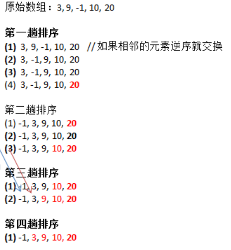

# 排序算法

## 冒泡排序

冒泡排序(Bubble Sorting)是入门级的排序算法，基本思想是：

>通过对**待排序序列**从前往后（从下标较小的元素开始）, **依次比较相邻元素的值，若发现逆序则交换**，使值较大的元素逐渐从前向后移动，就像水底下的气泡一样逐渐向上冒。

优化策略:

因为排序的过程中，各元素不断接近自己的位置，**如果一趟比较下来没有进行过交换，就说明序列有序**，因此要在排序的过程中设置一个标志flag判断元素是否进行过交换，从而减少不必要的比较。

### 第一种写法

我们的原始数组是 `[3, 9, -1, 10, 20]`。



通过上面的图解可以总结出来规律:
- 1、一共进行了数组长度-1次大的循环，最后一个数自动到了自己应该处的位置，无需循环比较
- 2、每一趟排序的次数在逐渐的减少
- 3、如果我们发现在某一趟排序中没有发生一次交换，可以提前结束冒泡排序，这是优化策略

为了更好观察，我们换一组数据来说明这个问题，我们的目标数组变成 `[3, 9, -1, 10, -2]`。

第一趟排序，就是将最大的数排在最后 那要循环多少次呢？因为是两两比较，所以总共的比较次数是数组的长度-1次，就可以完成第一次比较。
```js
let arr = [3, 9, -1, 10, -2];
let temp = 0; // 临时变量

// 第一趟排序，就是将最大的数排在最后一个位置
for (let j = 0; j < arr.length - 1; j++) {
  // 如果前面的数比后面的数大，则交换
  if (arr[j] > arr[j+1]) {
    temp = arr[j];
    arr[j] = arr[j+1];
    arr[j+1] = temp;
  }
}
console.log("第一趟排序后的数组")
console.log(arr);

// 第二趟排序，就是将第二大的数排在倒数第二位

// 因为第一趟已经确定了一个最大的数，下一次排序没有必要和这个数作比较了
// 因此可以少走一次循环
for (let j = 0; j < arr.length - 1 - 1; j++) {
  // 如果前面的数比后面的数大，则交换
  if (arr[j] > arr[j+1]) {
    temp = arr[j];
    arr[j] = arr[j+1];
    arr[j+1] = temp;
  }
}
console.log("第二趟排序后的数组")
console.log(arr);


// 第三趟排序，就是将第三大的数排在倒数第三位
for (let j = 0; j < arr.length - 1 - 2; j++) {
  // 如果前面的数比后面的数大，则交换
  if (arr[j] > arr[j+1]) {
    temp = arr[j];
    arr[j] = arr[j+1];
    arr[j+1] = temp;
  }
}
console.log("第三趟排序后的数组")
console.log(arr);

// 第四趟排序，就是将第四大的数排在倒数第四位
for (let j = 0; j < arr.length - 1 - 3; j++) {
  // 如果前面的数比后面的数大，则交换
  if (arr[j] > arr[j+1]) {
    temp = arr[j];
    arr[j] = arr[j+1];
    arr[j+1] = temp;
  }
}
console.log("第四趟排序后的数组")
console.log(arr);
```

打印出来的结果：
```
第一趟排序后的数组
[ 3, -1, 9, -2, 10 ]
第二趟排序后的数组
[ -1, 3, -2, 9, 10 ]
第三趟排序后的数组
[ -1, -2, 3, 9, 10 ]
第四趟排序后的数组
[ -2, -1, 3, 9, 10 ]
```

从上面的流程可以看出来，数组中总共有5个数，执行的大循环的次数是4次，剩下的一个数位置就已经确定了。并且四个for循环很有规律，我们可以外层再嵌套一个for循环，看如下代码：

```js
let arr = [3, 9, -1, 10, -2];
let temp = 0;

for (let i = 0;i < arr.length - 1; i++) {
  for (let j = 0; j < arr.length - 1 - i; j++) {
    if (arr[j] > arr[j+1]) {
      temp = arr[j];
      arr[j] = arr[j+1];
      arr[j+1] = temp;
    }
  } 
  console.log(`第${i+1}趟排序后的数组`)
  console.log(arr);
}
```

