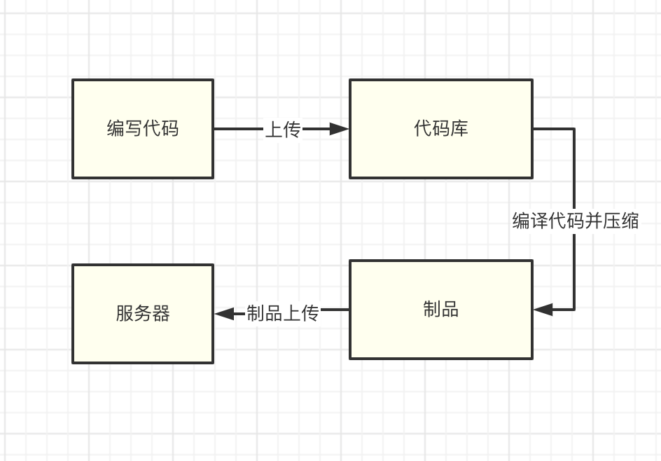
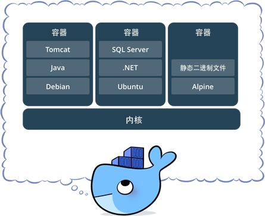

# CI/CD

## 什么是CI/CD

在开发阶段，许多编译工具会将我们的源码编译成可使用的文件。例如 `vue-cli`的项目被 `webpack`打包编译为浏览器可识别的文件，`Java` 项目会被编译为 `.class/jar`文件以供服务器使用。

但是开发人员过多关注构建和部署过程是很浪费时间的。以之前古老的构建部署流程为例，需要经历以下步骤：
- 1.开发人员将源代码，经过编译、压缩等一系列流程打包为制品（打包后的成品）。
- 2.将打包好的文件传到服务器
- 3.在服务器将编译后的文件，手动移动到可用的容器服务内（例如 `Nginx Tomcat Apache`等服务）



显而易见，这种流程不仅繁琐，且容易出错，是非常影响开发效率的。开发人员要花一些时间浪费在这上面，有没有提高效率，简单便捷一些方式呢？

这就要提到`CI/CD`了。 `CI`的意思是`持续构建`。负责拉取代码库中的代码后，执行用户预置定义好的操作脚本，通过一系列编译操作构建出一个 `制品`，并将制品推送到制品库里面，常用的工具有Gitlab CI, Github CI, Jenkins等，这个环节不参与部署，只负责构建代码，然后保存构建物。构建物被称作制品，保存制品的地方被称为"制品库"

CD则有两层含义：`持续部署(Continuous Deployment)` 和 `持续交付(Continuous Delivery)`。 `持续交付`的概念是：将制品库的制品拿出后，部署在测试环境/交付给客户提前测试。`持续部署`则是将制品部署在生产环境，可以进行持续部署的工具也有很多：`Ansible`批量部署，`Docker`直接推拉镜像等等。当然也包括我们后面写道的 `Kubernetes` 集群部署。

## 整体完成之后
- 1.写完了代码，提交到了`Git`代码仓库。
- 2.随后，代码仓库配置的 `WebHook` 钩子或者人工启动了 `JenKins` 的构建流程。
- 3.Jenkins 启动构建流程。按照你之前配置好的构建脚本，将代码编译成功。
- 4.编译成功后，将编译后的文件打包为 docker 镜像，并将镜像上传到私有镜像仓库。
- 5.随后，使用 kubectl 指定远程的k8s集群，发送镜像版本更新指令
- 6.远程的k8s集群接收到指令后，去镜像库拉取新镜像
- 7.镜像拉取成功，按照升级策略（滚动升级）进行升级，此时不会停机。
- 8.升级完毕。


## 正式开始

在第一章，我们已经大致了解过 CI/CD 的作用和历史，我们这一部分将正式搭建一套 CI/CD 流程

## 什么是Docker

docker 是一个开源的应用容器引擎，开发者可以将自己的应用打包在自己的镜像里面，然后迁移到其他平台的docker中，镜像中可以存放自定义的运行环境，文件、代码，设置等内容，再也不用担心环境造成运行问题。镜像共享运行机器的系统内核。

同样，docker也支持跨平台，你的镜像可以在window和linux 实现快速的运行和部署。



docker 的优势在于快速、轻量、灵活。开发者可以制作一个自己的镜像，也可以使用官方或者其他开发者的镜像来启动一个服务，通过将镜像创建为容器，容器之间相互隔离资源和进程不冲突。但是硬件资源又是共享的，创建的镜像也可以通过文件快速分享，也可以上传到镜像仓库进行保存和管理。同时docker镜像有分策略，每次对镜像的更新操作，都会堆叠一个新层，当你拉取/推送新版的镜像时，只推送.拉取修改的部分。大大加快了镜像的传输效率。

那么 docker 在 CI/CD 中有什么作用呢？

Docker 贯穿CI/CD的整个流程 作为应用服务器的载体有着非常重要的地位。

我们可以使用docker将应用打包为成为一个镜像，交给 Kubernetes 去部署在目标服务集群，并且可以将镜像上传到自己的镜像仓库，做好版本分类处理。

## 安装docker 
在了解到docker的作用后，我们开始来安装docker 在开始安装之前，需要首先安装 `device-mapper-persistent-data` 和 `lvm2` 两个依赖。

`device-mapper-persistent-data` 是 `Linux` 下的一个存储驱动， Linux 上的高级存储技术。 Lvm 的作用则是创建逻辑磁盘分区。这里我们使用 CentOS 的 Yum 包管理器安装两个依赖：

```shell
yum install -y yum-utils device-mapper-persistent-data lvm2
```
依赖安装完毕后，我们将阿里云的 Docker 镜像源添加进去。可以加速 Docker 的安装。

```shell
sudo yum-config-manager --add-repo http://mirrors.aliyun.com/docker-ce/linux/centos/docker-ce.repo
yum install docker-ce -y
```

安装完毕，我们就可以使用 systemctl 启动来启动 Docker 了。systemctl 是 Linux 的进程管理服务命令，他可以帮助我们启动 docker 

```shell
systemctl start docker
systemctl enable docker
```

接着执行一下 docker -v ，这条命令可以用来查看 Docker 安装的版本信息。当然也可以帮助我们查看 docker 安装状态。如果正常展示版本信息，代表 Docker 已经安装成功。

## 安装Jenkins 

安装完毕 Docker 之后，我们拥有了一个可以承载服务的载体，想要实现自动化构建，还需要安装另一个构建工具Jenkins，那什么是Jenkins呢？

Jenkins 是一个基于java语言开发的持续构建工具平台，主要用于持续构建，自动构建/测试你的软件和项目，它可以执行你预先设定好的构建脚本，也可以和git代码库做集成，实现自动触发和定时触发构建。

### 安装openjdk

因为 Jenkins 是java编写的构建平台，所以安装java必不可少

在这里，我们选定开源的openjdk即可，openjdk 是 SunJDK 一种开源实现。在这我们直接使用 yum 包管理器安装 openjdk 即可。
```shell
yum install -y java
```

### 使用yum 安装 Jenkins
由于 yum 源不带 Jenkins 的安装源，于是我们需要自己导入一份Jenkins安装源进行安装，导入后，使用yum 命令安装即可。

进入 /etc/yum.repos.d 这个目录

创建一个 jenkins.repo 的文件，进行编辑。

写入下面的信息，进行保存即可。
```
[jenkins]
name=Jenkins-stable
baseurl=http://pkg.jenkins.io/redhat-stable
gpgcheck=1
```


