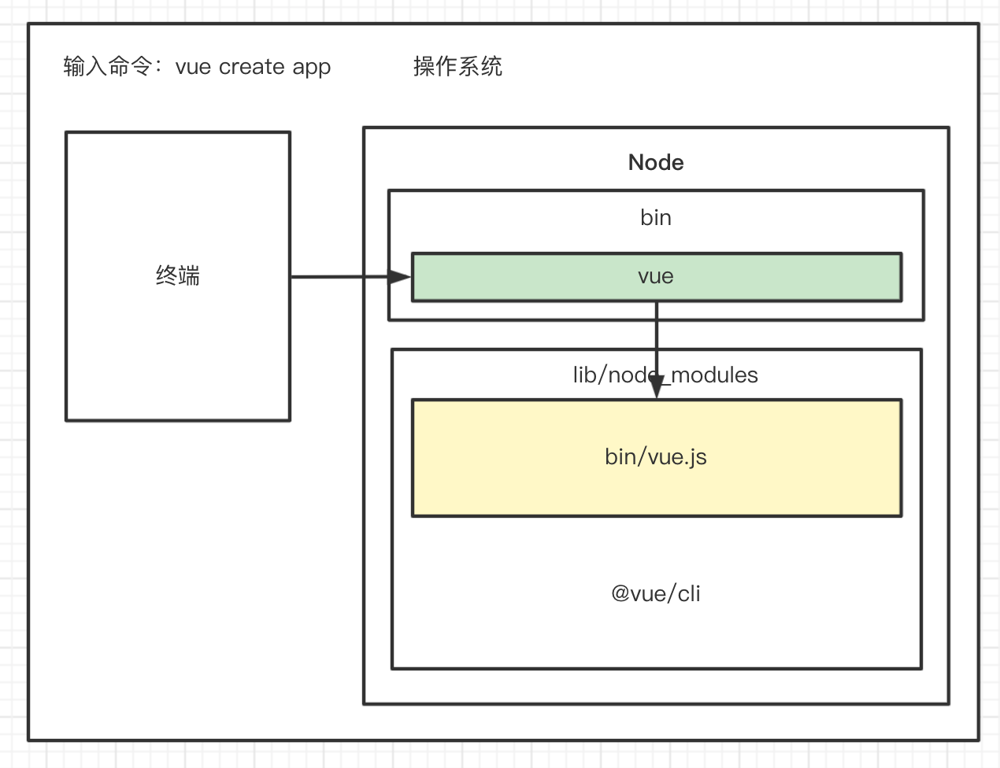

# 脚手架

## 脚手架的搭建学习

### 脚手架的核心价值
- 自动化：项目重复代码拷贝/git操作/发布上线操作
- 标准化：项目创建/git flow/发布流程/回滚流程
- 数据化：研发过程系统化、数据化，使得研发过程可以量化

### 脚手架的理解
脚手架本质是一个操作系统的客户端，它通过命令行执行，比如：

```bash
vue create vue-test-app
```

上面这条命令由3个部分组成:
- 主命令：vue
- command：create
- command 的 params：vue-test-app

它表示创建一个vue项目，项目的名称 为 vue-test-app，以上是一个比较简单的脚手架命令。

实际场景中可能比较复杂，比如当前目录已经存在了，我们需要覆盖当前目录下文件，强制进行安装vue项目。



- 当我们在终端中输入vue后，会在环境变量中找到vue指令，which vue(在mac中，可以输入which vue 查看某些命令是否存在)。
我在本机中输入 which vue 输出vue这个命令的指令所在的目录。
```bash
which vue
/usr/local/bin/vue
```
根据输出的信息，我进入 /usr/local/bin 目录。执行`ll`命令，查看vue命令的软链，因为我是通过yarn全局安装的vue脚手架。所以链接指向的是yarn的目录。

```bash
vue -> ../../../Users/louis/.config/yarn/global/node_modules/.bin/vue
```

进入软链接所对应的文件夹，查看vue命令最终的指向
```bash
lrwxr-xr-x  1 louis  staff    22B  3 30 21:12 vue -> ../@vue/cli/bin/vue.js
```
从上面路径可以看出，最终的vue指向 node_modules/@vue 文件夹。也就是安装的vue脚手架核心代码所在的地方

让我们总结一下：
- 终端中输入 vue create vue-test-app
- 终端中解析出vue命令
- 终端在**环境变量**中找到vue命令
- 终端根据vue命令链接到实际文件vue.js
- 终端利用node执行vue.js
- vue.js解析 command / options
- vue.js 执行 command
- 执行完毕，退出执行


### 发布属于自己的第一个脚手架

首先，首先我们需要创建一个npm的项目。在终端执行命令：
```
npm init -y
```
会生成一个package.json 文件

```json
{
  "name": "zf-process-cli",
  "version": "1.0.0",
  "description": "",
  "bin": {
    "zf-process-cli": "bin/index.js"
  },
  "main": "index.js",
  "scripts": {
    "test": "echo \"Error: no test specified\" && exit 1"
  },
  "keywords": [],
  "author": "chupengfei <chupengfeiit@gmail.com> (https://github.com/MagicalBridge)",
  "license": "ISC"
}
```

第二步：在根目录下创建一个bin目录，并创建一个index.js.

```
├── bin
│   └── index.js
└── package.json
```

第三步：先登录 npm 官网，如果自己使用nrm管理 npm 源的时候，不要忘记了切换到npm官方源。

```
nrm use npm // 切换到官方源进行处理
npm login 
```
按照要求填写用户名、密码、邮箱。

第四步：执行 npm publish 这一步需要注意，可能会因为发布过相同的版本而没有办法发布成功，注意修改版本。

### 脚手架的本地调试

第一步: 进入到脚手架所在的目录，执行 npm link。

具体的场景, 我本地创建一个脚手架, 还没有发布到线上，不能执行 `npm install -g zf-process-cli` 这种形式的安装。又想要调试脚手架是否可运行，可以在脚手架目录下执行执行`npm link`，

```shell
zf-process-cli git:(main) npm link

added 1 package, and audited 3 packages in 1s

found 0 vulnerabilities
```

第二步：如何确定脚手架本地已经链接成功？
此时使用 `which zf-process-cli` 查看当前脚手架的可执行命令已经被连接到了全局的node_module的bin目录下。如果显示已经连接到全局的node_module的bin目录下，说明已经连接成功，此时在终端中执行 脚手架的命令，就能启动脚手架。

```shell
zf-process-cli git:(main) ✗ which zf-process-cli
/Users/louis/.nvm/versions/node/v12.18.3/bin/zf-process-cli
```
事实上，我们在全局安装的所有的node_modules包都会默认放在这个目录下面
```shell
zf-process-cli git:(main) ✗ which npm
/Users/louis/.nvm/versions/node/v12.18.3/bin/npm

zf-process-cli git:(main) ✗ which yarn
/Users/louis/.nvm/versions/node/v12.18.3/bin/yarn
```
第三步：我们修改 脚手架中的代码，此时执行脚手架命令，会实时同步代码。

第四步：如何移除本地的链接？
我曾经尝试过使用`npm unlink zf-process-cli` 并没有成功。真实生效的命令是执行
```shell
npm uninstall -g zf-process-cli
```
这样就从全局的node_modules bin 目录下将脚手架移除了。

我们不禁会好奇，为什么会有这种情况，我们进入本地全局node_modules的下面bin目录执行如下操作

```shell
bin git:(f355b32) ✗ ll zf-process-cli
lrwxr-xr-x  1 louis  staff    47B  8 30 07:52 zf-process-cli -> ../lib/node_modules/zf-process-cli/bin/index.js
```

实际上执行link之后，生成了一个软连接，`bin/zf-process-cli` 指向的是 `../lib/node_modules/zf-process-cli/bin/index.js` 这个包的入口文件，这个是我们在package.json 中配置的规则。

```json{5-7}
{
  "name": "zf-process-cli",
  "version": "1.0.0",
  "description": "",
  "bin": {
    "zf-process-cli": "bin/index.js"
  },
  "main": "index.js",
  "scripts": {
    "test": "echo \"Error: no test specified\" && exit 1"
  },
  "keywords": [],
  "author": "chupengfei <chupengfeiit@gmail.com> (https://github.com/MagicalBridge)",
  "license": "ISC"
}
```

### 分包联合调试

在实际开发过程中，由于脚手架功能较多，不可能将所有的内容都写在一个包之中，需要将脚手架进行分包处理。这就是涉及到分包的联合调试，有这样的文件目录：

```
# zf-process-cli
.
├── core // 核心模块
│   ├── bin
│   │   └── index.js
│   └── package.json
└── lib // lib 工具模块
    ├── package.json
    └── src
        └── index.js
```

lib包还没有发布到npm线上的时候，就能够进行调试，这个应该如何操作呢？

第一步：在lib包中执行 `npm link` 变成全局模块。
```shell
# lib 目录下 
npm link
```
因为lib是一个库文件，且没有配置bin入口，因此执行完之后，再执行 which lib 是找不到的。但是在node_modules 中是能够找到lib 这个文件的。

第二步：进入 core 目录 执行 `npm link lib`
```shell
# core 目录下 
npm link lib
```
这样就能在core目录下添加一个node_modules文件夹，里面存放的就是lib目录。
```
# zf-process-cli
.
├── core
│   ├── bin
│   │   └── index.js
│   ├── node_modules
│   │   └── lib -> ../../lib
│   └── package.json
└── lib
    ├── package.json
    └── src
        └── index.js
```
第三步: 在core中引入 lib 模块的函数,可以使用。

```js
// core/bin/index.js
#!/usr/bin/env node
const lib = require("lib")

console.log(lib.sum);

console.log("welcome process-cli")
```

### 深入理解 npm link 命令

经过上述两个简单的用例可以看出来，无论是单一文件发布成脚手架，还是多包状态下调试，都离不开一个命令`npm link`。

- `npm link you-lib`: 将当前项目中node_modules下指定的库文件链接到 node 全局下 node_module下的库文件
- `npm link`: 将当前项目链接到 node 全局 node_modules中作为一个库文件，并解析 bin 配置创建可执行的文件

### 总结一下脚手架本地link标准流程
- 因为本地的脚手架还没有发布上线，但是想要实现和发布后的脚手架的使用效果，首先在本地执行
``` shell 
cd your-cli-dir
npm link
```
执行上述操作之后，就可以像使用vue脚手架那样使用这个自己的脚手架了，而且更改了代码还能实时更新。

- 由于分包处理的原因，有时候脚手架需要链接本地的lib库
```bash
cd your-lib-dir
npm link # 将本地的lib库链接为全局的库

cd your-cli-dir
npm link your-lib # 进入脚手架目录，link lib库
```

### 总结一下如何解除本地链接
- 首先进入本地的lib库 解除本地链接
```bash
cd your-lib-dir
npm unlink
```

- 进入cli目录 解除链接
```bash
cd your-cli-dir
# link 存在
npm unlink your-lib 
# link 不存在
rm -rf node_modules
npm install
```

### 如何解除本地链接呢？
解除的步骤和链接的步骤是相反的。

- 第一步: 在core目录中执行`npm unlink lib` 这个步骤执行完毕后lib从core的依赖中解除。
- 第二步: 删除node_modules依赖，删除 package.lock 文件。
- 第三步: lib link到全局之后 执行 `npm  remove -g lib` 删除依赖包，然后删除 package.lock 文件。

## 使用 lerna
lerna 是一款基于git + npm非常优秀的多包管理工具，上面我们手动创建的包可以很方便的交给工具。

它有诸多优势，能够大幅减少重复操作，提升操作的标准化，lerna 是架构优化的产物，它揭示了一个架构的真理：
>项目复杂度提升之后，就需要对项目进行架构优化，架构优化的主要目的往往都是以效能为核心。

我们常见的优秀的开源项目 babel、vue-cli 等都是基于 lerna 来管理的。

### lerna 解决了什么痛点
- 重复操作：
  - 多package 本地 link
  - 多package 依赖安装
  - 多package 单元测试
  - 多package 代码提交
  - 多package 代码发布
- 版本一致性
  - 发布时候版本一致性
  - 发布后相互依赖版本升级


### 脚手架项目初始化
- 1 使用 npm init -y 初始化一个npm 项目。
- 2 在本地全局安装lerna,这样方便使用。
- 3 执行 `lerna init` 初始化lerna项目。
- 4 这里需要注意，使用lerna 创建的项目会自动初始化一个git。
- 5 创建 .gitignore 文件，用于忽略文件

lerna init 操作执行之后，会在项目中生成一个 `lerna.json` 的文件,并且会生成一个packages文件夹。

```json
{
  "packages": [
    "packages/*"
  ],
  "version": "1.0.0"
}
```
这两个属性中packages代表之后的安装的包存放的位置。

### 创建package

```
lerna create <name> [loc] 
```
这是创建包的命令，指定包名`<name>`（使用尖括号包裹的内容都是必须填写的），`[loc]` 方括号包裹起来的内容是可以不写的，用来手动指定路径。

- 1、执行`lerna create core`创建一个叫做core的包，这里的core显示的是文件夹的名称，需要注意的是，我们需要**新建组**，新建组后在组里面创建子包，否则直接注册子包大概率已经被注册过了。如下图所示，第二行，我们创建的包是在 @zf-mock-cli 这个组下面。

发布之前，需要在npm的官方网站中注册一个组信息，否则包是上传不上去的。

```json {2}
{
  "name": "@zf-mock-cli/core",
  "version": "1.0.0",
  "description": "> TODO: description",
  "author": "褚鹏飞 <540788769@qq.com>",
  "homepage": "https://github.com/MagicalBridge/architect-all-in-one#readme",
  "license": "ISC",
  "main": "lib/core.js",
  "directories": {
    "lib": "lib",
    "test": "__tests__"
  },
  "files": [
    "lib"
  ],
  "publishConfig": {
    "registry": "https://registry.npm.taobao.org/"
  },
  "repository": {
    "type": "git",
    "url": "git+https://github.com/MagicalBridge/architect-all-in-one.git"
  },
  "scripts": {
    "test": "echo \"Error: run tests from root\" && exit 1"
  },
  "bugs": {
    "url": "https://github.com/MagicalBridge/architect-all-in-one/issues"
  }
}
```

- 2、 执行lerna create utils 创建一个工具包。工具包也放在 @zf-mock-cli 组下面。

```json {2}
{
  "name": "@zf-mock-cli/utils",
  "version": "1.0.0",
  "description": "> TODO: description",
  "author": "褚鹏飞 <540788769@qq.com>",
  "homepage": "https://github.com/MagicalBridge/architect-all-in-one#readme",
  "license": "ISC",
  "main": "lib/utils.js",
  "directories": {
    "lib": "lib",
    "test": "__tests__"
  },
  "files": [
    "lib"
  ],
  "publishConfig": {
    "registry": "https://registry.npm.taobao.org/"
  },
  "repository": {
    "type": "git",
    "url": "git+https://github.com/MagicalBridge/architect-all-in-one.git"
  },
  "scripts": {
    "test": "echo \"Error: run tests from root\" && exit 1"
  },
  "bugs": {
    "url": "https://github.com/MagicalBridge/architect-all-in-one/issues"
  }
}

```

- 3、 使用lerna add 安装依赖 

```shell
lerna add <package> [@version] [--dev] [--exact] [--peer] 
```

从上面的命令我们可以看到 package 必须要填写，版本信息可以不选。

::: warning
注意，如果我们直接执行 lerna add xxx 默认 lerna 会将package 安装到所有的包中
:::

```shell
➜  zf-mock-cli git:(main) ✗ lerna add mime
lerna notice cli v4.0.0
lerna info Adding mime in 2 packages
lerna info Bootstrapping 2 packages
lerna info Installing external dependencies
lerna info Symlinking packages and binaries
lerna success Bootstrapped 2 packages
```
从上面的安装信息可以看到，默认 lerna 将mime 模块安装到了 utils 和 core 两个包中。

如果我们想要安装到指定目录下应该如何操作呢？只需要跟上一个具体的路径就好.

```shell
lerna add <package> packages/utis
```

具体操作效果：
```shell
➜  zf-mock-cli git:(main) ✗ lerna add mime packages/utils 
lerna notice cli v4.0.0
lerna info Adding mime in 1 package
lerna info Bootstrapping 2 packages
lerna info Installing external dependencies
lerna info Symlinking packages and binaries
lerna success Bootstrapped 2 packages
```

- 4 使用lerna clean 删除node_modules

使用场景，安装依赖的时候，如果不指定安装到哪一个目录，默认会给所有目录都安装上指定的依赖。

当我们想要把 packages 下面的所有包的node_modules都删除的时候，可以使用这个命令。

需要注意的是，虽然我们把node_modules删除了，但是package.json 中的依赖并没有删除。在特定场景下需要手动进行删除。


- 5 使用lerna bootstrap 重新安装依赖

使用场景：在使用 lerna clean 删除的依赖，使用bootstrap，就能全部安装回来

```shell
lerna bootstrap
lerna notice cli v4.0.0
lerna info Bootstrapping 2 packages
lerna info Installing external dependencies
lerna info Symlinking packages and binaries
lerna success Bootstrapped 2 packages
```

- 6 learn link 链接依赖

如果我们创建的package中有互相的依赖,  `learn link` 可以帮助我们创建软连接。我们直接在项目中直接执行 `lerna link` 是没有多少效果的。我们必须在需要链接的模块下，手动添加依赖的名称和版本，然后执行 `lerna link` 这样才有效果。


### 脚手架的开发和测试
- 1 lerna exec 执行 shell 脚本 

在每个包下面执行脚本命令，需要在具体的命令前加上 `--` :

我们在上面的操作中使用 

```shell
# 删除所有package 里面的 node_modules 依赖
lerna exec -- rm -rf node_modules

# 执行命令之后的效果
➜  zf-mock-cli git:(main) ✗ lerna exec -- rm -rf node_modules
lerna notice cli v4.0.0
lerna info Executing command in 2 packages: "rm -rf node_modules"
lerna success exec Executed command in 2 packages: "rm -rf node_modules"
```

::: warning
执行这个命令是在packages这个目录下面，而不是在根目录下面，这点需要特别注意。
:::

如果我们想要在指定目录下面执行脚本，需要添加 `--scope` 后缀

比如，我们只想要删除 utils 下面的 node_modules 可以执行下面的命令

这里需要注意的是，删除需要 **指定包名称**

```shell
# 只删除 utils 下面的 node_modules
lerna exec --scope @zf-mock-cli/util rm -rf node_modules

# 执行效果
➜  zf-mock-cli git:(main) ✗ lerna exec --scope @zf-mock-cli/utils -- rm -rf node_modules
lerna notice cli v4.0.0
lerna notice filter including "@zf-mock-cli/utils"
lerna info filter [ '@zf-mock-cli/utils' ]
lerna info Executing command in 1 package: "rm -rf node_modules"
lerna success exec Executed command in 1 package: "rm -rf node_modules"
```

- 2 lerna run 执行 npm 命令

这个命令主要是执行 npm 的script 脚本，默认行情况下，会执行所有的包下面的 package.json 下面的脚本信息。 同样这个命令也支持 --scope 选项。

这个命令的执行 也是作用在packages里面的命令 

- 3 lerna clean 清空依赖
```shell
lerna clean 
```
执行上述命令之后，会删除node_module 信息，但是package.json 里面的内容不会被删除。这点需要注意
- 4 lerna bootstrap 重新安装依赖

### 脚手架发布上线

脚手架的发布上线，一般需要升级版本号，这种都属于常规操作。

- 1 lerna version bump version
- 2 lerna changed 查看上一个版本以来的所有变更

使用场景：我分别修改了 core 和 utils 两个包中的代码，在执行这个命令的时候打印两个包内容需要发布。

```
➜  cdp-wpm-cli git:(master) ✗ lerna changed 
info cli using local version of lerna
lerna notice cli v4.0.0
lerna info Assuming all packages changed
@cdp-wpm/core
@cdp-wpm/utils
lerna success found 2 packages ready to publish
```

- 3 lerna diff 查看diff
查看修改了哪些代码内容。


- 4 lerna publish 项目发布
发布过程中是非常坎坷的，对于组npm包而言，不仅仅是登录问题，还需要在package.json文件中添加如下字段：

```json
"publishConfig": {
  "access": "public"
},
```

只有添加了这个配置的文件才能发布上去。

还需要注意的点是，每当执行一次提交，都会在分支上打上tag。重复打tag会报错。

## lerna源码阅读
首先需要掌握源码调试的技巧。

- 1 入口文件在core目录下的lerna文件夹中

- 2 通过 core/lerna/package.json 中的bin字段可以看出来，真正的入口文件其实是 cli.js
```js
#!/usr/bin/env node

"use strict";

/* eslint-disable import/no-dynamic-require, global-require */
const importLocal = require("import-local");

if (importLocal(__filename)) {
  require("npmlog").info("cli", "using local version of lerna");
} else {
  require(".")(process.argv.slice(2));
}
```
上面代码中的 `require(".")` 其实是一种简写，点是相对路径的表示，默认会加载index.js 

- 3 在阅读lerna的源码的时候，会看到在依赖列表中看到了 `file:xxx` 这种形式。这种方法是非常值得借鉴的。

这种方法可以应用到我们当前编写的脚手架中。

使用场景：目前我们的脚手架中 只有 core 和 utils 两个包，我想在 core 中引用utils包。

首先在core的package.json中添加如下代码, 使用file这种写法，将uitls依赖进来

```json
"dependencies": {
  "@cdp-wpm/utils": "file:../utils",
  "koa": "^2.13.4"
},
```

然后在core目录下执行 `npm install`,  生成软链接，这样在core包中使用require语法加载 utils包之后，就能正常使用了。

core/bin/index.js 代码

```js
#! /usr/bin/env node 

const utils = require("@cdp-wpm/utils")

// 执行utils
utils()

console.log("hello cdp-wpm-cli")
```

## 核心开发
在学习lerna源码的时候，学习到了一个比较有意思的模块 `import-local`。

简单来说，使用 `import-local` 可以让全局安装的包使用你自己项目中自己的版本。意思是假设你在电脑中全局安装了webpack4，但是项目中使用的是webpack5，当你在项目中使用webpack命令的时候，他会优先使用webpack5版本，当然这个前提是你的node_modules已经安装了webpack。

import-local常常在cli工具中使用，可以方便cli工具开发（可以参考lerna）。使用方式如下：

```js
const importlocal = require("import-local")

if (importlocal(__filename)) {
  require("npmlog").info("cli", "using local version of lerna");
} else {
  require(".")(process.argv.slice(2));
}
```

看上面的代码，传入当前文件的执行路径，满足条件执行对应的逻辑即可。

import-local 执行时候通过传入 `__filename` 作为运行参数执行, `__filename`在node中为当前模块的文件名。这是当前模块文件的已经解析符号链接的**绝对路径**。

例如 从 `/Users/mjr` 运行 `node example.js` 

```js
console.log(__filename);
// 打印: /Users/mjr/example.js
```
[参考文章](https://juejin.cn/post/7015813508814077989)


## 模块拆分

首先根据功能点拆分成几个模块：
- 核心模块 core
- 命令模块 commands 
- 模型模块 models
- 工具模块 utils

上面几个模块就是我们的拆包的策略，将功能模块拆分之后，维护起来会更加的清晰。

首先在脚手架的 目录中创建这几个文件夹：
commands、core、models、utils

并且lerna.json文件中需要做对应的修改。

```json
{
  "packages": [
    "core/*",
    "commands/*",
    "models/*",
    "utils/*"
  ],
  "version": "0.0.6"
}
```

我们删除了原来的packages文件夹, 将里面的core和utils文件夹分别放入 core目录和utils目录。

因为core模块中安装了 utils模块，且路径换了，所以，修改core的package.json文件：

```json
...
 "dependencies": {
    "@cdp-wpm/utils": "file:../../utils/utils"
  },
...
```

删除原本两个包中安装的node_modules,重新执行 npm install 完成模块的安装。

修改 core/core 为 core/cli, 删除link之后，重新link。

安装 import-local 模块，模仿 lerna 脚手架的入口文件配置。

### core 模块拆分
核心模块 整体分为 3 个阶段
- 准备阶段
- 命令注册
- 命令执行


### 开发检查版本号的功能

在node中，使用`require`函数天生可以加载`.js、.json、.node`结尾的文件。因此在实现 加载版本号功能的时候，使用了下面的代码

```js
const pkg = require("../package.json")
console.log(pkg.version)
```

这其中还包含一些技术细节:

对于node来说:
- 如果解析js结尾的文件的时候，要求我们必须输出一个 module.exports 
- 如果解析.json 文件，会直接调用 JSON.parse 方法，解析成一个对象
- 如果是 .node 结尾的文件，会调用C++方法。当成一个模块

如果是其他的后缀，会默认使用js引擎去解析，如果解析不了就报错，解析成功就能成功执行。

### 封装 npmlog 方法

我们需要一个专门的包来打印日志，同样的需要使用lerna进行封装，并且在utils目录下创建

```shell
lerna create @cdp-wpm/log
```

使用上述命令创建的包会创建在 core 目录下，我们还需要修改 main 对应的入口文件。

因为我们需要基于npm-log封装，所以我们需要安装依赖：

```shell
lerna add npmlog utils/log
```

安装成功后，会在log中看到依赖，但是其他部分并不会看到依赖。

开发log的代码，打印 info 级别的日志。

在core模块中引用的时候，我们使用的依然是file协议，所以不要忘记重新在core文件夹中执行npm install 安装依赖。

对于npmlog 这个方法包来说, 我们可以自定义方法，使用的和info级别的日志一样，需要借助一个 addLevel 方法。

```js
log.addLevel("success", 2000, {fg:"green",bold:true})
```

日志的级别是有比较严格的限制的，（第二个参数显示的数字其实就是代表级别的高低）所以我们需要根据当前环境变量来控制日志的级别。

```js
const log = require("npmlog")
log.level = process.env.LOG_LEVEL ? process.env.LOG_LEVEL : "info"
log.heading = "cdp-wpm"
log.headingStyle = { fg: "yellow", bg: "black" }
log.addLevel("success", 2000, { fg: "green" })
```

### 封装检查node版本的方法

之所以需要检查node的版本，主要是为了防止因为安装了高版本的node导致某些方法不兼容。

因为我们在代码中应该对于node版本做一个判断。

这里需要用到1个关键的npm包 semver: 用于版本的判断。

在node中，我们可以通过 process.version 来获取当前运行环境的 node 版本号

### 检查root权限
在mac系统中，如果我们使用root权限去创建的一些目录或者文件，作为普通的权限的用户是没有办法进行修改的，这样的操作就会出现问题，因此，我们就需要对这样场景进行降级操作，使用普通用户的权限去操作。

我们这里使用一个库 root-check

我们在 core/cli 这个目录下进行安装

这里需要注意一件事情, 新版本的root-check使用的是ESModule标准，不能使用动态加载。所以我安装了1.0的版本，解决了这个问题。

process.geteuid() 这个方法 能够打印 我们目前的用户权限。

### 检查用户主目录
这里需要使用到一个包：`user-home` 用来判断是否是用户的主目录。

还需要一个`path-exist`这个包判断路径是否存在

首先还是需要在`core/cli`路径下执行下这两个库的安装操作

这里需要注意的是 `path-exists` 应该安装4.0版本，否则更加新的版本是`ESModule`。在现有的脚手架项目中并不是很好使用。

### 处理一些参数问题
对于脚手架来说，可能需要根据输入的参数 是否带有 --debug 来按照不同的标准打印日志。这就需要我们处理参数问题。

需要封装一个 checkInputArgs的 方法用于处理这种场景。

解析参数，我们使用一个仓库 `minimist` 来帮助我们解析入参。

[minimist](https://www.npmjs.com/package/minimist)

安装好了之后，在命令行输入命令 控制台打印

```shell
➜  cli git:(master) ✗ cdp-wpm --debug --help
cdp-wpm info cli 0.0.11
{ _: [], debug: true, help: true }
```

```js
function checkArgs() {
  if (args.debug) {
    process.env.LOG_LEVEL = "verbose"
  } else {
    process.env.LOG_LEVEL = "info"
  }
  // 在确定好了 log——level 之后重新给他赋值
  log.level = process.env.LOG_LEVEL
}
```

上面的函数中，在函数最后修改了 log 的 level的级别，在最后打印的时候 也是生效的。

### 检查环境变量

环境变量非常有用，一些用户的信息可以存在配置文件中。不用写在代码中。

这里需要使用到一个 npm 库 dotenv 非常好用。

这个仓库的使用也是比较简单，拥有一个 config 方法，调用方式类似于这样：

```js
require("dotenv").config()
```

默认情况下, 是获取当前目录下的 `.env` 文件, 如果想要获取用户主目录下面.

最终想要实现的效果是： { home: '/Users/louis', cliHome: '/Users/louis/.cdp-wpm' }

在mac中 使用 cd ~ 命令就能够快速进入用户主目录。

这里面还学习到了一个 vim 操作的小技巧，
- 如何删除一行: 使用dd
- 如果撤销操作: 使用u
- 如何快速复制一行: 使用yy
- 如何将复制的一行黏贴出来: 使用p 

### 检查是否为最新版本

这个检查是否全局更新的功能逻辑梳理：
- 获取最近的版本号和模块名
- 调用npm api 获取所有的版本号使用通用的apihttps://registry.npmjs.org/@cdp-wpm/core
- 提取所有的版本号，比对哪些版本号是大于当前版本号的
- 给出最新的版本号，提示用户更新到该版本

封装调用npm的方法，单独起一个包
```shell
lerna create @cdp-wpm/get-npm-info ./utils/get-npm-info
```

这里发现lerna的一个bug, 就是它会默认安装到lerna.json配置文件的第一个目录下，比如说我的配置是

```json
{
  "packages": [
    "core/*",
    "utils/*",
    "commands/*",
    "models/*"
  ],
  "version": "0.0.12"
}
```

那么就会默认安装在core目录下，为此，我还修改了这个配置顺序

`get-npm-info` 作为一个单独的npm包来使用。单独发布到npm上面。

因为我们要发起一个请求，所以需要在`utils`中安装`axios`这个仓库。

为了拼接url我们还可以安装一个npm包 `url-join` 节省我们的工作量 

从npm官方中拉取版本号的信息，拉取信息之后主要比对当前的版本号和最新的版本号之间的差距。

## 注册命令逻辑
[注册命令](./注册命令.md)


