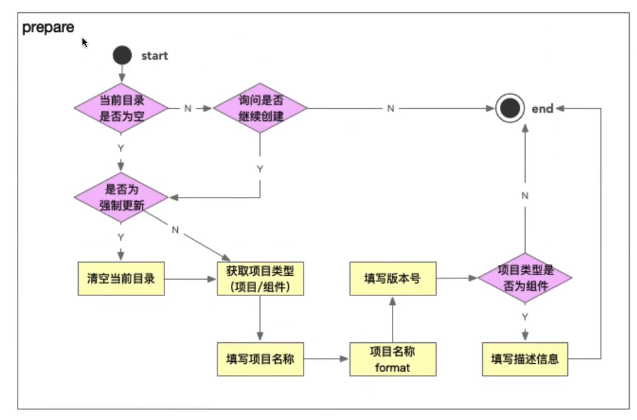
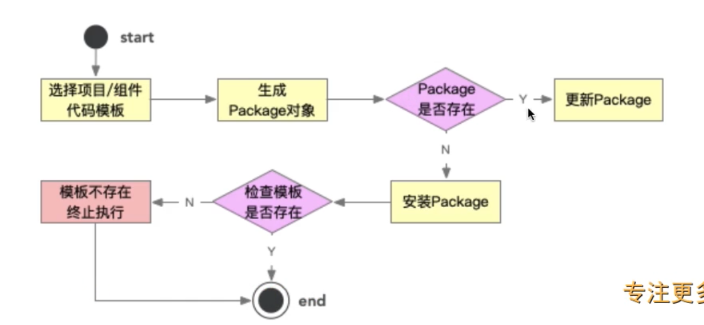

# 创建项目流程设计和开发

- 脚手架的项目创建功能的架构设计
- 通过命令行交互获取项目的基本信息
- 服务端 + 数据库集成
- 开发前端项目模板
- 服务端获取项目模板的api开发
- 项目模板下载功能的开发

## 2-1：脚手架项目创建的思考:
- 可扩展性：能够快速复用到不同的团队，适用不同团队之间的差异
- 低成本：在不改送脚手架源码的情况下，新增模板，且新增模板的成本很低
- 高性能：控制存储空间，安装时候充分利用node的多进程提升安装性能


## 2-2: 项目创建前的准备阶段的架构设计

 
我们是通过`process.cwd`获得目录的，所以准备阶段，我们首先需要判断当前执行命令的这个目录是不是有文件，有文件我们需要做一些和用户的交互操作。

这里涉及到了一个脚手架的开发技巧，我们之所以加上许多的校验，是因为本身脚手架的安装就是比较耗费时间的，如果因为一些参数的问题重新开始，是比较耗费时间的。

## 2-3: 下载模板的架构设计
我们把模板设置成一个npm包的形式，这样比较灵活。


## 3-1: 项目创建准备阶段

首先应该判断我们打算安装模板的目录是否为空，为此我们封装一个函数。

```js
isCwdEmpty() {
  const localPath = process.cwd();
  // fs.readdirSync 返回一个数组 当前文件的里面的文件夹的名称
  let fileList = fs.readdirSync(localPath)
  // 文件过滤的条件
  fileList = fileList.filter((file) => {
    !file.startsWith(".") && ["node_modules"].indexOf(file) < 0
  })
  // 如果过滤出来的文件是空的说明目录为空
  return !fileList || fileList.length <= 0
}
```

这个方法在prePare中进行调用，如果我们判断目录不为空的情况下，我们询问用户是否清空目录。

## 3-1 3-2 3-3: 询问用户是否清空目录
这里涉及到inquire的基本用法。

```js
#! /usr/bin/env node

const inquirer = require("inquirer");

inquirer
  .prompt({
    type: "input",
    name: "yourname",
    message: "your name",
    default: "noname",
    validate:function(v) { // 校验函数
      return typeof  v === "string"
    },
    transformer: function(v) {
      return  v + ':' //  
    },
    filter:function(v) {
      return v+'123'
    }
  })
  .then((answers) => {
    console.log(answers);
  })
  .catch((error) => {
    console.log(error);
  });
```
用法相对来说比较简单，就是监听用户的输入，然后打印参数。 这里需要注意一个细节，就是最新的版本的这个包只支持ESModule。

validate 函数用于校验使用，transformer函数用于展示使用，并不会改变用户输入的具体的值。filter 不太一样, 会改变我们输入的结果。

type不仅仅可以指定input类型，还可以指定number，confirm类型，或者list类型，对于confirm来说，类似于我们使用其他脚手架中yes或者no。

## 3-4: 强制清空当前目录功能

在上文中提到，判断想要安装模板的文件目录是否为空。不需要做别的过滤。

```js
if (!this.isCwdEmpty(localPath)) {
  // 询问是否继续创建模板
  const { ifContinue } = await inquirer.prompt({
    type: "confirm",
    name: "ifContinue",
    default: false,
    message: "当前文件夹不为空，是否继续创建项目？",
  })
  // console.log(ifContinue)
  if (ifContinue) {
    // 清空当前目录
    fse.emptyDirSync(localPath)
  }
} else {
  console.log("文件夹")
}
```

为了保险起见，我们还应该进行二次确认操作。这样比保险。

```js
if (!this.isCwdEmpty(localPath)) {
  // 询问是否继续创建模板
  const { ifContinue } = await inquirer.prompt({
    type: "confirm",
    name: "ifContinue",
    default: false,
    message: "当前文件夹不为空，是否继续创建项目？",
  })
  // console.log(ifContinue)
  if (ifContinue) {
    // 清空当前目录 这里为了误操作，给用户二次操作
    const { confirmDelete } = await inquirer.prompt({
      type: "confirm",
      name: "confirmDelete",
      default: false,
      message: "是否确认清空目录？",
    })
    if (confirmDelete === true) {
      fse.emptyDirSync(localPath)
    }
  }
} 
```

## 3-5: 获取项目的基本信息的操作

清空完目录之后，我们需要获取项目的基本信息。主要是使用交互的形式来获取用户输入的项目名称和版本号。
```js
  // ...
  async getProjectInfo() {
    // 1、选择创建项目还是组件
    const { type } = await inquirer.prompt({
      type: "list",
      name: "type",
      message: "请选择初始化的类型",
      default: TYPE_PROJECT,
      choices:[{
        name: "项目",
        value:TYPE_PROJECT
      },{
        name:"组件",
        value:TYPE_COMPONENT
      }]
    })
    
    if (type === TYPE_PROJECT) {
      // 2、获取用户输入的基本信息
      const projectInfo = await inquirer.prompt([{
        type: "input",
        name:"projectName",
        message: "请输入项目的名称",
        default:"",
        validate: (v) => {
          return typeof v === "string"
        },
        filter: (v) => {
          return v
        }
      },{
        type: "input",
        name:"projectVersion",
        message: "请输入项目的版本号",
        default:"",
        validate: (v) => {
          return typeof v === "string"
        },
        filter: (v) => {
          return v
        }
      }])
      console.log(projectInfo)
      // ...
    }
  }
```

上述代码中，提供了两种模式，一种模式是创建一个项目，另一个模式是创建一个组件。也使用到了连续输入的功能。


## 3-6: 项目名称和版本号的校验

这算是一个附属的能力，不能让用户输入一些不合法的文件名称。对于版本号的校验，有semver这个库可以帮我们去做。

validate 内部可以使用内置async方法进行验证。
```js
validate: function(v) {
  const done = this.async();
  setTimeout(() => {
    if (!semver.valid(v)) {
      done("请输入符合npm规范版本号")
    }
    done(null, true)
  }, 0);
  return !!semver.valid(v)
},
```

## 4-1 4-2: 下载模板功能实现流程

下载模板需要首先获取模板的信息，这就要借助服务端的能力去实现这个功能。

这里准备使用egg.js来搭建服务端的功能。

安装使用egg.js非常简单方便，按照官方文档的步骤一步步执行就可以了。

[官方文档](https://www.eggjs.org/intro/quickstart)

## 4-3: 创建第一个接口

首先编写router文件
```js
"use strict"

/**
 * @param {Egg.Application} app 
 */
module.exports = (app) => {
  const { router, controller } = app
  router.get("/project/template", controller.project.getTemplate)
}
```

上面的代码是配置了一个路由，当我们请求 `/project/template`, 就会执行 `getTemplate` 这个方法。

controller 文件夹下，创建`project.js`文件
```js
'use strict';

const Controller = require('egg').Controller;

class ProlectController extends Controller {
  async getTemplate() {
    const {ctx} = this
    ctx.body = "project"
  }
}
module.exports = ProlectController;
```
件这个controller模块导出。

## 4-4：mongoDB数据库的准备


