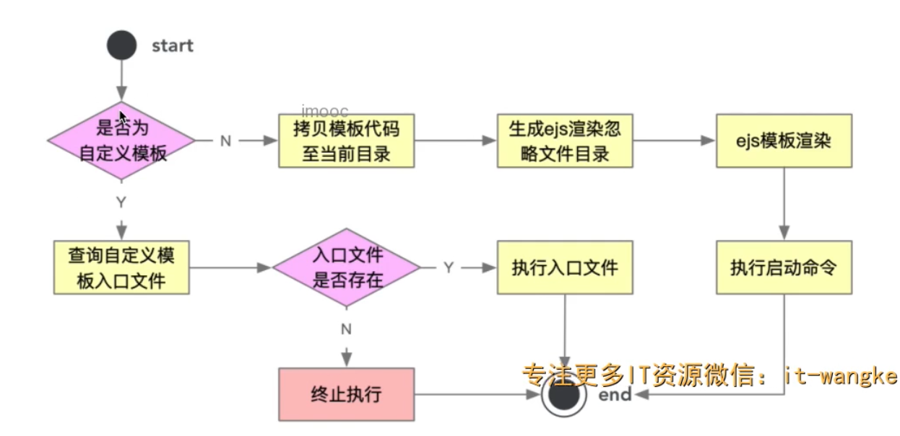

---
sidebar: auto
---

# 脚手架项目和组件初始化


之前的操作解决的是将项目的模板下载到了本地中，本章需解决的问题是，将下载的文件安装到执行命令的文件夹。进行一些ejs的模板渲染替换。 

## 3-1: ejs的模板引擎三种基本用法

第一种用法： ejs.compile 
```js
const ejs = require("ejs");
let html = "<div><%= user.name %></div>";
const options = {};

const data = {
  user: {
    name: "louis",
  },
};

// 返回一个编译函数
const compileFn = ejs.compile(html, options);
const res = compileFn(data)

console.log(res);  // <div>louis</div>
```

第二种用法：ejs.render方法

```js
const renderTempStr = ejs.render(html,data,options)
console.log(renderTempStr); // <div>louis</div>
```

第二种方法和第一种方法想比较而言。关键点是要不要生成编译函数。

第三种用法：

```html
<!DOCTYPE html>
<html lang="en">
<head>
  <meta charset="UTF-8">
  <meta http-equiv="X-UA-Compatible" content="IE=edge">
  <meta name="viewport" content="width=device-width, initial-scale=1.0">
  <title><%=user.name%></title>
</head>
<body>
  <script src="./index.js"></script>
</body>
</html>
```

```js
// 返回的是一个promsie
const renderFile = ejs.renderFile(path.resolve(__dirname, 'index.html'),data,options)
renderFile.then(file=> console.log(file))
```

替换变量之后的效果展示。

```html
<!DOCTYPE html>
<html lang="en">
<head>
  <meta charset="UTF-8">
  <meta http-equiv="X-UA-Compatible" content="IE=edge">
  <meta name="viewport" content="width=device-width, initial-scale=1.0">
  <title>louis</title>
</head>
<body>
  <script src="./index.js"></script>
</body>
</html>
```

## 4-1: 引入项目模板类型和标准安装流程开发。

下载模板的流程已经开发完成，接下来我们来实现安装模板的逻辑。安装模板是第三个步骤。

修改数据库的字段，将标准模板添加一个type字段，值为normal。标识模板类型。

我们在安装模板的时候，要根据不同的类型执行不同的安装方法

```js
  /**
   * 安装模板
   */
  async installTemplate() {
    // console.log(this.templateInfo)
    // {
    //   _id: '62f6fea2cdcd35e79a0773c6',
    //   name: 'vue2标准模板',
    //   npmName: 'cdp-wpm-template-vue2',
    //   version: '0.1.0',
    //   type: 'normal'
    // }
    if (this.templateInfo) {
      if (!this.templateInfo.type) { // 如果不存在type属性 赋值为标准类型
        this.templateInfo.type = TEMPLATE_TYPE_NROMAL
      }
      if (this.templateInfo.type === TEMPLATE_TYPE_NROMAL) {
        // 走标准安装
        await this.installNormalTemplate()
      } else if (this.templateInfo.type === TEMPLATE_TYPE_CUSTOM) {
        // 走自定义的安装
        await this.installCustomTemplate()
      } else {
        throw new Error("项目模板类型无法识别")
      }
    } else {
      // 抛出异常
      throw new Error("项目模板信息不存在")
    }
  }
```

## 4-2: 拷贝项目模板功能开发
这个部分的开发核心逻辑其实是要找到模板的缓存目录位置，找到了之后，拷贝到当前的命令执行的目录。

```js
async installNormalTemplate() {
  let spinner = spinnerStart("正在安装模板")
  try {
    // 获取缓存的目录
    const templatePath = path.resolve(
      this.templateNpm.cacheFilePath,
      "template"
    )
    // 命令执行的当前目录
    const targetPath = process.cwd()
    // 确保目录是存在的
    fse.ensureDirSync(templatePath)
    fse.ensureDirSync(targetPath)
    fse.copySync(templatePath, targetPath)
  } catch (error) {
    throw error
  } finally {
    spinner.stop(true)
    console.log("安装模板成功")
  }
}
```

## 4-3 项目模板安装依赖和启动命令
这里的安装和启动的命令，是配置在接口中的，根据接口中的配置来执行操作步骤。

我们之前封装过的spawn方法就是可以执行命令的。


## 4-4 白名单命令检测功能开发


## 4-5 项目名称自动化格式开发


## 4-6 ejs动态渲染项目模板


## 4-7 init命令直接传入项目名称功能支持

