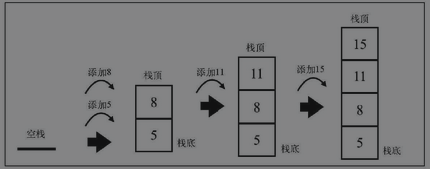
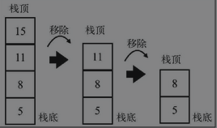

# 栈

## 栈：后入先出的数据结构
栈是一种遵从后进先出（LIFO）原则的有序集合。**新添加或者待删除**的元素都保存在栈的同一端，称作栈顶，另一端就叫栈底。在栈里，新的元素都靠近栈顶，旧元素都接近栈底。

在现实生活中，一摞书或者餐厅里面叠放的盘子都是栈的应用场景。

栈也被用在编程语言的编译器和内存中保存变量、方法调用等，也被用于浏览器历史记录（浏览器的返回按钮）。

### 一：创建一个基于数组的栈

创建一个类来表示栈
```js {3}
class Stack {
  constructor() {
    this.items = [];
  }
}
```

我们需要一种数据结构来保存栈里的元素, 我们选择数组, 数组允许我们在任何位置添加或者删除元素。由于栈遵循LIFO原则，需要对元素的插入和删除功能进行限制，我们需要声明一些方法。

- push(element): 添加一个（或者几个）新元素到栈顶。
- pop(): 移除栈顶的元素，同时返回被移除的元素。
- peek(): 返回栈顶的元素，不对栈做任何修改（该方法不会移除栈顶的元素，仅仅返回它）。
- isEmpty(): 如果栈里面没有任何元素返回true，否则返回false。
- clear(): 移除栈里面的所有元素
- size(): 返回栈里面的元素个数，该方法和数组的length属性很类似。

### 向栈中添加元素

我们要实现的第一个方法是push，该方法负责往栈里面添加新的元素，有一点很重要：该方法只添加元素到栈顶，也就是栈的末尾，push方法可以如下这样写。
```js
push(element) {
  this.items.push(element);
}
```

### 从栈移除元素

接着我们来实现pop方法，该方法主要用来移除栈里的元素。栈遵从LIFO原则，因此移出的是最后添加进去的元素。因此，我们可以利用数组的pop方法。

```js
pop() {
  return this.items.pop();
}
```
只能用push 和 pop 方法添加和删除栈中元素，这样一来，我们的栈自然就遵从了LIFO原则。

### 查看栈顶元素

我们实现一些额外的辅助方法，如果想要知道栈里面最后添加的元素是什么，可以使用peek方法。这个方法将返回栈顶的元素。

```js
peek() {
  return this.items[this.items.length-1]
}
```

因为类内部是使用的数组保存的元素，所以访问数组的最后一个元素可以用 length-1。

### 检查栈是否为空

下面我们要实现的方法是isEmpty，如果栈为空的话将返回 true，否则就返回false。

```js
isEmpty(){
  return this.items.length === 0;
}
```
使用isEmpty方法，我们能简单地判断内部数组的长度是否为0。

类似于数组的length属性，我们也能实现栈的length。对于集合，最好用size代替length。因为栈的内部使用数组保存元素，所以能简单地返回栈的长度。

```js
size() {
  return this.items.length;
}
```

### 清空栈元素
最后，我们来实现clear方法。clear方法用来移除栈里所有的元素，把栈清空。实现该方法最简单的方式如下。

```js
clear() {
  this.items = [];
}
```

完成了！栈已经实现。

### 使用Stack类

首先，我们需要初始化Stack类，然后验证一下栈是否为空

```js
const stack = new Stack();
console.log(stack.isEmpty()) // 输出为true
```

接着，往栈中添加一些元素（这里我们添加数字5和8；你可以添加任意类型的元素）。

```js
stack.push(5)
stack.push(8)
```

如果使用peek方法，将输出8，因为它是往栈里面添加的最后一个元素

```js
console.log(stack.peek()); // 输出8
```

再添加一个元素

```js
stack.push(11)
console.log(stack.size()) // 输出3
console.log(stack.isEmpty()) // 输出 false
```

我们往栈里添加了11。如果调用size方法，输出为3，因为栈里有三个元素（5、8和11）。如果我们调用isEmpty方法，会看到输出了false（因为栈里有三个元素，不是空栈）。最后，我们再添加一个元素。


```js
stack.push(15);
```

下图描绘了目前为止我们对栈的操作，以及栈的当前状态。



然后，调用两次pop方法从栈里移除两个元素。

```js
stack.pop();
stack.pop();
console.log(stack.size()) // 输出2
```

在两次调用pop方法前，我们的栈里有四个元素。调用两次后，现在栈里仅剩下5和8了。下图描绘了这个执行过程。




### 二：创建一个基于JavaScript对象的Stack类

创建一个Stack类最简答的方式就是使用一个数组来存储元素。在处理大量数据的时候，我们同样需要评估如何操作数据是最高效的。

在使用数组时，大部分方法的时间复杂度是O(n), 如果我们能直接获取元素，占用较少的内存空间，并且仍然保证所有元素按照我们的需要排列，我们也可以使用一个JavaScript对象来存储所有的栈元素，保证它们的顺序并且遵循LIFO原则。

首先，我们声明一个类

```js
class Stack {
  constructor() {
    this.count = 0;
    this.items = {};
  }
  // 方法
}
```
在这个版本的Stack类中，我们将使用一个count属性来帮助我们记录栈的大小（也能帮助我们从数据结构中添加和删除元素）。

### 向栈中添加元素
基于数组的版本中，我们可以同时向Stack类中添加多个元素，由于现在使用了一个对象，这个版本的push方法只允许我们一次插入一个元素。下面是push方法的代码

```js
push(element) {
  this.items[this.count] = element;
  this.count++;
}
```
在JavaScript中，对象是一系列键值对的集合，要向栈中添加元素，我们将使用count变量作为items对象的键名，插入元素则是它的值，在向栈插入元素后，我们递增count变量。

可以沿用之前示例来使用Stack类，并向其中插入元素5和8。

```js
const stack = new Stack();

stack.push(5);
stack.push(8);
```
在内部，items包含的值和count属性如下所示。

```js
items = {
  0: 5,
  1: 8
}
```
count = 2;

### 验证一个栈是否为空和它的大小
count属性也表示栈的大小，因此，我们可以简单地返回count属性的值来实现size方法

```js
size() {
  return this.count;
}
```
要验证栈是否为空，可以像下面这样判断count的值是否为0。
```js
isEmpty() {
  return this.count === 0;
}
```

### 从栈中弹出元素

由于我们没有使用数组来存储元素，需要手动实现移除元素的逻辑。pop方法同样返回了从栈中移除的元素，它的实现如下。

```js
pop() {
  if(this.isEmpty()) {
    return undefined
  }
  this.count--;
  const result = this.items[this.count];
  delete this.items[this.count];
  return result
}
```

首先，我们需要检验栈是否为空，如果为空，就返回undefined，如果栈不为空的话，我们会将count属性减1，并保存栈顶的值，以便删除它之后再返回。

由于我们使用的是JavaScript对象，可以用JavaScript的delete云算符偶从对象中删除一个特定的值。

我们使用如下内部的值来模拟pop操作
```js
items = {
  0: 5,
  1: 8
};
count = 2;
```
要访问的栈顶元素（即最后添加的元素8），我们需要访问键值为1的位置。因此我们将count变量从2减为1，这样就可以访问item[1],删除它，并将它的值返回了。

### 查看栈顶的值并将栈清空

上一节我们学习了，要访问栈顶元素，需要将count属性减一。那么我们看看peek方法的代码。

```js
peek() {
  if(this.isEmpty()) {
    return undefined
  }
  return this.items[this.count - 1];
}
```

要清空该栈，只需要将它的值复原为构造函数中使用的值即可。

```js
clear() {
  this.items = {};
  this.count = 0;
}
```
