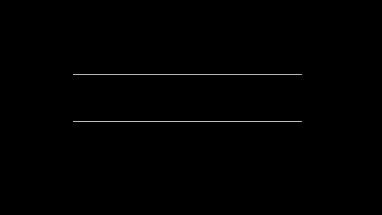

# 队列

## 队列：先入先出的数据结构

在FIFO数据结构中，将首先处理添加到队列中的第一个元素。

如上图所示，队列是典型的FIFO数据结构。插入（insert）操作也被称作入队（enqueue）,新元素始终被添加在队列的末尾。删除（delete）操作也被称为出队（dequeue）。你只能移除第一个元素。

在现实中，最常见的队列的例子就是排队。在电影院、自助餐厅、杂货店收银台，我们都会排队，排在第一位的人会先接受服务。

### 队列：实现

为了实现队列，我们可以使用数组