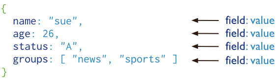

# Mongodb

## 什么是MongoDB ?

MongoDB 是由C++语言编写的，是一个基于分布式文件存储的开源数据库系统。MongoDB 旨在为WEB应用提供可扩展的高性能数据存储解决方案。

MongoDB 将数据存储为一个文档，数据结构由键值(key=>value)对组成。MongoDB 文档类似于 JSON 对象。字段值可以包含其他文档，数组及文档数组。

## 一些基本概念
- **数据库** MongoDB的单个实例可以容纳多个独立的数据库，比如一个学生管理系统就可以对应一个数据库实例
- **集合** 数据库是由集合组成的,一个集合用来表示一个实体, 如学生集合
- **文档** 集合是由文档组成的，一个文档表示一条记录, 比如一位同学张三就是一个文档

## 使用docker-compose安装mongoDB并设置密码
在服务器上部署mongo服务还是需要注意，如果不设置用户名和密码，很有可能被别人公网盗取自己的数据库文件。

