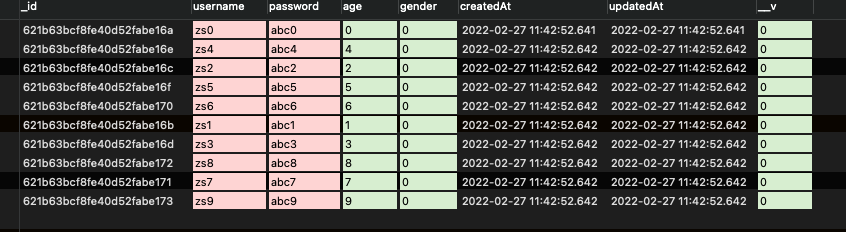

# Mongose使用

## 基本连接

mongose是比较常用的npm连接操作mongodb的工具库。

使用这个仓库连接数据库并操作的步骤可以分为几个步骤:

- 连接数据库，先看基本的连接代码,连接数据库是个异步操作 外面使用async包裹
```js
const mongoose = require("mongoose");
(async () => {
  try {
    const connect = await mongoose.connect(
      "mongodb://47.103.72.18:27017/hubble",
      {
        useUnifiedTopology: true,
        useNewUrlParser: true,
      },
      function (err) {
        if (err) {
          return console.log("数据库链接失败");
        }
        console.log("数据库连接成功");
      }
    );
    // 测试连接之后 需要断开连接，不然 code runner 没法再次启动
    mongoose.disconnect();
  } catch (error) {
    console.log(error);
  }
})();
```

- 想要操作数据库、或者说是集合，首先先要设定骨架，我们称之为`schema`. 这个骨架中，描述集合中的字段，规范存入的格式，在配置骨架的时候，可以配置上一些校验规则，包括一些对属性的操作功能。

- 最后一步就是创建一个模型来操作数据库，默认的规则是，模型Model默认是大写开头，那创建的collection就是小写带上s的，举个例子，假设我定义的模型, 
```js
const mongoose = require("mongoose");

(async () => {
  try {
    await mongoose.connect(
      "mongodb://47.103.72.18:27017/hubble",
      {
        useUnifiedTopology: true,
        useNewUrlParser: true,
      },
      function (err) {
        if (err) {
          return console.log("数据库链接失败");
        }
        console.log("数据库连接成功");
      }
    );
    // 给数据创造一个固定的骨架，用来描述集合中的字段 规范存入的数据格式，更像关系型数据库
    // 在配置骨架的时候，可以增加默认值和校验，包括对属性操作的功能。
    const UserSchema = mongoose.Schema({
      username: {
        type: String,
        trim: true, // 去掉前后空格
        lowercase: true,
        required: true,
      },
      password: {
        type: String,
        required: true,
        validate:{
          validator(value) {
            console.log(value);
            return true
          }
        }
      },
      age: {
        type: Number,
        default: 6,
        min: 0,
        max: 120,
      },
      gender: {
        type: Number,
        enum: [0, 1],
      },
    },{
       timestamps: {
          createAt: "createAt",
          updateAt: "updateAt",
        },
    });
    // 创建一个模型来操作数据库，默认会给你创造一个小写+s的集合, 当然可以自己指定名称，model 的第三个字段
    // 如果填写了，就是使用填写的名称
    const UserModel = mongoose.model("User", UserSchema);

    let r = await UserModel.create({
      username: " ZS ",
    });

    console.log(r); // { _id: 621b2dbaf0bdde719d94fb49, username: 'zs', __v: 0 }

    mongoose.disconnect();
  } catch (error) {
    console.log(error);
  }
})();
```
上面代码执行之后，会在数据库中创建一个名为`usrs`的collection。并创建一条记录, 这里需要注意的是，如果创建的字段并不在我们的骨架中，是不会添加进去的。

并且，各个字段还配置了一些丰富的校验类型, 比如最小值、默认值、枚举等等。其中自定义的validator的写法需要注意一些。

还可以添加默认的时间戳, 这个时间戳的场景是非常好用的。


## 常见操作

### 抽象
真实使用的时候，我们需要应的抽象和封装。抽象出来一个连接操作、抽象出来每个表的模型。

### 创建操作
首先创造10条数据：

```js
const UserModel = require("./model/user")
const mongoose = require("mongoose")

let arr = []
for (let i = 0; i < 10; i++) {
  arr.push({ username: "zs" + i, password: "abc" + i, age: i, gender: 0 })
}
;(async () => {
  // 添加数据
  let users = await UserModel.create(arr)
}
```

上述代码执行完毕后，数据库中会多出一张user表，表中数据被填充。
```json
// 1
{
    "_id": ObjectId("621b63bcf8fe40d52fabe16a"),
    "username": "zs0",
    "password": "abc0",
    "age": NumberInt("0"),
    "gender": NumberInt("0"),
    "createdAt": ISODate("2022-02-27T11:42:52.641Z"),
    "updatedAt": ISODate("2022-02-27T11:42:52.641Z"),
    "__v": NumberInt("0")
}
....
```


### 查询操作

查询操作是最常用的方法，查询操作一般来说有这几种：**并且的情况、或者的情况、范围的情况**
- find: 查询全部
- findById: 查询一个

#### 并且的关系
```js
let users = await UserModel.find(
  {
    username: "zs4",
    password: "abc4",
  },
  { age: 1, gender: 1, _id: 0 } // 查询的第二个条件意思是查询出来的信息,只显示 age 和 gender _id 也不显示
console.log(users)

// [ { age: 4, gender: 0 } ]
```

#### 或者的关系
- 或者的关系，使用 $or 关键字，传递的是一个数组，数组中存放的是平行的条件

```js
let users = await UserModel.find({
  $or: [{ username: "zs1" }, { username: "zs4" }],
}) 
console.log(users)

// [ { age: 4, gender: 0 }, { age: 1, gender: 0 } ]
```

#### 范围查询
所谓的范围查询，就是大于、小于等于这类操作
- lt：小于
- lte: 小于等于
- gt: 大于
- gle: 大于等于
```js
/**
   * 或者的关系，使用 $lg $gt 关键字，代表的对于某些条件的范围
   */
  let users = await UserModel.find(
    {
      age: { $lt: 4 },
    },
    { age: 1, gender: 1, _id: 0 }
  )
  console.log(users)
// [
//   { age: 0, gender: 0 },
//   { age: 4, gender: 0 },
//   { age: 2, gender: 0 },
//   { age: 1, gender: 0 },
//   { age: 3, gender: 0 }
// ]
```

#### 分页查询
在书写wpm服务的时候，列表接口使用的就是分页查询的逻辑。

分页查询中，比较重要的是三个字段：
- total：当前条件下的总条数
- pageSize: 一页显示多少条
- pageNumber: 显示第几页

一般的设计思路是，如果不传递pageSize和pageNumber会有默认的内容传递。


#### findOneAndUpdate方法的使用
我在做wpm需求的时候，有一个场景是，在注册包的阶段，立即生成一条操作记录，默认状态是unknow

当我在更新之后，需要使用这个命令对这条数据做更新操作。

- 基本用法：
```
Model.findOneAndUpdate(filter, update, [options])
```
- filter: document 类型，更新的选择标准，与find方法中一样。
- update: 针对某些字段的操作，这里需要注意 原生中需要指定 $set 这种操作

那我做的项目为例子：
```js
// 更新记录
await this.wpmOperateRecordRepository.findOneAndUpdate({
  username,
  packageName,
  packageVersion
},{
  $set:{
    archiveStatus: OperatestatusEnum.SUCCESS
  }
});
```


