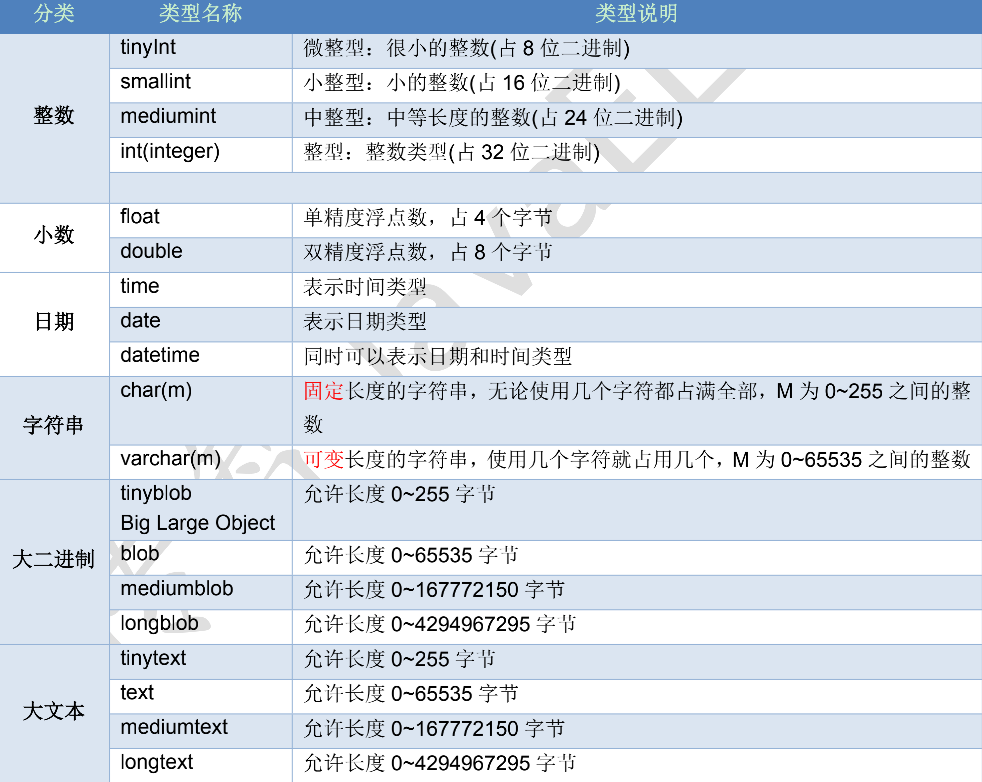

# MySql

## 1、SQL的概念

### 1.1 什么是SQL
Structured Query Language 结构化查询语言

### 1.2 SQL作用
1) 是一种所有关系型数据库的查询规范，不同的数据库都支持。
2) 通用的数据库操作语言，可以用在不同的数据库中。
3) 不同的数据库SQL语句有一些区别。

### 1.3 SQL语句的分类
1) Data Definition Language (DDL 数据定义语言) 如：建库，建表
2) Data Manipulation Language(DML 数据操纵语言)，如：对表中的记录操作增删改
3) Data Query Language(DQL 数据查询语言)，如：对表中的查询操作
4) Data Control Language(DCL 数据控制语言)，如：对用户权限的设置

### 1.4 MySQL的语法

1）每条语句以分号结尾，如果在数据库可视化工具中不是必须加的。
2）SQL 中不区分大小写，关键字中认为大写和小写是一样的。
3）3种注释：
|  注释的语法  | 说明  |
|  -----  |  -----  |
| --空格   | 单行注释 |
| /* */   | 多行注释 |
| #       | 这是mysql特有的注释方式 |


## 2、DDL操作数据库

### 2.1 创建数据库

#### 2.1.1 创建数据库的几种方式

- 创建数据库
```sql
CREATE DATABASE 数据库名;
```

- 判断数据库是否已经存在，不存在则创建数据库
```sql
CREATE DATABASE IF NOT EXISTS 数据库名;
```

- 创建数据库并指定字符集
```sql
CREATE DATABASE 数据库名 CHARACTER SET 字符集;
```

#### 2.1.2 具体操作 
```sql
-- 直接创建数据库 db1
create database db1;
-- 判断是否存在，如果不存在则创建数据库 db2
create database if not exists db2;
-- 创建数据库并指定字符集为 gbk
create database db3 default character set gbk;
```

### 2.2 查看数据库

```sql
-- 查看所有的数据库
show databases;

-- 查看某个数据库的定义信息
show create database db3;
show create database db1;
```

### 2.3 修改数据库

#### 2.3.1 修改数据库默认的字符集

```sql
ALTER DATABASE 数据库名 DEFAULT CHARACTER SET 字符集;
```

#### 2.3.2 具体操作
- 将db3数据库的字符集修改成utf8

```sql
alter database db3 character set utf8;
```

### 2.4 删除数据库

#### 2.4.1 删除数据库的语法

```sql
DROP DATABASE 数据库名;
```

#### 2.4.2 具体操作：
- 每行SQL语句需要选中再执行。
- 删除db2数据库
```sql
drop database db2;
```

### 2.5 使用数据库

#### 2.5.1 查看正在使用的数据库

```sql
SELECT DATABASE();
```

#### 2.5.2 使用/切换数据库

```sql
USE 数据库名;
```

#### 2.5.3 具体操作
```sql
-- 查看正在使用的数据库
select database();
-- 改变要使用的数据库
use db4;
```

## 3、DDL操作表结构

### 3.1 创建表

### 3.1.1 创建表的格式

```sql
CREATE TABLE 表名 (
  字段名 1 字段类型 1,
  字段名 2 字段类型 2
);
```

### 3.1.2 关键字说明
| 创建表的关键字| 说明 |
|  -----  |  -----  |
|CREATE|创建         |
|TABLE|表           | 


### 3.2 MySQL数据类型


#### 3.2.1 常使用的数据类型如下
| 类型| 描述 |
|  -----  |  -----  |
|   int   |    整型  |
|double   |  浮点型  | 
|varchar  |  字符串型 | 
|date     |  日期类型，格式为yyyy-MM-dd,只有年月日，没有时分秒 | 

#### 3.2.2 详细数据类型




#### 3.2.3 具体操作

- 创建student表，包含 id，name, birthday 字段

```sql
create table student (
  id int, -- 整数
  name varchar(20), -- 字符串
  birthday date -- 生日，最后没有逗号
);
```

### 3.3 查看表

#### 3.3.1 查看某个数据库中所有的表

```sql
SHOW TABLES;
```

#### 3.3.2 查看表结构

```sql
DESC 表名
```

#### 3.3.3 查看建表的SQL语句
```sql
SHOW CREATE TABLE 表名;
```

#### 3.3.4 具体操作
- 查看person数据库中所有的表
```sql
use person;
show tables;
```

- 查看 student 表的结构
```sql
desc student;
```

- 查看 student 创建表的SQL语句
```sql
show create table student;
```
执行结果：
` 存在的目的是为了避免关键字的冲突
```
CREATE TABLE `student` (
`id` int(11) DEFAULT NULL,
`name` varchar(20) DEFAULT NULL,
`birthday` date DEFAULT NULL
) ENGINE=InnoDB DEFAULT CHARSET=utf8
```

### 4 查询操作
我这里使用尚硅谷提供的练习表来进行下面内容的学习

[表的创建语句](./atguigudb.md)

#### 4.1 最基本的查询语句 SELECT 字段1,字段2 FROM 表名
```sql
# 最基本的查询语句 SELECT 字段1,字段2 FROM 表名
# * 代表的是查询所有的列
SELECT * FROM employees
```

#### 4.2 只想查询 员工id 和 姓名
```sql
# 只想查询 员工id 和 姓名 
SELECT employee_id, last_name FROM employees
```

#### 4.3 可以给列设置别名
```sql
# 给 last_name 设置别名
SELECT employee_id, last_name name FROM employees

# 别名使用AS这个关键字
SELECT employee_id, last_name AS name FROM employees
```

#### 4.4 去除重复数据
```sql
# 去除重复数据 只保留不重复的部门id
SELECT DISTINCT department_id FROM employees
```


