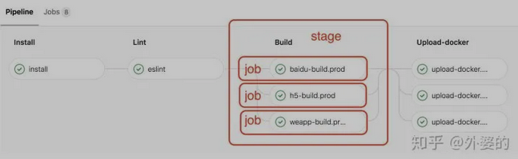
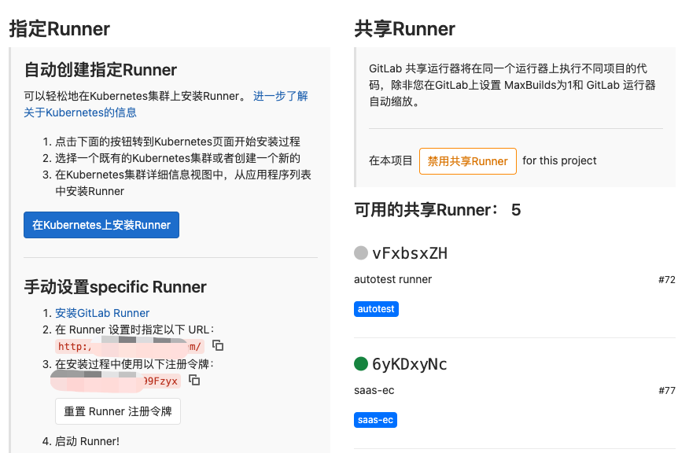

# DevOps

## 

## gitlab-ci涉及的抽象概念

### pipeline & job

pipeline是Gitlab根据项目的 `.gitlab-ci.yml` 文件执行的流程，它由许多个任务节点组成,而这些pipeline上的每一个任务节点，都是一个独立的job。

**每一个job都会配置一个stage属性，用来表示这个job所处的阶段**

一个pipeline有若干个stage，每个stage上有至少一个job如下图所示。

### Runner

Runner可以理解为：「在特定机器上」根据项目的 **`.gitlab-ci.yml`文件，对项目执行pipeline的」程序**。Runner可以分为两种：「**Specific Runner**」 和 「**Shared Runner**」

- 是Gitlab平台提供的免费使用的runner程序，它由Google云平台提供支持，每个开发团队有十几个。对于公共开源项目是免费使用的，如果是私人项目则有每月2000分钟的CI时间上限。

- 是我们自定义的，在自己选择的机器上运行的runner程序，gitlab给我们提供了一个叫gitlab-runner的命令行软件，只要在对应机器上下载安装这个软件，并且运行gitlab-runner register命令，然后输入从gitlab-ci交互界面获取的token进行注册, 就可以在自己的机器上远程运行pipeline程序了。

[GitLab-runner的下载链接](https://docs.gitlab.com/runner/install/)

#### Shared Runner 和 Specific Runner的区别

- 1.Shared Runner是所有项目都可以使用的，而Specific Runner只能针对特定项目运行
- 2.Shared Runner默认基于docker运行，没有提前装配的执行pipeline的环境，例如node等。而Specific Runner你可以自由选择平台，可以是各种类型的机器，如Linux/Windows等，并在上面装配必需的运行环境，当然也可以选择Docker/K8s等
- 3.私人项目使用Shared Runner受运行时间的限制，而Specific Runner的使用则是完全自由的。

