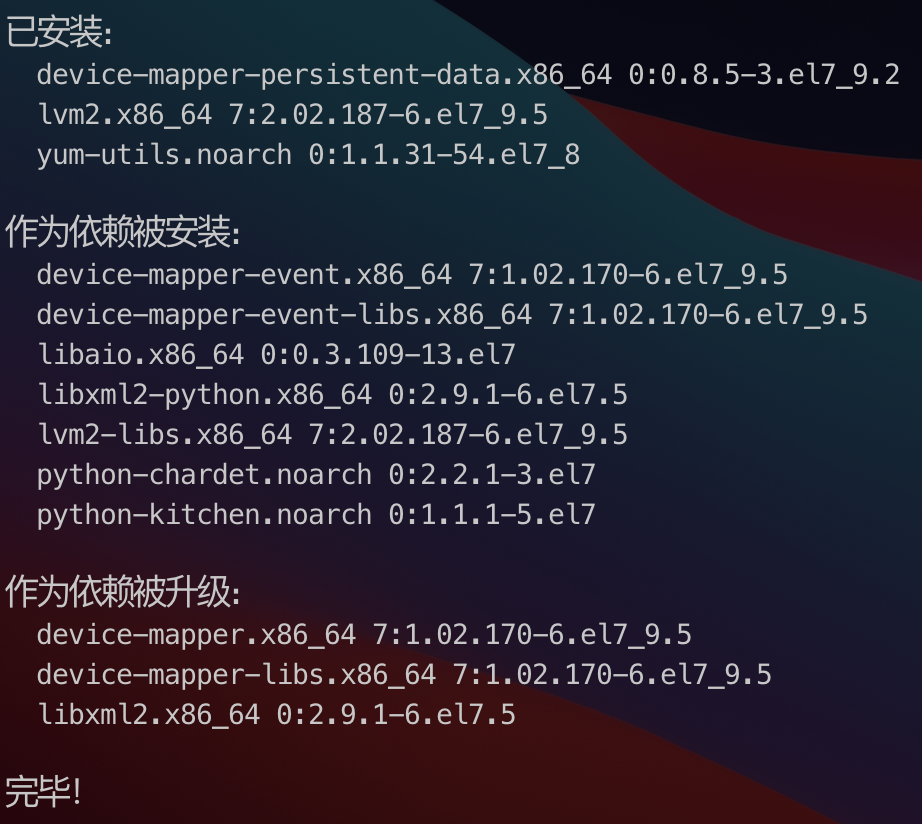
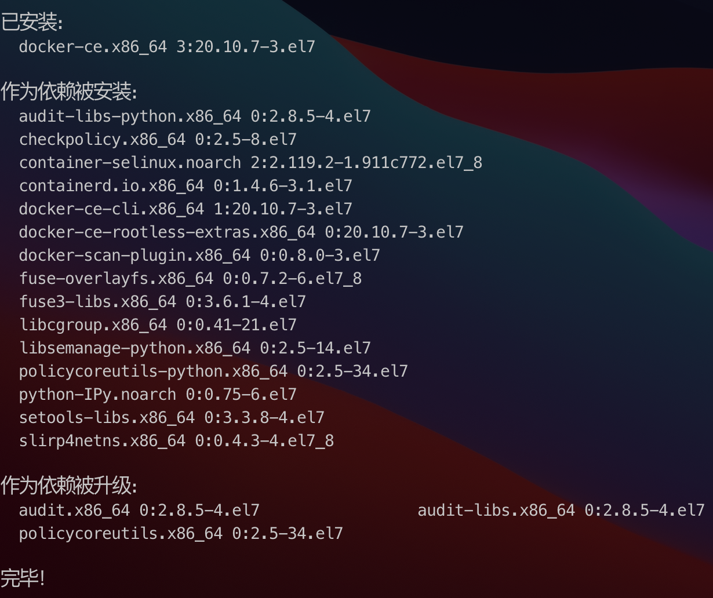
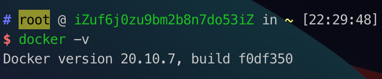
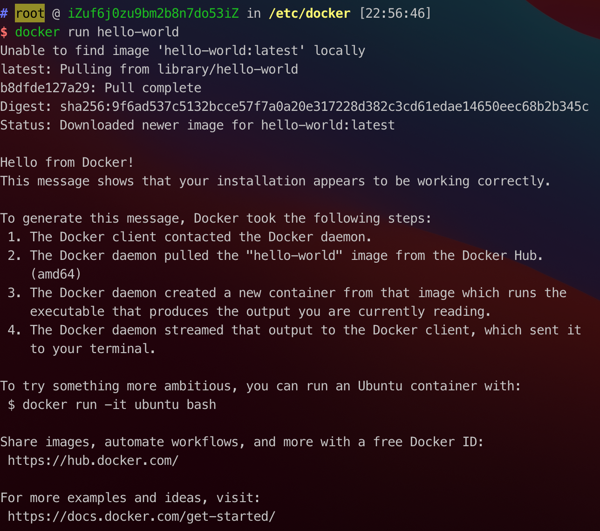
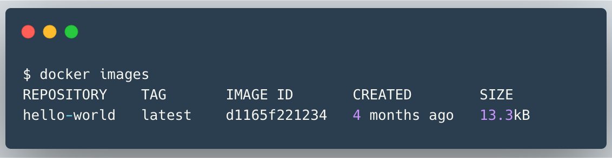

# Docker

## 容器技术介绍
我们说的容器 container是指一项技术，而Docker只是一个容器技术的实现，或者说让容器技术普及开来的最成功的的实现。简单来说，容器技术是一种打包技术，它拥有以下三个特点：
- 标准化
- 轻量化
- 易移植

### 容器技术的标准化
- 容器会加速你的软件开发
- 容器会加速程序的编译和构建
- 容器会加速测试
- 容器会加速故障修复

[参考文档](https://dockertips.readthedocs.io/en/latest/)

## 什么是Docker
Docker 是一个开源的应用容器引擎。开发者可以将自己的应用打包在自己的镜像里面，然后迁移到其他平台的 Docker 中。镜像中可以存放你自己自定义的运行环境，文件，代码，设置等等内容，再也不用担心环境造成的运行问题。镜像共享运行机器的系统内核。

同样， Docker 也支持跨平台。你的镜像也可以加载在 Windows 和 Linux，实现快速运行和部署。

## Docker解决了什么问题

一句话，解决了运行环境和配置问题的**软件容器**，方便于持续集成并有助于整体发布推动软件虚拟化技术。

## Docker三要素
- **镜像 (image)**:

Docker镜像就是一个**只读**的模板，镜像可以用来创建docker容器，一个镜像可以创建很多容器。镜像其实是一种轻量级、可执行的独立软件包，用来打包软件运行环境和基于运行环境开发的软件，它包含运行某个软件所需要的所有内容，包括代码、依赖、库、环境和配置文件, 可以理解为一个模板，镜像具有分层的概念

- **容器（Container）**  
 
Docker利用容器（Container）独立运行的一个或者一组应用，容器是用镜像创建爱你的**运行实例**。它可以被启动、开始、停止、删除。每个容器都是相互隔离的、保证平台的安全。可以把容器看成是一个简单的Linux环境（包括root用户权限、进程空间、用户空间和网络空间等）和运行在其中的应用程序。容器的定义几乎和镜像一模一样，也是一堆层的统一视角，唯一区别在于容器的最上面那一层是**可读可写**的。

- **仓库**

是集中存放镜像的地方,我们可以把镜像发布到仓储中，需要的时候从仓储中拉取下来就可以了。

## Docker架构


## Docker安装 (CentOS7)

在Docker安装之前，我们首先安装`device-mapper-persistent-data` 和 `lvm2` 两个依赖。

`device-mapper-persistent-data` 是 `Lunix`下的一个存储驱动，Linux 上的高级存储技术。

`lvm2` 的作用是创建逻辑磁盘分区，这里我们使用CentOS的Yum包管理工具安装两个依赖。

```shell
yum install -y yum-utils device-mapper-persistent-data lvm2
```


依赖安装完毕后，我们将阿里云的 Docker 镜像源添加进去。可以加速 Docker 的安装。

```shell
sudo yum-config-manager --add-repo http://mirrors.aliyun.com/docker-ce/linux/centos/docker-ce.repo
```

最后安装 docker

```shell
yum install docker-ce -y
```



接着执行一下 `docker -v` ，这条命令可以用来查看 Docker 安装的版本信息。当然也可以帮助我们查看 docker 安装状态。如果正常展示版本信息，代表 Docker 已经安装成功。

如果我们在终端中输入：
```
docker version
```

会显示以下信息,下面的信息显示的docker在安装过程中安装了 客户端和服务端。

```
Client: Docker Engine - Community
 Version:           20.10.10
 API version:       1.41
 Go version:        go1.16.9
 Git commit:        b485636
 Built:             Mon Oct 25 07:42:56 2021
 OS/Arch:           linux/amd64
 Context:           default
 Experimental:      true

Server: Docker Engine - Community
 Engine:
  Version:          20.10.10
  API version:      1.41 (minimum version 1.12)
  Go version:       go1.16.9
  Git commit:       e2f740d
  Built:            Mon Oct 25 07:41:17 2021
  OS/Arch:          linux/amd64
  Experimental:     false
 containerd:
  Version:          1.4.11
  GitCommit:        5b46e404f6b9f661a205e28d59c982d3634148f8
 runc:
  Version:          1.0.2
  GitCommit:        v1.0.2-0-g52b36a2
 docker-init:
  Version:          0.19.0
  GitCommit:        de40ad0
```

docker安装完毕之后，需要重启docker，不然可能会遇到无法使用的情况。

```
Cannot connect to the Docker daemon at unix:/var/run/docker.sock. Is the docker daemon running?
```


```shell
docker -v
```


## 安装docker-compose
[官方网站地址](https://docs.docker.com/compose/install/)
运行此命令以下载 Docker Compose 的当前稳定版本：

```shell
sudo curl -L "https://github.com/docker/compose/releases/download/1.29.2/docker-compose-$(uname -s)-$(uname -m)" -o /usr/local/bin/docker-compose
```

如果你想安装的版本不是1.29.2，直接替换这个版本号即可。

对二进制文件应用可执行权限
```shell
sudo chmod +x /usr/local/bin/docker-compose
```

### 安装完毕之后测试版本
```shell
docker-compose --version
```


## Docker安装 hello-world镜像

```shell
docker run hello-world
```


从图中展示的信息可以看到，在执行run命令的时候，首先会从本地查找镜像，发现在本地没有找到，就去仓库中寻找，下载之后，基于这个镜像创建一个容器。

## Docker镜像常用命令

帮助命令
```shell
# 帮助命令
docker --help
```

在终端输入`docker image` 就能够列出 docker 关于镜像的所有操作方法：
```shell
$ docker image

Usage:  docker image COMMAND

Manage images

Commands:
  build       Build an image from a Dockerfile
  history     Show the history of an image
  import      Import the contents from a tarball to create a filesystem image
  inspect     Display detailed information on one or more images
  load        Load an image from a tar archive or STDIN
  ls          List images
  prune       Remove unused images
  pull        Pull an image or a repository from a registry
  push        Push an image or a repository to a registry
  rm          Remove one or more images
  save        Save one or more images to a tar archive (streamed to STDOUT by default)
  tag         Create a tag TARGET_IMAGE that refers to SOURCE_IMAGE

Run 'docker image COMMAND --help' for more information on a command.
```
按照提示，进一步，如果想要查看某一个镜像的命令，可以继续操作, 例如：
```shell
$ docker image pull --help

Usage:  docker image pull [OPTIONS] NAME[:TAG|@DIGEST]

Pull an image or a repository from a registry

Options:
  -a, --all-tags                Download all tagged images in the repository
      --disable-content-trust   Skip image verification (default true)
      --platform string         Set platform if server is multi-platform capable
  -q, --quiet                   Suppress verbose output
```

列出本地主机上的所有镜像
```shell
# 列出本地主机上的所有镜像
docker images
```


各个选项说明:
- REPOSITORY: 表示镜像仓库
- TAG: 镜像标签
- IMAGE ID: 镜像id
- CREATED: 镜像创建时间
- SIZE: 镜像大小

::: tip
同一个仓库可以有多个TAG，代表这个仓库源的不同个版本，我们使用`REPOSITORY:TAG` 来定义不同的镜像。如果你不指定一个镜像的版本标签，将默认是使用最新的版本。
:::

当然 docker images 后面还可以添加 options 参数：
```shell
docker images -a // 显示全部镜像，镜像是分层的
docker images -q // 只显示镜像的 images id
docker search xxx // 从dockerhub 中查找指定名称的镜像
docker search -s 30 xxx // 查找指定镜像在一定star数量之上的
docker pull xxx // 拉取指定名称的镜像 注意默认拉取的是最新的版本的镜像
docker rmi  xxx // 删除指定镜像 如果不添加任何标签默认删除最新版本的镜像
docker rmi -f xxx // 强制删除指定镜像
docker inspect 镜像id // 查看指定镜像的详细信息
```

如果我想要搜索 mongo 数据库，可以执行命令：
```shell
docker search mongo
```

如果我想拉取 mongo和centos镜像，可以执行命令:

```shell
# 默认拉取最新版本的镜像
docker pull mongo

# 拉取centos最新版本的镜像
docker pull centos

# 拉取指定版本的镜像(后面使用冒号指定版本号)
docker pull mongo:3.4.1

# 查看 id 0dffc7177b06 详细信息
docker inspect  0dffc7177b06
```


如果我想要删除 hello-world 这个镜像，可以执行命令：
```shell
docker rmi hello-world
```

当然我们还可以通过id删除镜像，分为两个步骤：
```shell
# 列出所有的镜像
$ docker images
REPOSITORY            TAG       IMAGE ID       CREATED         SIZE
busybox               latest    16ea53ea7c65   5 months ago    1.24MB
nginx                 latest    ad4c705f24d3   5 months ago    133MB
outlinewiki/outline   latest    c2b92b5cd802   5 months ago    471MB
hello-world           latest    d1165f221234   11 months ago   13.3kB
easymock/easymock     1.6.0     193a7b904d4f   2 years ago     699MB
redis                 4.0.6     1e70071f4af4   4 years ago     107MB
mongo                 3.4.1     0dffc7177b06   5 years ago     402MB

# 执行 rmi 命令
$ docker rmi c2b92b5cd802 
```

## Docker容器常用命令

一般执行容器命令的时候 使用 `docker container xxx` 这种形式， 当然我们可以使用简写，将中间的 container 省略掉。

### 新建并启动容器
```shell
options说明：
--name="容器新名字"：为容器指定一个名称
-d: 后台运行容器，并返回容器ID
-i: 以交互模式运行容器，通常与 -t 同时使用
-t: 为容器分配一个伪输入终端，通常与 -i 同时使用
-P: 随机端口映射
-p: 指定端口映射，有以下四种格式
  ip:hostPort: containerPort
  ip::containerPort
  hostPort: containerPort
  containerPort
```

### 列出当前所有**正在运行**的容器
```shell
docker ps

# 显示出当前我的服务器中启动的所有的容器
$ docker ps
CONTAINER ID   IMAGE                     COMMAND                  CREATED        STATUS        PORTS                      NAMES
0c1c8d14921b   mongo:3.4.1               "/entrypoint.sh mong…"   43 hours ago   Up 43 hours   0.0.0.0:27017->27017/tcp   yapi-mongodb-docker
c9693a7fa9dd   easymock/easymock:1.6.0   "/bin/bash -c 'npm r…"   4 weeks ago    Up 3 hours    0.0.0.0:7300->7300/tcp     easy-mock_web_1
f506572bb5c7   mongo:3.4.1               "/entrypoint.sh mong…"   4 weeks ago    Up 3 hours    27017/tcp                  easy-mock_mongodb_1
4a7a0c8348a7   redis:4.0.6               "docker-entrypoint.s…"   4 weeks ago    Up 3 hours    6379/tcp                   easy-mock_redis_1
```
当然这个命令也是可以添加options的

```
-a 列出当前所有正在运行的容器 + 历史上运行过的
-l 显示最近创建的容器
-n 显示最近n个创建的容器
-q 静默模式，只显示容器编号
--no-trunc 不截断输出
```
docker ps -a

```shell
$ docker ps -a
CONTAINER ID   IMAGE                     COMMAND                  CREATED             STATUS                         PORTS                      NAMES
ea1732dfe8de   centos                    "/bin/bash"              16 minutes ago      Exited (0) 16 minutes ago                                 mycentos
3fe4caec1b0a   nginx                     "/docker-entrypoint.…"   18 minutes ago      Exited (0) 17 minutes ago                                 my-nginx
ebb4102ec952   nginx                     "/docker-entrypoint.…"   About an hour ago   Exited (0) About an hour ago                              nginx-server
0c1c8d14921b   mongo:3.4.1               "/entrypoint.sh mong…"   43 hours ago        Up 43 hours                    0.0.0.0:27017->27017/tcp   yapi-mongodb-docker
c9693a7fa9dd   easymock/easymock:1.6.0   "/bin/bash -c 'npm r…"   4 weeks ago         Up 3 hours                     0.0.0.0:7300->7300/tcp     easy-mock_web_1
f506572bb5c7   mongo:3.4.1               "/entrypoint.sh mong…"   4 weeks ago         Up 3 hours                     27017/tcp                  easy-mock_mongodb_1
4a7a0c8348a7   redis:4.0.6               "docker-entrypoint.s…"   4 weeks ago         Up 3 hours                     6379/tcp                   easy-mock_redis_1
0ffe03ebfdeb   hello-world               "/hello"                 2 months ago        Exited (0) 2 months ago                                   sad_jackson
```

### 启动容器
```shell
# 首先启动容器 进入交互式命令
$ docker run  -it --name mycentos centos
[root@941b40fa94aa /]#

# 退出交互式命令
[root@941b40fa94aa /]# exit
exit

# 退出容器之后，想要查看上一个刚退出的容器，可以看到，上次启动的是 mycentos 
$ docker ps -l
CONTAINER ID   IMAGE     COMMAND       CREATED         STATUS                          PORTS     NAMES
941b40fa94aa   centos    "/bin/bash"   2 minutes ago   Exited (0) About a minute ago             mycentos
```
有时候，我们并不想使用交互式启动命令的方式，只想启动之后让它在后台运行，这个时候我们可以添加 -d 这个选项

```shell
# 我想要后台运行 centos 可以执行下面的命令
$ docker run -d centos
9a52cdc137ef7e2efef6919a5e296b555baf5524f1a1d82170f1c9c28b1e7a31

```
此时执行 docker ps 这个命令是查找不出来这个后台运行的容器的。执行 docker ps -a 是能够显示出来这个容器的，但是状态是退出的状态：

```shell
$ docker ps -a
CONTAINER ID   IMAGE                     COMMAND                  CREATED          STATUS                     PORTS                      NAMES
9a52cdc137ef   centos                    "/bin/bash"              10 minutes ago   Exited (0) 9 minutes ago                              dazzling_clarke
0c1c8d14921b   mongo:3.4.1               "/entrypoint.sh mong…"   2 days ago       Up 2 days                  0.0.0.0:27017->27017/tcp   yapi-mongodb-docker
c9693a7fa9dd   easymock/easymock:1.6.0   "/bin/bash -c 'npm r…"   4 weeks ago      Up About an hour           0.0.0.0:7300->7300/tcp     easy-mock_web_1
f506572bb5c7   mongo:3.4.1               "/entrypoint.sh mong…"   4 weeks ago      Up 13 hours                27017/tcp                  easy-mock_mongodb_1
4a7a0c8348a7   redis:4.0.6               "docker-entrypoint.s…"   4 weeks ago      Up 13 hours                6379/tcp                   easy-mock_redis_1
0ffe03ebfdeb   hello-world               "/hello"                 2 months ago     Exited (0) 2 months ago                               sad_jackson
```

> docker 容器的后台运行, 就必须有一个前台进程，容器运行的命令如果不是那些一直挂起的命令，就是会自动退出的。这个是docker的运行机制问题。

### 重启容器
```shell
# docker restart 容器id 或者容器名称
# 比如我想重新启动easymock这个容器，可以执行命令
docker restart  c9693a7fa9dd
# 命令行返回 c9693a7fa9dd 说明重启成功
```
### 停止容器
docker stop  容器ID
```shell
docker stop  c9693a7fa9dd
```
### 强制停止容器
docker kill 容器ID
```shell
# 强制停止容器 c9693a7fa9dd
docker kill c9693a7fa9dd
```
### 删除已经停止的容器
docker rm 容器ID
```shell
# 删除已经停止掉的容器 c9693a7fa9dd
docker rm c9693a7fa9dd
```
### 查看容器内部细节
```shell
# 容器其实是一层一层的，这个命令可以显示内部的细节
docker inspect c9693a7fa9dd
```

### 拷贝docker中的文件到宿主机
docker cp 容器ID：容器内的路径 目标主机路径
```shell
# 将docker中nginx的配置文件拷贝到宿主机的cp目录下
docker cp xxxxx: /ect/nginx/nginx.conf /ect/nginx/cp/
```

### 以指定端口映射启动容器
```shell
# -p 宿主机端口:docker容器启动的端口 -d 指的是后台启动  --name 设置别名
docker run --name MyNginx -d -p 80:80  nginx

# 启动redis 指定版本的redis 使用的是冒号
docker run --name myredis -d -p 6379:6379 redis:4.0.6
```

## Docker容器数据卷

docker理念就是将应用与运行的环境打包形成容器运行，运行可以伴随着容器，但是我们对数据的要求希望是持久化的，容器之间希望可以共享数据

docker容器产生的数据，如果不通过 docker commit 生产新的镜像，使得数据作为镜像的一部分保存下来，那么当容器删除之后，数据自然也就没有了。

为了能保存数据，在docker中我们卷的概念。

### 以nginx为例，在docker上启动nginx并配置容器数据卷
1、首先使用docker 拉取镜像,如果不加版本号，默认是最新版本
```shell
$docker pull nginx
```

2、使用docker 启动nginx
```shell
# -d 后台运行  -p 80:80 宿主机的端口映射nginx的端口 --name 别名
$docker run --name mynginx -d -p 80:80 nginx
```

3、重新开一个命令交互启动我们自己的nginx
```shell
$docker exec -it mynginx bash
```

4、我们想要修改nginx的配置文件
```shell
vim /etc/nginx/nginx.conf
```
执行上述命令发现容器内部实际上并没有安装 vim 这个工具，可以使用 apt-get 进行安装

```shell
# 更新源
$apt-get update

# 安装vim
$apt-get install vim
```

5、当然这种方式还是有些繁琐，我们可以把宿主机上的配置文件映射到 容器nginx容器里面
```shell
$docker run --name mynginx -d -p 80:80 -v /usr/local/docker/my-docker-nginx/vuepress:/usr/share/nginx/html/vuepress  -v /usr/local/docker/my-docker-nginx/conf.d/default.conf:/etc/nginx/conf.d/default.conf nginx 
```
解释下上述命令的含义:
- docker run --name mynginx : 以 mynginx为别名启动nginx
- -d: 代表的是后台启动
- -p 80:80 用宿主机的80端口映射 docker容器中nginx的80端口
- -v /usr/local/docker/my-docker-nginx/vuepress:/usr/share/nginx/html/vuepress 宿主机的vuepress目录映射到 docker容器中的文件目录
- -v /usr/local/docker/my-docker-nginx/conf.d/default.conf:/etc/nginx/conf.d/default.conf 宿主机的文件替换容器文件
- nginx 启动的是nginx

## 阿里云使用mongoDB
我已经在将docker3.4.1版本的镜像下载到阿里云上，一个镜像可以构建多个容器。

之前因为使用默认的端口号，并且没有设置密码，导致被黑客攻击。启动的时候需要替换一个不太常用的端口号。

```sh
$docker run --name myMongo -d -p 27898:27017 mongo:3.4.1
```

这样启动之后，阿里云的安全组需要重新配置，才能生效。

## 阿里云使用redis
我的阿里云服务器上已经下载好了redis镜像，下载的版本是`redis:4.0.6`。

我的诉求是以指定的端口启动，防止被黑客攻击，映射到容器内的6379端口，并能够通过外网访问。

```sh
$docker run --name my-docker-redis -d -p 6978:6379 redis:4.0.6
```

这样启动之后，阿里云的安全组需要重新配置，才能生效。

## DockerFile 
### [Dockerfiles](./Dockerfiles.md)


## Docker Compose
[docker-compose](./docker-compose.md)
