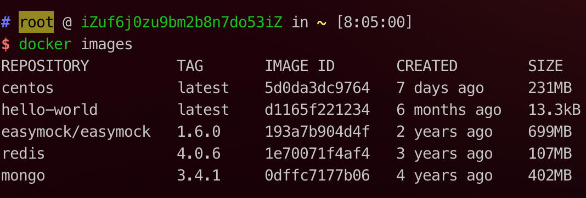

# Docker

## 什么是Docker
Docker 是一个开源的应用容器引擎。开发者可以将自己的应用打包在自己的镜像里面，然后迁移到其他平台的 Docker 中。镜像中可以存放你自己自定义的运行环境，文件，代码，设置等等内容，再也不用担心环境造成的运行问题。镜像共享运行机器的系统内核。

同样， Docker 也支持跨平台。你的镜像也可以加载在 Windows 和 Linux，实现快速运行和部署。

## Docker解决了什么问题

一句话，解决了运行环境和配置问题的**软件容器**，方便于持续集成并有助于整体发布推动软件虚拟化技术。

## Docker三要素
- **镜像 (image)**:

Docker镜像就是一个**只读**的模板，镜像可以用来创建docker容器，一个镜像可以创建很多容器。
- **容器（Container）**  
 
Docker利用容器（Container）独立运行的一个或者一组应用，容器是用镜像创建爱你的运行实例。它可以被启动、开始、停止、删除。每个容器都是相互隔离的、保证平台的安全。可以把容器看成是一个简单的Linux环境（包括root用户权限、进程空间、用户空间和网络空间等）和运行在其中的应用程序。容器的定义几乎和镜像一模一样，也是一堆层的统一视角，唯一区别在于容器的最上面那一层是可读可写的。

- **仓库**

是集中存放镜像的地方,我们可以把镜像发布到仓储中，需要的时候从仓储中拉取下来就可以了。

## Docker架构


## Docker安装 (CentOS7)

在Docker安装之前，我们首先安装`device-mapper-persistent-data` 和 `lvm2` 两个依赖。

`device-mapper-persistent-data` 是 `Lunix`下的一个存储驱动，Linux 上的高级存储技术。

`lvm2` 的作用是创建逻辑磁盘分区，这里我们使用CentOS的Yum包管理工具安装两个依赖。

```shell
yum install -y yum-utils device-mapper-persistent-data lvm2
```


依赖安装完毕后，我们将阿里云的 Docker 镜像源添加进去。可以加速 Docker 的安装。

```shell
sudo yum-config-manager --add-repo http://mirrors.aliyun.com/docker-ce/linux/centos/docker-ce.repo
```

最后安装 docker

```shell
yum install docker-ce -y
```


接着执行一下 `docker -v` ，这条命令可以用来查看 Docker 安装的版本信息。当然也可以帮助我们查看 docker 安装状态。如果正常展示版本信息，代表 Docker 已经安装成功。

```shell
docker -v
```


## Docker安装 hello-world镜像

```shell
docker run hello-world
```


从图中展示的信息可以看到，在执行run命令的时候，首先会从本地查找镜像，发现在本地没有找到，就去仓库中寻找，下载之后，基于这个镜像创建一个容器。

## Docker镜像常用命令

帮助命令
```shell
# 帮助命令
docker --help
```

列出本地主机上的所有镜像
```shell
# 列出本地主机上的所有镜像
docker images
```


各个选项说明:
- REPOSITORY: 表示镜像仓库
- TAG: 镜像标签
- IMAGE ID: 镜像id
- CREATED: 镜像创建时间
- SIZE: 镜像大小

::: tip
同一个仓库可以有多个TAG，代表这个仓库源的不同个版本，我们使用`REPOSITORY:TAG` 来定义不同的镜像。如果你不指定一个镜像的版本标签，将默认是使用最新的版本。
:::

当然 docker images 后面还可以添加 options 参数：
```shell
docker images -a // 显示全部镜像，镜像是分层的
docker images -q // 只显示镜像的 images id
docker search xxx // 从dockerhub 中查找指定名称的镜像
docker search -s 30 xxx // 查找指定镜像在一定star数量之上的
docker pull xxx // 拉取指定名称的镜像 注意默认拉取的是最新的版本的镜像
docker rmi  xxx // 删除指定镜像 如果不添加任何标签默认删除最新版本的镜像
docker rmi -f xxx // 强制删除指定镜像
```

如果我想要搜索 mongo 数据库，可以执行命令：
```shell
docker search mongo
```

如果我想拉取 mongo和centos镜像，可以执行命令:

```shell
# 默认拉取最新版本的镜像
docker pull mongo

# 拉取centos最新版本的镜像
docker pull centos

# 拉取指定版本的镜像(后面使用冒号指定版本号)
docker pull mongo:3.4.1
```


如果我想要删除 hello-world 这个镜像，可以执行命令：
```shell
docker rmi hello-world
```

## Docker容器常用命令

### 新建并启动容器
```shell
options说明：
--name="容器新名字"：为容器指定一个名称
-d: 后台运行容器，并返回容器ID
-i: 以交互模式运行容器，通常与 -t 同时使用
-t: 为容器分配一个伪输入终端，通常与 -i 同时使用
-P: 随机端口映射
-p: 指定端口映射，有以下四种格式
  ip:hostPort: containerPort
  ip::containerPort
  hostPort: containerPort
  containerPort
```

### 列出当前所有**正在运行**的容器
```shell
docker ps

# 显示出当前我的服务器中启动的所有的容器
$ docker ps
CONTAINER ID   IMAGE                     COMMAND                  CREATED        STATUS        PORTS                      NAMES
0c1c8d14921b   mongo:3.4.1               "/entrypoint.sh mong…"   43 hours ago   Up 43 hours   0.0.0.0:27017->27017/tcp   yapi-mongodb-docker
c9693a7fa9dd   easymock/easymock:1.6.0   "/bin/bash -c 'npm r…"   4 weeks ago    Up 3 hours    0.0.0.0:7300->7300/tcp     easy-mock_web_1
f506572bb5c7   mongo:3.4.1               "/entrypoint.sh mong…"   4 weeks ago    Up 3 hours    27017/tcp                  easy-mock_mongodb_1
4a7a0c8348a7   redis:4.0.6               "docker-entrypoint.s…"   4 weeks ago    Up 3 hours    6379/tcp                   easy-mock_redis_1
```
当然这个命令也是可以添加options的

```
-a 列出当前所有正在运行的容器 + 历史上运行过的
-l 显示最近创建的容器
-n 显示最近n个创建的容器
-q 静默模式，只显示容器编号
--no-trunc 不截断输出
```
docker ps -a

```shell
$ docker ps -a
CONTAINER ID   IMAGE                     COMMAND                  CREATED             STATUS                         PORTS                      NAMES
ea1732dfe8de   centos                    "/bin/bash"              16 minutes ago      Exited (0) 16 minutes ago                                 mycentos
3fe4caec1b0a   nginx                     "/docker-entrypoint.…"   18 minutes ago      Exited (0) 17 minutes ago                                 my-nginx
ebb4102ec952   nginx                     "/docker-entrypoint.…"   About an hour ago   Exited (0) About an hour ago                              nginx-server
0c1c8d14921b   mongo:3.4.1               "/entrypoint.sh mong…"   43 hours ago        Up 43 hours                    0.0.0.0:27017->27017/tcp   yapi-mongodb-docker
c9693a7fa9dd   easymock/easymock:1.6.0   "/bin/bash -c 'npm r…"   4 weeks ago         Up 3 hours                     0.0.0.0:7300->7300/tcp     easy-mock_web_1
f506572bb5c7   mongo:3.4.1               "/entrypoint.sh mong…"   4 weeks ago         Up 3 hours                     27017/tcp                  easy-mock_mongodb_1
4a7a0c8348a7   redis:4.0.6               "docker-entrypoint.s…"   4 weeks ago         Up 3 hours                     6379/tcp                   easy-mock_redis_1
0ffe03ebfdeb   hello-world               "/hello"                 2 months ago        Exited (0) 2 months ago                                   sad_jackson
```

### 启动容器
```shell
# 首先启动容器 进入交互式命令
$ docker run  -it --name mycentos centos
[root@941b40fa94aa /]#

# 退出交互式命令
[root@941b40fa94aa /]# exit
exit

# 退出容器之后，想要查看上一个刚退出的容器，可以看到，上次启动的是 mycentos 
$ docker ps -l
CONTAINER ID   IMAGE     COMMAND       CREATED         STATUS                          PORTS     NAMES
941b40fa94aa   centos    "/bin/bash"   2 minutes ago   Exited (0) About a minute ago             mycentos
```
### 重启容器
```shell
# docker start 容器id 或者容器名称
# 比如，我想把刚才退出的
```

### 停止容器

### 强制停止容器

### 删除已经停止的容器


