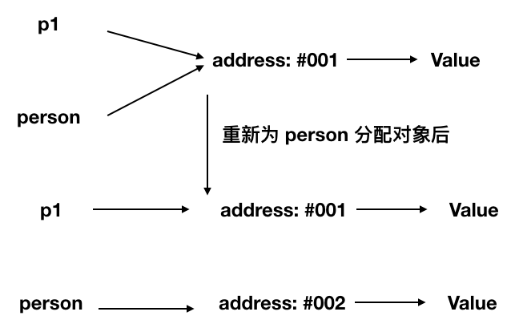

# 前端面试之道

## JavaScript基础知识面试题

### 原始类型

::: tip
JavaScript 中原始类型有六种，原始类型既只保存原始值，是没有函数可以调用的。
:::

#### 六种原始类型
* string
* number
* boolean
* null
* undefined
* symbol

::: warning 注意
为什么说原始类型没有函数可以调用，但`'1'.toString()`却又可以在浏览器中正确执行？
:::
因为`'1'.toString()`中的字符串`'1'`在这个时候会被封装成其对应的字符串对象，以上代码相当于`new String('1').toString()`，因为`new String('1')`创建的是一个对象，而这个对象里是存在`toString()`方法的。

#### null到底是什么类型
现在很多书籍把`null`解释成空对象，是一个对象类型。然而在早期`JavaScript`的版本中使用的是32位系统，考虑性能问题，使用低位存储变量的类型信息，`000`开头代表对象，而`null`就代表全零，所以将它错误的判断成`Object`，虽然后期内部判断代码已经改变，但`null`类型为`object`的判断却保留了下来，至于`null`具体是什么类型，属于仁者见仁智者见智，你说它是一个`bug`也好，说它是空对象，是对象类型也能理解的通。

### 对象类型
::: tip
在 JavaScript 中，除了原始类型，其他的都是对象类型，对象类型存储的是地址，而原始类型存储的是值。
:::
```js
var a = [];
var b = a;
a.push(1);
console.log(b); // 输出[1]
```
在以上代码中，创建了一个对象类型`a`(数组)，再把`a`的地址赋值给了变量`b`，最后改变`a`的值，打印`b`时，`b`的值也同步发生了改变，因为它们在内存中使用的是同一个地址，改变其中任何一变量的值，都会影响到其他变量。

函数参数是对象的情况

```js
function test(preson) {
  person.age = 26;
  person = {
    name: 'louis',
    age: 28
  }
  return person
}

const p1 = {
  name: 'mac',
  age: 25
}
const p2 = test(p1)

console.log(p1); => ?
console.log(p2); => ?
```

对于上面的代码，你是否能够正确的写出结果呢？ 我们来解析一下：

- 首先 函数传递参数是传递的对象指针的副本。
- 到函数内部修改参数的属性这一步，我相信大家都知道，当前p1的值也被修改了。
- 但是当我们重新为`person`分配一个对象的时候就出现了分歧 请看下图。



所以 最后 person 拥有了一个新的地址 (指针)，也就是和 p1 没有任何关系了，导致了最终两个变量的值是不相同的。

#### typeof vs instanceof

> 涉及面试题: typeof 是否能够正确的判断类型？ instanceof 能正确判断类型的原理是什么？

`typeof` 对于原始类型来说，除了 `null` 都可以显示正确的类型

```js
typeof 1 // 'number'
typeof "1" // 'string'
typeof undefined // 'undefined'
typeof true // 'boolean'
typeof Symbol() // 'symbol'
```

`typeof` 对于对象来说，除了函数都会显示 `object`，所以说 `typeof` 并不能准确判断变量到底是什么类型.

```js
typeof [] // 'object'
typeof {} // 'object'
typeof console.log // 'function'
```

如果我们想判断一个对象的正确类型，这个时候可以考虑使用 `instanceof`,因为内部机制是通过原型链来判断的。

```js
const Person = function() {}
const p1 = new Person()
p1 instanceof Person // true

var str = 'hello world'
str instanceof String // false

var str1 = new String('hello world')
str1 instanceof String // true
```

### this

`this`是很多人会混淆的概念，但是其实一点也不复杂，我们先来看看几个函数调用的场景
```js
function foo() {
  console.log(this.a)
}
var a = 1;
foo();

const obj = {
  a:2,
  foo: foo,
}
obj.foo();

const c = new foo();
```

接下来我们一个个分析上面的几个场景
- 对于直接调用 `foo` 来说,不管`foo`函数放在了什么地方，`this`一定指向window
- 对于`obj.foo()`来说，我们只需要记住，谁调用了函数，谁就是`this`,所以在这个场景下`foo`函数中的`this`就是`obj`对象。
- 对于 `new`的方式来说， `this`被永远绑定在了 `c` 上面，不会被任何方式改变 `this`

说完了以上的几种情况，其实很多代码中的this应该就没有什么问题了，下面让我们看看箭头函数中的this

```js
function a() {
  return ()=>{
    return ()=>{
      console.log(this)
    }
  }
}
a()()() // window
```

首先箭头函数是没有`this`的，箭头函数中的`this`只取决于包裹箭头的第一个普通函数的`this`，在这个例子中，因为包裹箭头函数的第一个函数是`a`,所以此时的`this`是`window`。另外对箭头函数使用bind这类函数是无效的。

做一个小结:

首先， new的方式优先级最高，接下来就是 bind这些函数，然后就是 obj.foo() 这种调用形式，最后是 foo 这种调用方式，同时，箭头函数的this一旦被绑定，就不会被任何方式改变。


