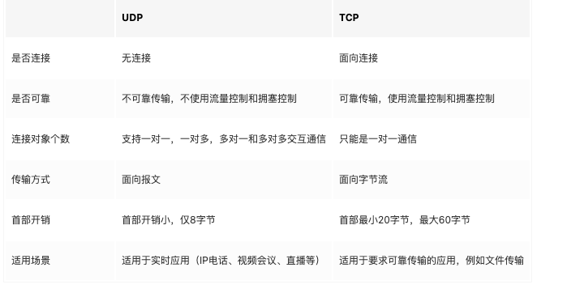

# 计算机网络

## HTTP和HTTPS有什么区别？
[参考文章](https://juejin.cn/post/6844903471565504526)

超文本传输协议也就是我们所说的 HTTP 协议被用在web浏览器和服务器之间传递信息。

HTTP协议有以下特点：
- 通信使用明文（不加密），内容可能会被窃听
- 不验证通信双方的身份，因此有可能遭到伪装
- 无法证明报文的完整性，所以有可能已经遭到篡改

如果攻击者截取了浏览器和网站服务器之间的传输报文，就能够直接获取其中的信息，并且可能会伪造这些信息，所以HTTP不适合传输一些敏感信息，例如：身份证号码、银行卡号码等等。

为了改进上述的几种问题，出现了HTTPS，它其实是HTTP和SSL(安全套阶层)的一个组合。HTTP + 加密 + 认证 + 完整性保护 = HTTPS

HTTPS的作用主要是两个：
- 建立一个安全的信息通道
- 通过证书机制，确认网站的真实性

总结一下他们两者的区别:
- https协议需要申请ca证书，这些证书一般是收费的，是由权威的第三方机构颁发的。
- http协议是明文传输的，https则是具有安全性的ssl加密传输协议。
- http和https使用的的连接方式也不一样，用的端口也不一样，前者是80，后者是443
- http的连接很简单，是无状态的；HTTPS协议是由SSL+HTTP协议构建的可进行加密传输、身份认证的网络协议，比http协议安全。

## HTTPS的工作原理？
- 客户端发起HTTPS请求，用户在浏览器里输入一个https网址，然后连接到server的443端口。
- 服务端的配置，采用HTTPS协议的服务器必须要有一套数字证书。这套证书其实就是一对公钥和私钥。
- 传送证书，这个证书其实就是公钥，只是包含了很多信息，如证书的颁发机构，过期时间等等。
- 客户端解析证书，如果发现没有问题，那么就生成一个随机值，然后用证书对该随机值进行加密，除非有私钥，否则看不到内容。
- 传送加密信息，传送的是用证书加密后的随机值，目的就是让服务端得到这个随机值，以后客户端和服务端的通信就可以通过这个随机值来进行加密解密了
- 服务段解密信息，服务端用私钥解密后，得到了客户端传过来的随机值，然后把内容通过该值进行对称加密
- 传输加密后的信息，这部分信息是服务段用私钥加密后的信息，可以在客户端被还原。
- 客户端解密信息，客户端用之前生成的私钥解密服务段传过来的信息，于是获取了解密后的内容。

## 你知道HTTPS使用的是什么加密机制吗？

HTTPS采用共享密钥加密（对称加密）和公开密钥加密（非对称加密）两者并用的混合加密机制。

之所以采用混合的方式是为了解决密钥传送的问题, 密钥在传送的过程中也可能出现泄露的风险。

使用非对称加密算法，利用公钥加密随机密钥，拿到私钥之后进行解密，当这个安全通路创建完毕之后，再使用对称加密的方式进行信息通讯。

公开加密与共享密钥加密相比速度要慢。

## 你对options请求了解多少？
options请求，又称作预检请求，这种请求只有跨域的时候才会出现，且只有在复杂请求时候才会出现，默认情况下get和post都是简单请求，按理来说是不会出现的，但是如果自己定义了header信息之类的，这样就变成了复杂请求，在发送post之前，会有一个预检请求信息，询问服务端是否支持跨域。如果不是发送的get或者post请求，我们认为是复杂请求。options请求的间隔时间是可以服务控制的。

## TCP和UDP有什么区别？
[参考文章](https://juejin.cn/post/6844903806103191559)

TCP和UDP都是传输层的协议，位于我们熟悉的HTTP协议所在的应用层的下一层。

UDP协议和和TCP协议一样用于处理数据包，具有如下的特点：
- 1、面向无连接：首先 UDP 是不需要和 TCP一样在发送数据前进行三次握手建立连接的，想发数据就可以开始发送了，不会对数据报文进行任何拆分和拼接操作。具体来说：
  - 在发送端，应用层将数据传递给传输层的 UDP 协议，UDP 只会给数据增加一个UDP头，标识下是UDP协议，然后就传递给网络层了。
  - 在接收端，网络层将数据传递给传输层，UDP 只去除 IP 报文头就传递给应用层，不会任何拼接操作。
- 2、有单播、多播，广播的功能。：UDP 不止支持一对一的传输方式，同样支持一对多，多对多，多对一的方式，也就是说 UDP 提供了单播，多播，广播的功能。
- 3、UDP是面向报文的：对于应用层传递下的报文，既不合并，也不拆分，而是保留这些报文的边界。因此，应用程序必须选择合适大小的报文。
- 4、不可靠性：首先不可靠性体现在无连接上，通信都不需要建立连接，想发就发，这样的情况肯定不可靠。并且收到什么数据就传递什么数据，并且也不会备份数据，发送数据也不会关心对方是否已经正确接收到数据了。再者网络环境时好时坏，但是 UDP 因为没有拥塞控制，一直会以恒定的速度发送数据。即使网络条件不好，也不会对发送速率进行调整。这样实现的弊端就是在网络条件不好的情况下可能会导致丢包，但是优点也很明显，在某些实时性要求高的场景（比如电话会议）就需要使用 UDP 而不是 TCP。
- 5. 头部开销小，传输数据报文时是很高效的。

TCP协议全称是传输控制协议是一种面向连接的、可靠的、基于字节流的传输层通信协议, TCP 是面向连接的、可靠的流协议。流就是指不间断的数据结构，你可以把它想象成排水管中的水流。

TCP协议的特点：
- 1、面向连接，发送数据之前，必须建立连接，建立连接的方法是”三次握手“。
- 2、仅支持单播传输，每条TCP传输连接只能有两个端点，只能进行点对点的数据传输，不支持多播和广播传输方式。
- 3、面向字节流：TCP不像UDP一样那样一个个报文独立地传输，而是在不保留报文边界的情况下以字节流方式进行传输。
- 4、可靠传输：对于可靠传输，判断丢包，误码靠的是TCP的段编号以及确认号。TCP为了保证报文传输的可靠，就给每个包一个序号，同时序号也保证了传送到接收端实体的包的按序接收。然后接收端实体对已成功收到的字节发回一个相应的确认(ACK)；如果发送端实体在合理的往返时延(RTT)内未收到确认，那么对应的数据（假设丢失了）将会被重传。
- 5、提供拥塞控制:  当网络出现拥塞的时候，TCP能够减小向网络注入数据的速率和数量，缓解拥塞。

