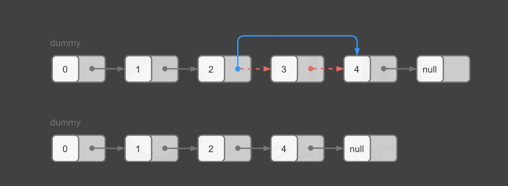

# 019.删除链表的倒数第N个节点
## [题目描述](https://leetcode.cn/problems/remove-nth-node-from-end-of-list/)

::: tip
标签：链表 双指针
:::

给你一个链表，删除链表的倒数第 n 个结点，并且返回链表的头结点。

示例 1：
```
输入：head = [1,2,3,4,5], n = 2
输出：[1,2,3,5]
```

示例 2：
```
输入：head = [1], n = 1
输出：[]
```

示例 3：
```
输入：head = [1,2], n = 1
输出：[1]
```

## 算法思路
在对链表进行操作时，一种常用的技巧是添加一个【哑节点（dummy node）】，它的 next 指针指向链表的头节点。这样一来，我们就不需要对头节点进行特殊的判断了。

例如，在本题中，如果我们要删除节点y，我们需要知道节点y的前驱节点x，并将x的指针指向y的后继节点。需要删除的节点y有可能就是头节点，但由于头节点不存在前驱节点，因此我们需要在删除头节点时进行**特殊判断**。但如果我们添加了【哑节点】，那么头节点的前驱节点就是哑节点本身，此时我们就只需要考虑通用的情况即可。

### 方法一：计算链表的长度：
一种容易想到的方法是，我们首先从头节点开始对链表进行一次遍历，得到链表的长度L，随后我们再从头节点开始对链表进行遍历, 当遍历到第`L - n + 1` 个节点时候，它就是我们需要删除的节点。对于 `[1,2,3,4,5]` 这个链表，倒数第二个节点就是4，按照算法，就是 5 - 2 + 1，这是个数学问题。

> 注意: 为了与题目中的n保持一致，节点的编号从1开始，头节点为编号为1的节点。

为了方便删除操作，我们可以从哑节点开始遍历`L - n + 1`个节点，当遍历到`L - n + 1`个节点时候，它的下一个节点就是我们需要删除的节点，这样我们只需要修改一次指针，就能完成操作。



```ts
/**
 * Definition for singly-linked list.
 * class ListNode {
 *     val: number
 *     next: ListNode | null
 *     constructor(val?: number, next?: ListNode | null) {
 *         this.val = (val===undefined ? 0 : val)
 *         this.next = (next===undefined ? null : next)
 *     }
 * }
 */

function removeNthFromEnd(head: ListNode | null, n: number): ListNode | null {
  // 创建一个“dummy”节点，用来简化处理从链表尾部移除节点的情况
  let dummy: ListNode = new ListNode(0, head);
  // 计算链表的长度
  let length: number = getLength(head);
  // cur指向“dummy”节点
  let cur: ListNode = dummy;
  for (let i = 1; i < length - n + 1; i++) {
    cur = cur.next;
  }
  // cur的下一个节点就是需要移除的节点，这行代码将cur的下一个节点设置为需要移除节点的下一个节点，从而跳过需要移除的节点
  cur.next = cur.next.next;
  // 返回新的链表的头节点
  return dummy.next;
};

function getLength(head: ListNode | null): number {
  let length: number = 0;
  // 遍历链表，直到链表尾部
  while (head != null) {
    ++length;
    head = head.next;
  }
  // 返回链表的长度
  return length;
}
```

## 复杂度分析：
- 时间复杂度：O(L), 其中L是链表的长度
- 空间复杂度：O(1)

### 方法二：使用栈

我们也可以在遍历链表的同时将所有节点依次入栈。根据栈**先进后出**的原则，我们弹出栈的第n个节点就是需要删除的节点，并且目前栈顶的节点就是待删除节点的前驱节点。这样一来，删除操作就变得十分方便了。

```ts
  function removeNthFromEnd(head: ListNode | null, n: number): ListNode | null {
    // 创建一个新的节点并将它的下一个节点设为头节点
    let dummy = new ListNode(0);
    dummy.next = head;

    // 创建一个栈来存放链表中的节点
    let stack: Array<ListNode> = [];
    let cur: ListNode | null = dummy;

    // 遍历链表，将所有节点压入栈中
    while (cur !== null) {
      stack.push(cur);
      cur = cur.next;
    }

    // 弹出栈顶的 n 个元素，这将移动到待删除节点的前一个节点
    for (let i = 0; i < n; ++i) {
      stack.pop();
    }

    // 获取栈顶元素，它是待删除节点的前一个节点
    let prev = stack.pop();

    // 删除待删除的节点
    if (prev !== undefined && prev.next !== null) {
      prev.next = prev.next.next;
    }

    // 返回结果链表的头节点
    return dummy.next;
  }
```

复杂度分析：
- 时间复杂度：O(L) 其中L是链表的长度
- 空间复杂度：O(L) 其中L是链表的长度。主要是栈的开销


