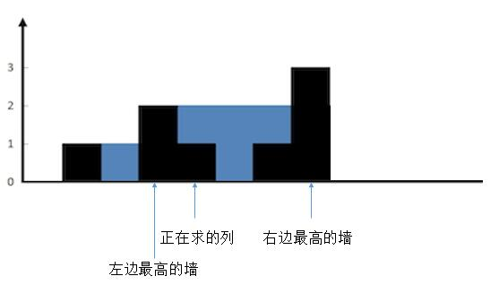
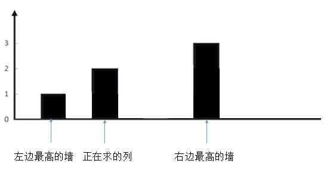
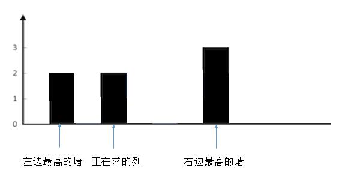

# 042.接雨水

::: tip
标签: 栈、数组、双指针、动态规划、单调栈
:::


给定n个非负整数表示每个宽度为1的柱子的高度图，计算按此排列的柱子，下雨之后还能接多少雨水。

示例1：


```
输入：height = [0,1,0,2,1,0,1,3,2,1,2,1]
输出：6
解释：上面是由数组 [0,1,0,2,1,0,1,3,2,1,2,1] 
表示的高度图，在这种情况下，可以接 6 个单位的雨水（蓝色部分表示雨水）。 
```

## 算法思路：

### 方法一：暴力破解：按照列求解

直接按照题目的描述进行，对于数组中的每一个元素（对应每一列），我们找出下雨之后水能达到的最高位置：等于两边最大高度较小值减去当前高度的值。(就是木桶原理，是否能存住水，主要看端的一端)

根据较矮的那个墙和当前的墙的高度可以分为三种情况：

- 情况1、较矮的墙的高度大于当前列的墙的高度


把正在求的列左边最高的墙和右边最高的墙确定后，然后为了方便理解，我们把无关的墙去掉。


这样就很清楚了，现在想象一下，往两边最高的墙之间注水。正在求的列会有多少水？很明显，较矮的一边，也就是左边的墙的高度，减去当前列的高度就可以了，也就是 2 - 1 = 1，可以存一个单位的水。


- 情况2、较矮的墙的高度小于当前列的墙的高度


同样的，我们把其他无关的列去掉。


想象下，往两边最高的墙之间注水。正在求的列会有多少水？正在求的列不会有水，因为它大于了两边较矮的墙。

- 情况3、较矮的墙的高度等于当前列的墙的高度，这种情况和上一种情况一样的，不会有水。



明白了这三种情况，程序就很好写了，遍历每一列，然后分别求出这一列两边最高的墙。找出较矮的一端，和当前列的高度比较，结果就是上边的三种情况。


还是按照上面图示举例说明：
- 索引值位置：2
- 左边最大是索引值为1的部分，正好高度也是1
- 右边最大是索引值为7的部分，高度是3

当前这个位置能够存储多少水，是由短边决定的，所以 索引为2的部分可以存储的水就是一个单位
- 索引值位置：3
- 算上当前的索引位置的高度左边的最大值是2
- 右边最大是索引值为7的部分，高度是3

这样一来 ans 就是0。说明索引为3的位置不能存储雨水

按照这种思路和模式，将所有的位置全部都计算一遍，然后把每个位置能够存储的水**加和**就是我们想要的结果。

```js
/**
 * @param {number[]} height
 * @return {number}
 */
var trap = function (height) {
  // 变量，最终会返回这个部分的内容,
  let res = 0;
  // 遍历每一个节点，遍历是必须的，因为本质上就是按照列求解
  for (let i = 0; i < height.length; i++) {
    let max_left = 0;
    let max_right = 0;
    // 以当前curr这个位置为基准，找出左边的边界的最大值 找出右边边界的最大值
    // 这种找寻的方法 肯定是包含它自己的，
    for (let j = i; j >= 0; j--) {
      max_left = Math.max(max_left, height[j])
    }
    for (let j = i; j < height.length; j++) {
      max_right = Math.max(max_right, height[j])
    }
    res += (Math.min(max_left, max_right) - height[i])
  }
  return res
};
```

```ts
function trap(height: number[]): number {
  let res: number = 0;
  
  for (let i = 0; i < height.length; i++) {
    let max_left: number = 0;
    let max_right: number = 0;
    // 以当前curr 这个位置为基准，找出左边的边界的最大值 找出右边边界的最大值
    for (let j = i; j >= 0; j--) {
      max_left = Math.max(max_left, height[j])
    }
    for (let j = i; j < height.length; j++) {
      max_right = Math.max(max_right, height[j])
    }
    res += Math.min(max_left, max_right) - height[i]
  }
  return res
};
```

### 方法二：动态规划
我们注意到，在解法一中，对于每一列，我们求它左边最高的墙和右边最高的墙，都是重新遍历一遍所有的高度，这部分是可以进行优化的。

首先用两个数组 `max_left[i]` 代表第 i 列左边最高的高度，`max_right[i]` 代表 i 列右边最高的墙的高度。（一定要注意下，第i列左，右边最高的墙，是不包含自身的）

对于max_left我们可以这样求:

`max_left[i] = Max( max_left[i-1], height[i-1] )`  它前边的墙的左边的最高高度和它前边的墙的高度选一个较大的，就是当前列左边最高的墙了。

对于max_right我们可以这样求：

`max_right[i] = Max( max_right[i+1], height[i+1] )` 它后边的墙的右边的最高高度和它后边的墙的高度选一个较大的，就是当前列右边最高的墙了。

这样，我们再利用解法一的思路，就不用for循环里面每次重新遍历一次求 max_left 和 max_right 了。

```java
public int trap(int[] height) {
  int sum = 0;

  int[] max_left = new int[height.length];
  int[] max_right = new int[height.length];

  for (int i = 1; i < height.length - 1; i++) {
    max_left[i] =  Math.max(max_left[i - 1], height[i - 1]);
  }

  for (int i = height.length - 2; i >= 0; i--) {
    max_right[i] = Math.max(max_right[i + 1], height[i + 1]);
  }

  for (int i = 1; i < height.length - 1; i++) {
    int min = Math.min(max_left[i], max_right[i]);
    if (min > height[i]) {
      sum = sum + (min - height[i]);
    }
  }

  return sum
}
```


### 方法三: 双指针解法

我们先声明几个变量的含义：

```
left_max: 左边的最大值，它是从左往右遍历得到的
right_max: 右边的最大值，它是从右往左遍历得到的
left: 从左往右处理的当前下标
right: 从右往左处理的当前下标
```

在某个位置i处，它能存储的水，取决于它左右两边最大值中较小的一个，这点很好理解，和木桶原理类似，取决于短板。这个思路和暴力解法中使用左边最大值还是右边最大值减去当前这个位置的高度的思路是类似的。

当我们从左往右处理`left`下标的时候，左边的最大值`left_max`对它而言是可以信赖的，但是`right_max`对它而言是不可信的, 因为中间没有遍历到的部分是否有最大值是未知的，因此，对于`left`下标而言，`right_max`未必就是它右边最大的值。

当我们从右向左处理`right`下标的时候，右边的最大值`right_max`对它而言是可信的，但是`left_max`对它而言是不可信的。

对于位置`left`而言，它左边的最大值一定是`left_max`, 而右边的最大值“大于等于right_max”, 此时, 如果`left_max < right_max`成立，还记的我们上文说的存储水的基本条件是：取决于它左右两边的最大值中较小的一个，那么它就知道自己能存多少水了，无论右边将来会不会出现更大的`right_max`,都不影响这个结果，所以当 `left_max < right_max` 时，我们就希望去处理`left`下标，反之，我们希望去处理`right`下标。

```js
/**
 * @param {number[]} height
 * @return {number}
 */
var trap = function (height) {
  let left = 0;
  let right = height.length - 1;
  let res = 0;
  let leftMax = 0;
  let rightMax = 0;
  while (left < right) {
    if (height[left] < height[right]) {
      leftMax = Math.max(height[left], leftMax);
      res += leftMax - height[left];
      left++;
    } else {
      rightMax = Math.max(height[right], rightMax);
      res += rightMax - height[right];
      right--;
    }
  }
  return res;
};
```

函数的输入参数是一个表示高度的数组 height。函数的返回值是一个整数，表示能够接住的雨水的单位数。

函数的实现过程如下：

- 初始化左右指针 left 和 right，分别指向数组的左右两端。
- 初始化变量 res 和 leftMax 和 rightMax，分别表示能够接住的雨水的单位数、左侧最大高度和右侧最大高度，初始值都为 0。
- 当 left < right 时，执行以下操作：
  - 如果 height[left] < height[right]，则说明左侧的高度比右侧低，此时可以确定左侧能够接住的雨水的高度为 leftMax - height[left]，并将 leftMax 更新为 left 和 leftMax 中的最大值。然后将 left 指针向右移动一位。
  - 如果 height[left] >= height[right]，则说明右侧的高度比左侧低或相等，此时可以确定右侧能够接住的雨水的高度为 rightMax - height[right]，并将 rightMax 更新为 right 和 rightMax 中的最大值。然后将 right 指针向左移动一位。

循环结束后，返回 res，即为能够接住的雨水的单位数。

该函数的时间复杂度为 O(n)，其中 n 是数组的长度。

复杂性分析
- 时间复杂度：O(n)。单次遍历的时间O(n)。
- 空间复杂度：O(1)的额外空间。


