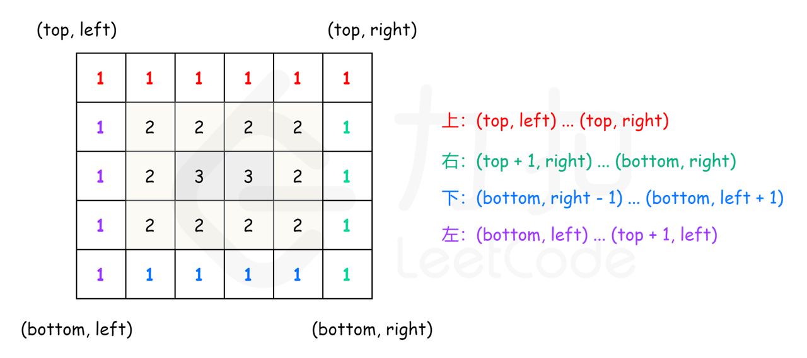

# 054.螺旋矩阵
## [题目描述](https://leetcode.cn/problems/spiral-matrix/)

::: tip
标签：数组、矩阵、模拟
:::

## 算法思路

按照层进行模拟，可以把矩阵看成若干层，首先输出最外层的元素，其次输出次外层的元素，直到输出最内层的元素。

定义矩阵的第k层是到最近边界为k的所有顶点。例如，下图矩阵最外层元素都是第1层，次外层元素都是第2层，剩下的元素都是第三层。

```
[
  [1, 1, 1, 1, 1, 1, 1],
  [1, 2, 2, 2, 2, 2, 1],
  [1, 2, 3, 3, 3, 2, 1],
  [1, 2, 2, 2, 2, 2, 1],
  [1, 1, 1, 1, 1, 1, 1]
]
```

对于每层，从左上方开始以顺时针的顺序遍历所有元素，假设当前的左上角位于（top,left）右下角位于（bottom，right），按照如下顺序遍历当前元素。

- 1、从左到右遍历上侧元素，依次为 (top, left) 到 (top,right)
- 2、从上到下遍历右侧元素，依次为（top+1, right）到 (bottom,right)
- 3、如果 left < right 且 top  < bottom ,  则从右到左遍历下侧元素，依次为 (bottom ,right-1) 到 (bottom,left+1), 以及从下到上遍历左侧元素，依次为 (bottom,keft) 到 (top+1, left)


遍历完当前层元素之后，将left和top分别增加1，将right 和 bottom 分别减少1，进入下一层继续遍历，直到遍历完毕所有元素为止。



```js
var spiralOrder = function(matrix) {
  if (!matrix.length || !matrix[0].length) {
    return [];
  }

  const rows = matrix.length, columns = matrix[0].length;
  const order = [];
  
  let left = 0, right = columns - 1, top = 0, bottom = rows - 1;

  while (left <= right && top <= bottom) {
    for (let column = left; column <= right; column++) {
      order.push(matrix[top][column]);
    }

    for (let row = top + 1; row <= bottom; row++) {
      order.push(matrix[row][right]);
    }

    if (left < right && top < bottom) {
      for (let column = right - 1; column > left; column--) {
        order.push(matrix[bottom][column]);
      }
      for (let row = bottom; row > top; row--) {
        order.push(matrix[row][left]);
      }
    }

    [left, right, top, bottom] = [left + 1, right - 1, top + 1, bottom - 1];
  }
  
  return order;
};
```


