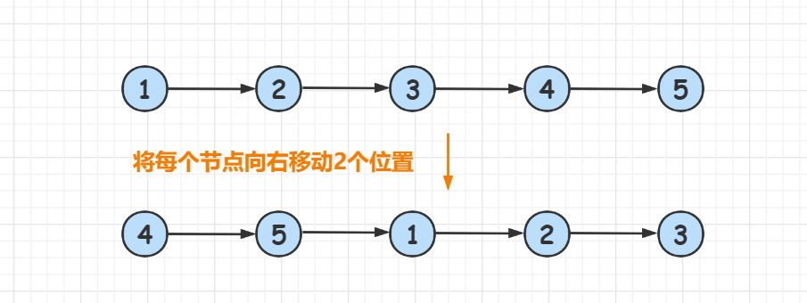
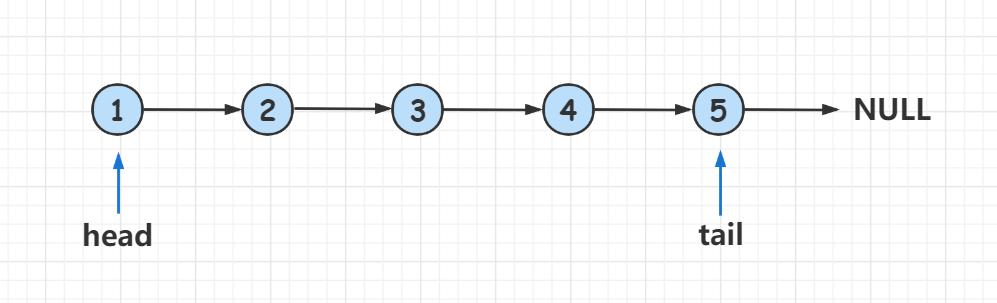
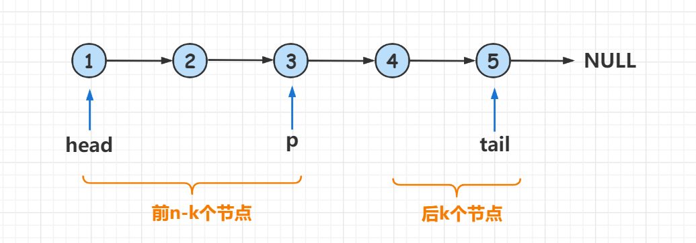

# 061.旋转链表

[题目描述](https://leetcode.cn/problems/rotate-list/)

::: tip
标签: 链表、双指针
:::

## 算法思路：

给你一个链表的头节点head，然后将链表每个节点向右移动k个位置。

如图所示 head = [1,2,3,4,5] k=2 我们输出 [4,5,1,2,3] 下面讲解一下模拟的做法。

假设链表的长度为n, 为了将链表的每个节点向右移动k个位置，我们只需要将链表的后 `k % n` 个节点移动到链表的最前面，然后将链表的后 `k % n` 个节点和前 n - k 个节点连接到一起即可。

> % 是取余数运算

具体过程如下：

1、 首先遍历整个链表，求出链表的长度，并找出链表的尾结点tail。

2、由于k可能很大，所以我们令 k = k % n 然后再次从头节点 head 开始遍历，找到第n-k个节点p, 那么 1-p 是链表的前 n-k 个节点， p+1-n 是链表的后k个节点

