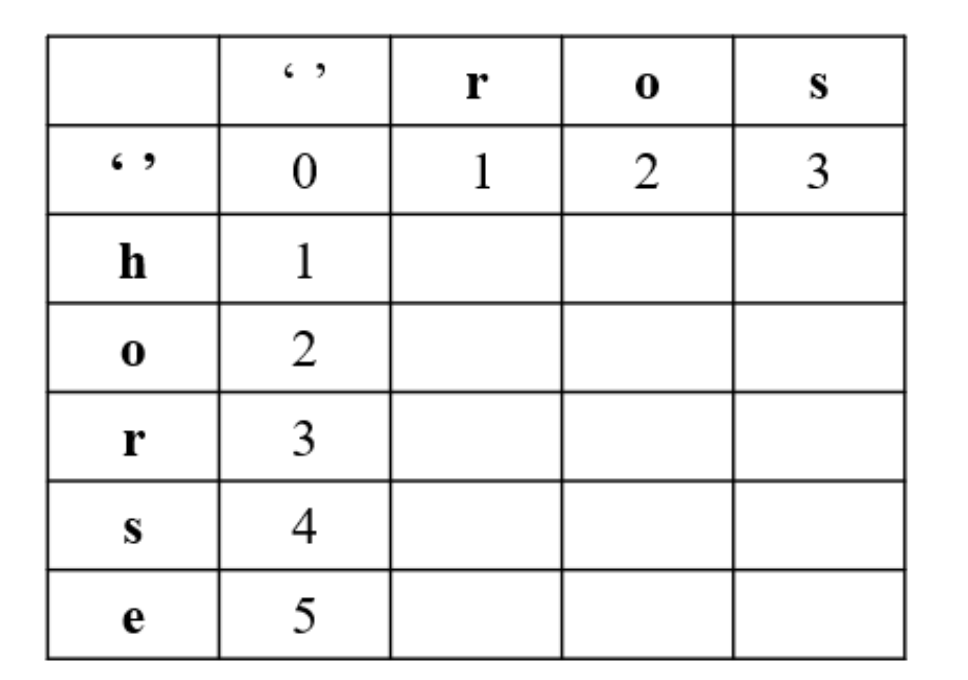

# 072编辑距离

给你两个单词 word1 和 word2，请你计算出将 word1 转换成word2所使用的最少操作数。你可以对一个单词进行如下三种操作：
- 插入一个字符
- 删除一个字符
- 替换一个字符

示例 1：
```
输入：word1 = "horse", word2 = "ros"
输出：3
解释：
horse -> rorse (将 'h' 替换为 'r')
rorse -> rose (删除 'r')
rose -> ros (删除 'e')
```

示例 2：
```
输入：word1 = "intention", word2 = "execution"
输出：5
解释：
intention -> inention (删除 't')
inention -> enention (将 'i' 替换为 'e')
enention -> exention (将 'n' 替换为 'x')
exention -> exection (将 'n' 替换为 'c')
exection -> execution (插入 'u')
```

## 思路
编辑距离算法被数据科学家广泛应用，是做机器翻译和语音识别评价标准的基本算法

## 方法一：动态规划

我们可以对任意一个单词进行三种操作：
- 插入一个字符
- 删除一个字符
- 替换一个字符

题目给定了两个单词 设为A和B,这样我们就能有6种操作方法。
- 对A删除一个字符和对B插入一个字符是等价的，例如A为doge B为dog 我们就可以删除单词A的最后一个字符e，得到相同的dog，也可以在单词B末尾添加一个e,得到相同的doge;
- 同理，对单词B 删除一个字符和对单词 A 插入一个字符也是等价的；
- 对单词A替换一个字符和对单词B替换一个字符是等价的，例如当单词 A 为 bat，单词 B 为 cat 时，我们修改单词 A 的第一个字母 b -> c，和修改单词 B 的第一个字母 c -> b 是等价的。

这样一来，本质不同的操作实际上就只有三种：
- 在单词A中插入一个字符
- 在单词B中插入一个字符
- 修改单词A的一个字符

这样一来，我们就可以把原问题转化为规模较小的子问题。我们用 a=horse b = ros 作为例子，来看下，如何把这个问题转化为规模较小的若干个子问题的。

`dp[i][j]` 代表 word1 到 i 位置转换为 world2 到 j 位置需要多少步数。

- 当 word1[i] === word2[j], dp[i][j] = dp[i-1][j-1], 因为当前这个位置是并不需要操作的。
- 当 word1[i] !== word2[j], dp[i][j] = min(dp[i-1][j-1], dp[i-1][j], dp[i][j-1]) + 1 其中，dp[i-1][j-1] 表示替换操作，dp[i-1][j] 表示删除操作，dp[i][j-1] 表示插入操作。

注意，针对第一行，第一列要单独考虑，我们引入 '' 下图所示：

;

```typescript
function minDistance(word1: string, word2: string): number {
  const m = word1.length; // 获取 word1 的长度
  const n = word2.length; // 获取 word2 的长度

  // 创建一个二维数组，用于存储从 word1 的前缀转换到 word2 的前缀所需的最小操作数
  const dp: number[][] = [];

  // 初始化二维数组的第一行和第一列
  for (let i = 0; i <= m; i++) {
    dp[i] = [];
    dp[i][0] = i; // word2 为空字符串时，将 word1 的字符删除，需要的步数为 i
  }

  for (let j = 0; j <= n; j++) {
    dp[0][j] = j; // word1 为空字符串时，将 word2 的字符插入，需要的步数为 j
  }

  // 动态规划求解最小操作数
  for (let i = 1; i <= m; i++) {
    for (let j = 1; j <= n; j++) {
      if (word1[i - 1] === word2[j - 1]) {
        // 当前字符相等，不需要进行操作，保持相同的状态
        dp[i][j] = dp[i - 1][j - 1];
      } else {
        // 当前字符不相等，可以进行插入、删除或替换操作，取三种操作的最小值并加一
        dp[i][j] = Math.min(dp[i - 1][j], dp[i][j - 1], dp[i - 1][j - 1]) + 1;
      }
    }
  }

  // 返回 word1 转换成 word2 所需的最小操作数
  return dp[m][n];
}
```

