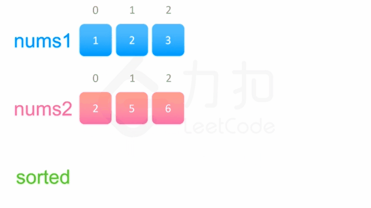

## 88.合并两个有序数组
[题目描述](https://leetcode-cn.com/problems/merge-sorted-array/)

::: tip
标签：数组、双指针、排序
:::

给你两个有序整数数组 `nums1` 和 `nums2`, 请你将nums2合并到nums1中，使得nums1 成为一个有序数组。

初始化 nums1 和 nums2 的元素个数分别为 m 和 n 你可以假设nums1空间大小等于m+n 这样它就有足够的空间来存储nums2的元素。

示例1:
```
输入：nums1 = [1,2,3,0,0,0], m = 3, nums2 = [2,5,6], n = 3
输出：[1,2,2,3,5,6]
```

示例2:
```
输入：nums1 = [1], m = 1, nums2 = [], n = 0
输出：[1]
```
提示:
- nums1.length == m+n
- nums2.length == n
- 0 <= m, n <= 200
- 1 <= m + n <= 200
- -10^9 <= nums1[i], nums2[i] <= 10^9

### 方法一: 直接合并后排序
算法
最直观的方法是先将数组`nums2`放进数组`nums1`的尾部，然后直接对整个数组进行排序。

```js
/**
 * @param {number[]} nums1
 * @param {number} m
 * @param {number[]} nums2
 * @param {number} n
 * @return {void} Do not return anything, modify nums1 in-place instead.
 */
var merge = function(nums1, m, nums2, n) {
  nums1.splice(m, nums1.length-m, ...nums2);
  nums1.sort((a,b) => a - b )
}
```
[splice用法](https://developer.mozilla.org/zh-CN/docs/Web/JavaScript/Reference/Global_Objects/Array/splice)

复杂度分析
- 时间复杂度: O((m+n)log(m+n)), 排序序列长度为 m+n 套用快速排序的时间复杂度即可。
- 空间复杂度: O(log(m+n)), 排序序列长度为 m+nm+n，套用快速排序的空间复杂度即可，平均情况为 O(\log(m+n))O(log(m+n))。
  

### 方法二：双指针
算法

方法一没有利用 `nums1` 和 `nums2` 已经被排序的性质。为了利用这一性质，我们可以使用双指针的方法。这一方法将两个数组看作队列，每次从两个数组头部取出比较小的数字放到结果中，看下面的动画演示。


```js
/**
 * @param {number[]} nums1
 * @param {number} m
 * @param {number[]} nums2
 * @param {number} n
 * @return {void} Do not return anything, modify nums1 in-place instead.
 */
var merge = function(nums1,m, nums2,n) {
  // 两个索引指针
  let p1 = 0;
  let p2 = 0;
  // 生成一个m+n长度的数组默认每个位置填充弄0
  const sorted = new Array(m + n).fill(0);
  // 当前遍历到的位置的元素
  let cur;
  // 循环内部使用的是后自加的方式
  // 等于的情况说明已经遍历到了某一个数组的末尾
  while (p1 < m || p2 < n) {
    if (p1 === m) {
      cur = nums2[p2];
      p2 += 1;
    } else if (p2 === n) {
      cur = nums1[p1];
      p1 += 1;
    } else if (nums1[p1] < nums2[p2]) {
      cur = nums1[p1];
      p1 += 1;
    } else {
      cur = nums2[p2];
      p2 += 1;
    }
    sorted[p1 + p2 - 1] = cur;
  }

  for (let i = 0; i !== m + n; ++i) {
    nums1[i] = sorted[i];
  }
  return nums1;
}
```
复杂度分析:
- 时间复杂度：O(m+n)。指针移动单调递增，最多移动 m+n次，因此时间复杂度为 O(m+n)。
- 空间复杂度：O(m+n)。需要建立长度为 m+n 的中间数组 sorted。


### 方法三：逆向双指针

```js
var merge = function(nums1, m, nums2, n) {
  // 将指针指向两个数组的最后一个元素
  let p1 = m - 1, p2 = n - 1;
  // 将尾指针指向 加和元素的最后的一个元素
  let tail = m + n - 1;
  var cur;
  
  // 两个数组只要还有一个没有遍历完毕就不能停止遍历
  while (p1 >= 0 || p2 >= 0) {
    if (p1 === -1) {
      cur = nums2[p2--];
    } else if (p2 === -1) {
      cur = nums1[p1--];
    } else if (nums1[p1] > nums2[p2]) {
      cur = nums1[p1--];
    } else {
      cur = nums2[p2--];
    }
    nums1[tail--] = cur;
  }
};
```