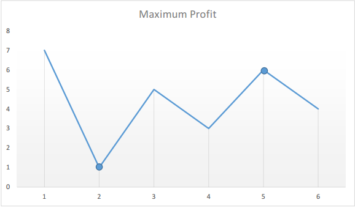

# 121.买卖股票的最佳时机
[题目描述](https://leetcode.cn/problems/best-time-to-buy-and-sell-stock/)

::: tip
标签: 数组、动态规划
:::

## 算法思路
我们需要找出给定数组中两个数字之间的最大差值——即最大利润。此外，第二个数字(卖出价格)必须大于第一个数字 (买入价格)

形式上，对于每组 i 和 j 其中 (j >= i） 我们需要找出 `max(prices[j]−prices[i])`

方法一：暴力法

```js
function maxProfit(prices) {
  let maxprofit = 0;
  for (let i = 0; i < prices.length-1;i++) {
    for (let j = i+1; j < prices.length; j++ ) {
      let profit = prices[j] - prices[i]
      if (profit > maxprofit) {
        maxprofit = profit
      }
    }
  }
  return maxprofit
}
```

```ts
function maxProfit(prices: number[]): number {
  let maxprofit:number = 0;
  for (let i = 0; i < prices.length-1;i++) {
    for (let j = i+1; j < prices.length; j++ ) {
      let profit:number = prices[j] - prices[i]
      if (profit > maxprofit) {
        maxprofit = profit
      }
    }
  }
  return maxprofit
};
```

方法二：一次遍历

假定给定的数组是 `[7,1,5,3,6,4]`, 如果在图表上绘制出来，我们会得到：


我们来假设自己购买股票，随着时间的推移，我们都可以选择是否出售股票。

真实场景中，如果我是在历史最低点买的股票就好了，在题目中我们只需要用一个变量记录一个历史的最低价格 `minprice`, 我们就可以假设自己的股票就是那天购买的，那么我们在第i天卖出股票得到的利润就是 `prices[i] - minprice`。


因此，我们只需要遍历价格数组一遍，记录历史最低点，然后在每一天考虑这么一个问题：

> 如果我是在历史最低点买进的，那么我今天卖出能赚多少钱？当考虑完所有天数之时，我们就得到了最好的答案。


```js
function maxProfit(prices) {
  // 初始化设置一个非常大的值，理论上股票价格不会达到这个值
  let minprice = Number.MAX_SAFE_INTEGER
  // 最大的利润 初始化设置为0
  let maxprofit = 0;

  for (let i = 0; i < prices.length; i++ ) {
    // 在遍历的过程中不断的更新最小值
    if (prices[i] < minprice) {
      minprice = prices[i];
    } else if (prices[i] - minprice > maxprofit) { // 尝试做减法
      maxprofit = prices[i] - minprice;
    }
  }
  return maxprofit
}
```


