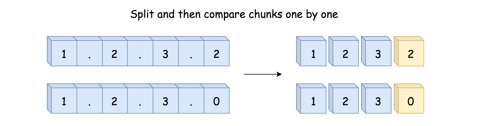

## 165.比较版本号
[题目描述](https://leetcode-cn.com/problems/compare-version-numbers/)

> 标签: 双指针 字符串

给你两个版本号 version1 和 version2, 请你比较它们。

版本号由一个或者多个修订号组成，各修订号由一个 `.`连接，每个修订号由**多位数字**组成，可能包含**前导0**，每个版本号至少包含一个字符，修订号从左往右编号，下标从0开始，最左边的修订号下标为0,下一个修订号下标为1，以此类推。例如 2.5.33 和 0.1都是有效的版本号。

比较版本号时候，请按照从左到右的顺序依次比较它们的修订号，比较修订号时，只需比较**忽略任何前导零后的整数值** 。也就是说，修订号 1 和修订号 001 相等。如果版本号没有指定某个下标处的修订号，则该修订号视为0 。例如，版本 1.0 小于版本 1.1 ，因为它们下标为 0 的修订号相同，而下标为 1 的修订号分别为 0 和 1 ，0 < 1 。

返回规则如下：

如果 version1 > version2 返回 1，
如果 version1 < version2 返回 -1，
除此之外返回 0。

示例1:
```
输入：version1 = "1.01", version2 = "1.001"
输出：0
解释：忽略前导零，"01" 和 "001" 都表示相同的整数 "1"
```

示例 2：
```
输入：version1 = "1.0", version2 = "1.0.0"
输出：0
解释：version1 没有指定下标为 2 的修订号，即视为 "0"
```

示例 3：
```
输入：version1 = "0.1", version2 = "1.1"
输出：-1
解释：version1 中下标为0的修订号是 "0"，version2 中下标为 0 的修订号是 "1" 。0 < 1，所以 version1 < version2
```

示例4:
```
输入：version1 = "1.0.1", version2 = "1"
输出：1
解释：version2中没有指定某一个位置的下标，那么这部分的修订号默认为0，1.0.0
```

示例 5：
```
输入：version1 = "7.5.2.4", version2 = "7.5.3"
输出：-1
```

### 方法一: 分割+解析，两次遍历，线性空间

第一个想法就是将两个字符串按照点字符分割成块，然后逐个比较这些块。



如果两个版本号的块数相同，则可以有效工作，如果不同，则需要在比较短字符串末尾补充相应的 `.0` 使得块数相同


算法:
- 根据点分割两个字符串将分割的结果存储到数组中
- 遍历较长的数组并逐个比较。如果其中一个数组结束了，实际上可以根据需要添加尽可能多的0，以继续与较长的数组进行比较。
  - 如果两个版本好不同返回1或者-1.
- 版本号相同，返回0。

```js
/**
 * @param {string} version1
 * @param {string} version2
 * @return {number}
 */
var compareVersion = function (version1, version2) {
  version1 = version1.split('.');
  version2 = version2.split('.');
  let n = Math.max(version1.length, version2.length)
  for (let i = 0; i < n; i++) {
    // 利用js的特性，在版本号不等长情况下，当元素为undefined时取0，
    // 否则使用parseInt清除前导0进行比较
    let code1 = (version1[i] === undefined) ? 0 : parseInt(version1[i]);
    let code2 = (version2[i] === undefined) ? 0 : parseInt(version2[i]);
    if (code1 > code2) {
      return 1
    } else if (code1 < code2) {
      return -1
    }
  }
  return 0;
};
```

```ts
function compareVersion(version1: string, version2: string): number {
  const version1Arr: string[] = version1.split(".")
  const version2Arr: string[] = version2.split(".")

  let n: number = Math.max(version1Arr.length, version2Arr.length)

  for (let i = 0; i < n; i++) {
    // 利用js的特性,在版本号不等长的情况下，当元素为undefined时候取0
    // 否则使用parseInt清除前导0进行比较: 这是个技巧
    let code1 = (version1Arr[i] === undefined) ? 0 : parseInt(version1Arr[i]);
    let code2 = (version2Arr[i] === undefined) ? 0 : parseInt(version2Arr[i]);

    if (code1 > code2) {
      return 1
    } else if (code1 < code2) {
      return -1
    }
  }
  return 0
};
```

复杂度分析
- 时间复杂度：O(N + M + max(N, M))其中 N 和 M 指的是输入字符串的长度。
- 空间复杂度：O(N + M)，使用了两个数组 nums1 和 nums2 存储两个字符串的块。
