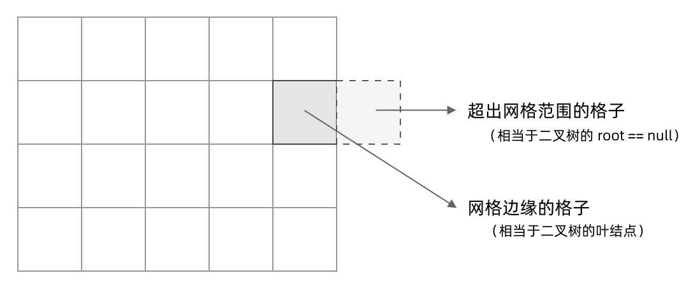

# 200.岛屿数量
## [题目描述](https://leetcode.cn/problems/number-of-islands/)

::: tip
标签: 数组、矩阵、深度优先搜索
:::

## 算法思路
在LeetCode中，「岛屿问题」是一系列的问题，比如：
```
200. 岛屿数量 （Medium）
463. 岛屿的周长 （Easy）
695. 岛屿的最大面积 （Medium）
827. 最大人工岛 （Hard）
```

我们所熟悉的DFS(深度优先搜索)问题通常是在树或者图结构上进行的。这里我们讨论的DFS是在「网格」中进行的；

岛屿问题是这类网格DFS问题的典型代表。网格结构遍历起来要比二叉树复杂一些，如果没有掌握一定的方法，DFS代码容易写的冗长复杂。

### 网格问题的基本概念

我们首先要明确一下岛屿问题中的网格结构是如何定义的，以便后面进行讨论。

网格问题是由 `m×n` 个小方格组成一个网格，每个小方格与它本身的**上下左右**四个方格认为是相邻的，要在这样的网格上进行某种搜索。

岛屿问题是一类典型的网格问题。每个格子中的数字可能是`0`或者`1`。我们把数字为`0`的格子看成海洋格子，数字为`1`的格子看成陆地格子，这样相邻的陆地格子就连接成一个岛屿。


在这样一个设定下，就出现了各种岛屿问题的变种，包括岛屿的**数量**、**面积**、**周长**等。不过这些问题，基本都可以用`DFS`遍历来解决。


### DFS的基本结构

网格结构要比二叉树结构稍微复杂一些，它其实是一种简化版的图结构。要写好网格上的`DFS`遍历，我们首先要理解二叉树上的`DFS`遍历方法，再类比写出网格结构上的`DFS`遍历。我们写的二叉树`DFS`遍历一般是这样的：

```java
void traverse(TreeNode root) {
  // 判断 base case
  if (root == null) {
    return;
  }
  // 访问两个相邻结点：左子结点、右子结点
  traverse(root.left);
  traverse(root.right);
}
```

可以看到，二叉树的 DFS 有两个要素：「访问相邻结点」和「判断 base case」。

第一个要素是访问相邻结点。二叉树的相邻结点非常简单，只有左子结点和右子结点两个。二叉树本身就是一个递归定义的结构：一棵二叉树，它的左子树和右子树也是一棵二叉树。那么我们的`DFS`遍历只需要递归调用左子树和右子树即可。

第二个要素是判断**base case**, 一般来说，二叉树遍历的**base case**是 `root == null`, 这样一个条件判断有两个含义:
- 一方面，这表示 root 指向的子树为空，不需要再往下遍历了，
- 另一方面，在 `root == null` 的时候及时返回，可以让后面的 `root.left` 和 `root.right` 操作不会出现空指针异常。

对于网格上的DFS，我们完全可以参考二叉树的DFS，写出网格的DFS的要素。

首先，网格结构中的格子有多少相邻的节点？答案是 上下左右四个，对于格子 `(r,c)` 来说，它的相邻结点就是 `(r-1,c)`, `(r+1,c)`, `(r,c-1)`, `(r,c+1)`。换句话说，网格结构是「四叉」的。


其次，网格 DFS 中的 base case 是什么？从二叉树的 base case 对应过来，应该是网格中不需要继续遍历、`grid[r][c]` 会出现数组下标越界异常的格子，也就是那些超出网格范围的格子。



这一点稍微有些反直觉，坐标可以临时超出网格的范围，这种方法称之为「先污染后治理」先不要考虑当前在哪个格子，先往四个方向走一步再说，如果发现走出了网格的范围再往回返回，这其实和二叉树的遍历方法是一样的，先递归调用，发现`root == null`再返回。

这样，我们得到了网格DFS遍历的框架代码:

```java
void dfs(int[][] grid, int r, int c) {
    // 判断 base case
    // 如果坐标 (r, c) 超出了网格范围，直接返回
    if (!inArea(grid, r, c)) {
        return;
    }
    // 访问上、下、左、右四个相邻结点
    dfs(grid, r - 1, c);
    dfs(grid, r + 1, c);
    dfs(grid, r, c - 1);
    dfs(grid, r, c + 1);
}

// 判断坐标 (r, c) 是否在网格中
boolean inArea(int[][] grid, int r, int c) {
    return 0 <= r && r < grid.length 
        	&& 0 <= c && c < grid[0].length;
}
```

### 如何避免重复遍历
网格结构的 DFS 与二叉树的 DFS 最大的不同之处在于，遍历中可能遇到遍历过的结点。这是因为，网格结构本质上是一个「图」，我们可以把每个格子看成图中的结点，每个结点有向上下左右的四条边。在图中遍历时，自然可能遇到重复遍历结点。

这时候，DFS 可能会不停地「兜圈子」，永远停不下来，如下图所示：


如何避免这样的重复遍历呢？答案是标记已经遍历过的格子，以岛屿的问题为例子，我们需要在所有值为1的陆地格子上做DFS遍历，每走过一个陆地格子，就把格子的值改为2，这样当我们遇到2的时候，就知道这是之前遍历过的格子。也就是说，每个格子可能有三种取值：
- 0：海洋格子
- 1：陆地格子 （没有遍历过）
- 2：陆地格子 （已经遍历过）

我们在框架代码中加入避免重复遍历的语句：
```java
void dfs(int[][] grid, int r, int c) {
    // 判断 base case
    if (!inArea(grid, r, c)) {
        return;
    }
    // 如果这个格子不是岛屿，直接返回
    if (grid[r][c] != 1) {
        return;
    }
    grid[r][c] = 2; // 将格子标记为「已遍历过」
    
    // 访问上、下、左、右四个相邻结点
    dfs(grid, r - 1, c);
    dfs(grid, r + 1, c);
    dfs(grid, r, c - 1);
    dfs(grid, r, c + 1);
}

// 判断坐标 (r, c) 是否在网格中
boolean inArea(int[][] grid, int r, int c) {
    return 0 <= r && r < grid.length 
        	&& 0 <= c && c < grid[0].length;
}
```


这样，我们就得到了一个岛屿问题，乃至各种网络问题的通用的DFS遍历方法。以下所讲的几个例题，其实都只需要在 DFS 遍历框架上稍加修改而已。


::: tip
在一些题解中，可能会把「已遍历过的陆地格子」标记为和海洋格子一样的 0，美其名曰「陆地沉没方法」，即遍历完一个陆地格子就让陆地「沉没」为海洋。这种方法看似很巧妙，但实际上有很大隐患，因为这样我们就无法区分「海洋格子」和「已遍历过的陆地格子」了。如果题目更复杂一点，这很容易出 bug。
:::

```js
/**
 * @param {character[][]} grid
 * @return {number}
 */
// 我们可以将二维网络看成一个无向图竖直或者水平之间有边相连
// 为了求出岛屿的数量,我们可以扫描整个二维网络，如果一个位置为1 则以其为起点节点
// 开始进行深度优先搜索。在深度优先搜索的过程中,每搜索到1都会标记为2。
// 最终岛屿的数量就是我们进行深度搜索的次数
var numIslands = function (grid) {
  // 边界条件
  if (grid == null || grid.length == 0) {
    return 0;
  }
  let yLen = grid.length;
  let xLen = grid[0].length;
  
  // 初始化设置岛屿的数量是0；
  let num_islands = 0;
  
  // 开始遍历矩阵
  for (let r = 0; r < yLen; r++) {
    for (let c = 0; c < xLen; c++) {
      // 如果判断出来一块陆地
      if (grid[r][c] == "1") {
        num_islands++;
        // 进行深度优先搜索
        dfs(grid, r, c);
      }
    }
  }

  return num_islands;
};

function dfs(grid, r, c) {
  let yLen = grid.length;
  let xLen = grid[0].length;

  // 这是边界条件
  if (r < 0 || c < 0 || r >= yLen || c >= xLen || grid[r][c] !== "1") {
    return;
  }
  // 遍历过的地方 做个标记为2 说明已经走过了
  grid[r][c] = "2";
  dfs(grid, r - 1, c);
  dfs(grid, r + 1, c);
  dfs(grid, r, c - 1);
  dfs(grid, r, c + 1);
}
```


