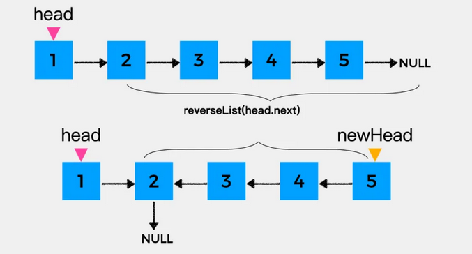
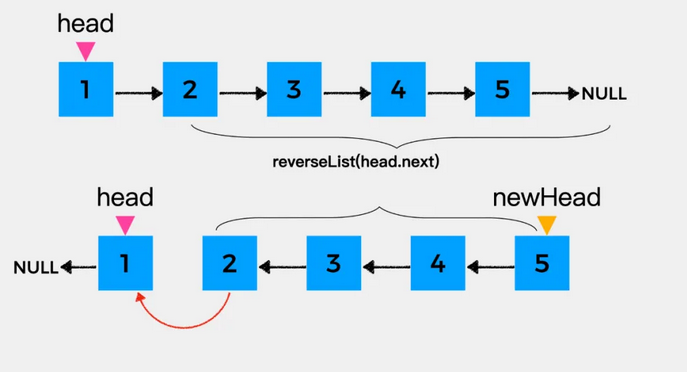

# 206.反转链表

[题目描述](https://leetcode-cn.com/problems/reverse-linked-list/)

::: tip
标签: 链表
:::

给你单链表的头节点`head`,请你翻转链表，并返回翻转后的链表。

示例1：
```
输入：head = [1,2,3,4,5]
输出：[5,4,3,2,1]
```

示例2：
```
输入：head = [1,2]
输出：[2,1]
```

示例3：
```
输入：head = []
输出：[]
```

提示：
- 链表中的节点数目范围是 [0,5000],
- -5000 <= Node.val <= 5000

进阶：链表可以选用迭代和递归的方式完成反转，你能否用两种方法解决这道题目？

### 方法一：迭代
假设存在链表 `1 -> 2 -> 3 -> ∅`  我们想要把它改成 `∅ <- 1 <- 2 <- 3`,在遍历链表时，将当前的节点的next指针改为指向前一个元素，由于节点没有引用其上一个节点，因此必须事先存储前一个元素。在更改引用前，还需要另一个指针来存储下一个节点，不要忘记在最后返回新的头引用。

动画图示：


```js
/**
 * Definition for singly-linked list.
 * function ListNode(val, next) {
 *     this.val = (val===undefined ? 0 : val)
 *     this.next = (next===undefined ? null : next)
 * }
 */
/**
 * @param {ListNode} head
 * @return {ListNode}
 */
var reverseList = function(head) {
  // 前置节点，作为新链表的尾部
  let pre = null;
  // 这个变量用于不断的移动指针。 
  let cur = head;
  
  while(cur !== null) {
    let next = cur.next; // 需要先记录下来当前节点的后指针 否则翻转之后找不到了
    // 开始翻转
    cur.next = pre; // 当前指针指向前置节点;
    pre = cur; // pre 移动到 cur节点；
    cur = next; // cur 移动到next 
  }
  // 退出while循环的条件是 cur为null，只要记住
  // pre 是指向null的前一个元素，所以翻转之后返回的应该是pre
  return pre
};
```

复杂度分析
- 时间复杂度：O(n),假设n是链表的长度，时间复杂度是O(n)。
- 空间复杂度：O(1)。

### 方法二：递归

递归解题首先要明确递推公式的含义，在这里对于节点1来说，它只需要知道它之后的所有节点反转之后的结果就可以了，也就是说递推公式`reverseList`的含义是： **把拿到的链表进行反转，然后返回新的头结点。**


节点1之后的节点，经过递推公式 `reverseList` 处理之后的结果如下图：



到这里，我们就可以写如下代码了。

```js
/**
 * @param {ListNode} head
 * @return {ListNode}
 */
var reverseList = function(head) {
  // 调用递推公式反转当前节点之后的所有节点
  // 返回的结果是翻转后的链表的头节点
  let newHead = reverseList(head.next);
}
```

接着要做的就是反转节点1，也就是将head指向的节点作为其下一个节点的下一个节点，即head.next.next = head。


最后，将head指向的节点的下一个节点置为null，就完成了整个链表的反转。

将反转head指向的结点的代码完善之后，就可以得到如下的代码：

```js
/**
 * @param {ListNode} head
 * @return {ListNode}
 */
var reverseList = function(head) {
  // 调用递推公式反转当前节点之后的所有节点
  // 返回的结果是翻转后的链表的头节点
  let newHead = reverseList(head.next);
  head.next.next = head;
  head.next = null;
  return newHead;
}
```
递归调用这一部分完成之后，还有重要的一步就是递归终止条件，递归反转链表什么时候停止呢？在head指向的结点为null或head指向的结点的下一个结点为null时停止，因为在这两种情况下，反转后的结果就是它自己。到这里，就可以写出完整的代码了：

<code-group>
  <code-block title="JavaScript" active>
  ```js
  /**
  * @param {ListNode} head
  * @return {ListNode}
  */
  var reverseList = function(head) {
    if (head === null || head.next === null) {
      return head;
    }
    // 调用递推公式反转当前节点之后的所有节点
    // 返回的结果是翻转后的链表的头节点
    let newHead = reverseList(head.next);
    head.next.next = head;
    head.next = null;
    return newHead;
  }
  ```
  </code-block>

  <code-block title="TypeScript">
  ```ts
  function reverseList(head: ListNode | null): ListNode | null {
    let pre = null;
    let cur = head;
    while (cur !== null) {
      let next = cur.next;
      // 开始进行变换
      cur.next = pre;
      pre = cur;
      cur = next;
    }
    return pre;
  };
  ```
  </code-block>
</code-group>
