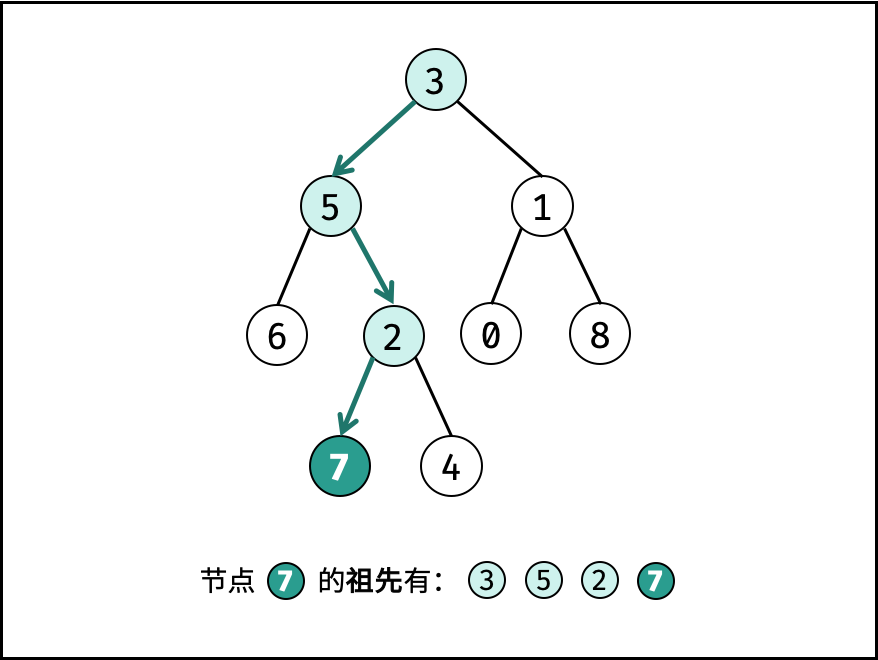

# 236.二叉树的最近公共祖先

给定一个二叉树，找到该树中两个指定节点的最近公共祖先

百度百科中最近公共祖先的定义为: "对于有根树T的两个节点p,q",最近公共祖先表示一个节点x,满足x是p、q的祖先且x的深度尽可能大（一个节点也可以是它自己的祖先）。"


```
输入：root = [3,5,1,6,2,0,8,null,null,7,4], p = 5, q = 1
输出：3
解释：节点 5 和节点 1 的最近公共祖先是节点3。
```

## 解题思路
祖先的定义: 若节点p在节点root的左（右）子树中，或者 p = root, 则称root是p的祖先。

最近公共祖先的定义: 设节点root为节点p,q的某公共祖先，若其左子节点root.left 和 右子节点 root.right 都不是p,q的公共祖先，则称root是"最近的公共祖先"。



根据以上的定义，若root是p,q的最近公共祖先，则只可能为以下情况之一：
- 1、 p和q在root的子树中，且分列root的异侧（即分别在左右子树中）
- 2、p == root, 且q在root的左或者右子树中；
- 3、q == root, 且p在root的左或者右子树中；


考虑通过递归对二叉树进行先序遍历，当遇到节点p或者q的时候返回，从底部到顶部回溯，当节点 p, q 在节点 root 的异侧时，节点 root 即为最近公共祖先，则向上返回 root。


