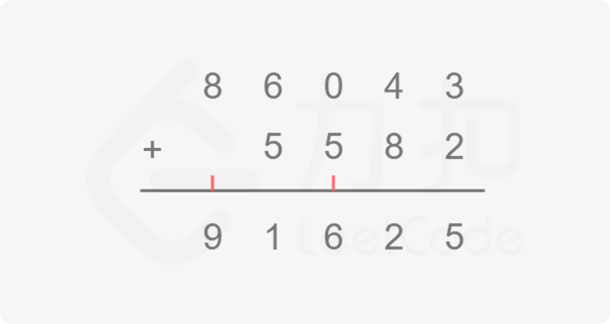

# 标签: 数学 字符串 模拟

## 415.字符串相加

[题目描述](https://leetcode-cn.com/problems/add-strings/)

给定两个字符串形式的非负整数`num1` 和 `num2`,计算他们的和。

提示：
  - 1.num1和num2长度都小于5100
  - 2.num1和num2都只包含数字0-9
  - 3.num1和num2都不包含任何前导零
  - 4.你不能使用任何內建 BigInteger 库， 也不能直接将输入的字符串转换为整数形式


### 方法一: 模拟

思路和算法

本题我们只需要对两个大整数模拟「**竖式加法**」的过程。竖式加法就是我们平常学习生活中常用的对两个整数相加的方法，回想一下在纸上对两个整数相加的操作，是不是如下图将相同的数位对齐，从低到高逐位相加，如果当前位超过10，则向高位进一位，因此我们只要将这个过程用代码写出来即可。



具体的实现也不复杂，我们定义两个指针i和j分别指向num1和num2的末尾，即最低位，同时定义一个变量add维护当前是否有进位，然后从末尾到开头逐位相加即可。你可能会想两个数字位数不同怎么处理，这里我们统一在指针当前下标处于负数的时候返回0，等价于对位数比较短的数字进行补零操作，这样就可以除去两个数字位数不同的情况处理, 需要特殊强调的一点是 循环的条件，因为两个数字的位数可能不同, 所以即使一个数循环完毕，算式还是需要继续，并且加法过程中，进位也是需要进行特殊处理的。

```js
/**
 * @param {string} num1
 * @param {string} num2
 * @return {string}
*/
var addStrings = function (num1, num2) {
  // 两个尾部指针
  let i = num1.length - 1;
  let j = num2.length - 1;
  // 加和
  let add = 0;
  // 声明存放元素
  const ans = [];
  // 双指针的问题
  while( i >= 0 || j >= 0 || add !== 0) {
    const x = i >= 0 ? Number(num1.charAt(i)) : 0;
    const y = j >= 0 ? Number(num2.charAt(j)) : 0;
    const result = x + y + add;
    ans.push(result % 10) // 加和对10取余
    add = result >= 10 ? 1 : 0;
    i -= 1;
    j -= 1;
  }
  return ans.reverse().join('')
}
```

复杂度分析
- 时间复杂度：O(max⁡(len1,len2))其中 len1=num1.length len2=num2.length竖式加法的次数取决于较大数的位数。
- 空间复杂度：O(1)。除答案外我们只需要常数空间存放若干变量。


