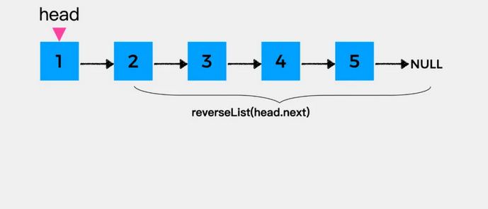
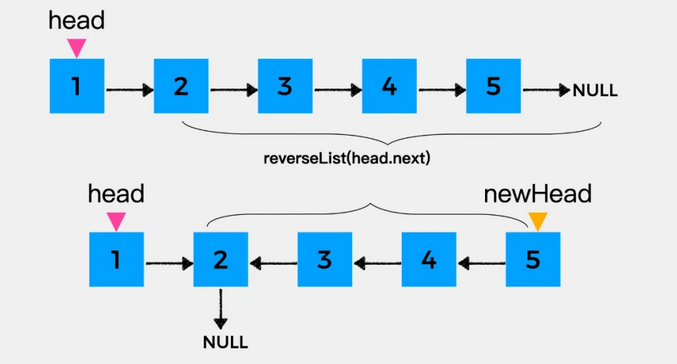
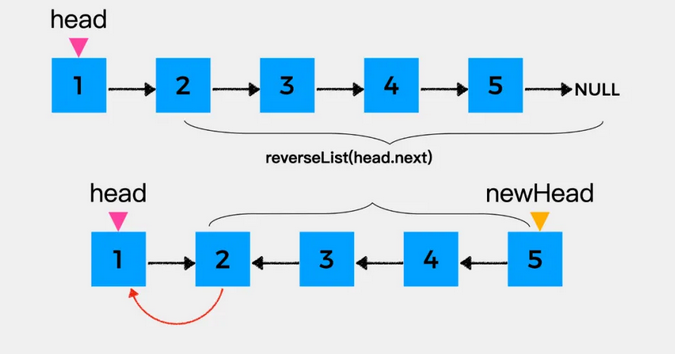
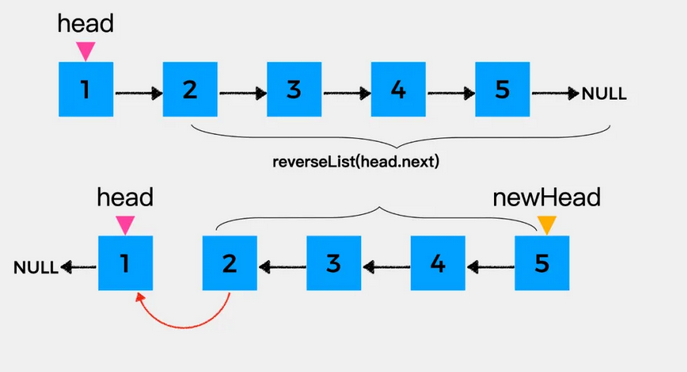

# LeetCode算法题解

## 01.两数之和

[题目描述](https://leetcode-cn.com/problems/two-sum/)

> 标签: 数组、哈希表

给定一个整数数组 `nums` 和一个整数目标值 `target`，请你在该数组中找出 和为目标值 `target`  的那 两个 整数，并返回它们的数组下标。

你可以假设每种输入只会对应一个答案。但是，数组中同一个元素在答案里不能重复出现。

你可以按任意顺序返回答案。

示例 1：

```
输入：nums = [2,7,11,15], target = 9
输出：[0,1]
解释：因为 nums[0] + nums[1] == 9 ，返回 [0, 1] 。
```

示例 2：
```
输入：nums = [3,2,4], target = 6
输出：[1,2]
```

示例 3：
```
输入：nums = [3,3], target = 6
输出：[0,1]
```
### 方法一：暴力枚举

思路以及算法

最容易想到的方法是枚举数组中的每一个数`x`,寻找数组中是否存在`target-x`。

当我们使用遍历整个数组的方式寻找`target-x`时候，需要注意到每一个位于`x`之前的元素都已经和x匹配过，因此不能进行重复匹配。而每一个元素不能被使用两次，所以我们只需要在x后面的元素中寻找`target-x`。

但是这个算法的时间复杂度是 O(n^2)。我们想要实现一个O(n)时间复杂度的算法。

```js
/**
 * @param {number[]} nums
 * @param {number} target
 * @return {number[]}
 */
let twoSum = function (nums, target) {
  let n = nums.length;
  for (let i = 0; i < n; i++) {
    for (let j = i + 1; j < n; j++) {
      if (nums[i] + nums[j] === target) {
        return [i, j]
      }
    }
  }
  return []
}
```
复杂度分析:
- 时间复杂度：O(n^2) ,其中 n 是数组中的元素数量。最坏情况下数组中任意两个数都要被匹配一次.
- 空间复杂度：O(1)。

### 方法二：借助哈希表

由于暴力搜索的方法是遍历所有的两个数字的组合，然后算其和，这样虽然节省了空间，但是时间复杂度高，一般来说，为了减少时间的复杂度，需要使用空间来换，这里我们想要使用线性的时间复杂度来解决问题，也就是说，只能遍历一个数字，而另外一个数字呢，可以事先将其存储起来，使用一个Map数据结构，来建立数字和坐标之间的映射关系，由于Map是常数级查找效率, 这样在遍历数组的时候, 用target减去遍历到的数字，就是另外一个需要的数字了，直接在Map中查找其是否存在即可，需要注意的是，判断查找的数字不是第一个数字，比如target是4，遍历得到了一个2，那么另外一个2不能是之前的那个2，整个实现步骤为: 先遍历一遍数组，建立Map映射，然后再遍历一遍，开始查找，找到则记录index.

```js
/**
 * @param {number[]} nums
 * @param {number} target
 * @return {number[]}
 */
let twoSum = function (nums, target) {
  let result = [];
  let map = new Map();
  // 遍历一遍数组, 将数组中每个值和对应的索引 做一个映射
  for (let i = 0; i < nums.length; i++) {
    map.set(nums[i], i);
  }
  // 再遍历一遍数组
  for (let i = 0; i < nums.length; i++) {
    // 循环每一个元素的时候 都将目标值算出来
    let anotherOne = target - nums[i];
    // 检查 map 中是否包含这个元素，且对应的索引不能是当前的这个索引
    if (map.has(anotherOne) && map.get(anotherOne) !== i) {
      // 找到则放进数组
      result.push(i);
      result.push(map.get(anotherOne))
      break;
    }
  }
  // 返回结果
  return result
}
```

复杂度分析
- 时间复杂度: O(N), 其中 N 是数组中的元素数量。对于每一个元素x,我们可以 O(1)地寻找 target - x。
- 空间复杂度: O(N), 其中 N 是数组中的元素数量。主要为哈希表的开销。

### 方法三：基于哈希表只遍历一遍
```js
/**
 * @param {number[]} nums
 * @param {number} target
 * @return {number[]}
 */
let twoSum = function (nums, target) {
  const map = new Map();
  for (let i = 0; i < nums.length; i++) {
    // 遍历到当前元素的时候, 判断map中是否存在目标值
    if (map.has(target - nums[i])) {
      // 只循环一遍能够保证 索引不重复
      return [i, map.get(target - nums[i])]
    }
    map.set(nums[i], i)
  }
  return [];
}
```

复杂度分析
- 时间复杂度: O(N), 其中 N 是数组中的元素数量。对于每一个元素 x，我们可以 O(1) 地寻找target - x。
- 空间复杂度: O(N), 其中 N 是数组中的元素数量。主要为哈希表的开销。

## 02.两数相加
[题目描述](https://leetcode-cn.com/problems/add-two-numbers/)

> 递归、链表、数学

这道题目是一道比较基础的链表方面的题目, 解题思路就是建立一个新链表, 然后把输入的两个链表从头往后撸, 每两个相加, 添加一个新节点到新链表后面。

为了避免两个输入链表同时为空，我们建立一个 `dummyHead` 结点，将两个结点相加生成的新结点按顺序加到 `dummyHead` 结点之后，由于 `dummyHead` 结点本身不能变，所以我们用一个指针 `cur` 来指向新链表的最后一个结点。

可以开始让两个链表相加了，这道题好就好在**最低位在链表的开头**，所以我们可以在遍历链表的同时按从低到高的顺序直接相加。`while` 循环的条件两个链表中只要有一个不为空就行，由于链表可能为空，所以我们在取当前结点值的时候，先判断一下，若为空则取 0，否则取结点值。然后把两个结点值相加，同时还要加上进位 carry。

然后更新 `carry`，直接 `sum/10` 即可，然后以 `sum % 10` 为值建立一个新结点，连到 `cur` 后面，然后 `cur` 移动到下一个结点。之后再更新两个结点，若存在，则指向下一个位置。while 循环退出之后，最高位的进位问题要最后特殊处理一下，若 carry 为 1，则再建一个值为 1 的结点，代码如下：

```js
/**
 * Definition for singly-linked list.
 * function ListNode(val, next) {
 *     this.val = (val===undefined ? 0 : val)
 *     this.next = (next===undefined ? null : next)
 * }
 */
/**
 * @param {ListNode} l1
 * @param {ListNode} l2
 * @return {ListNode}
 */
var addTwoNumbers = function (l1, l2) {
  // 创建虚拟头节点
  let dummyHead = new ListNode(-1);
  // 将虚拟头结点赋值被cur 之后这个cur会不断地向后移动 
  let cur = dummyHead;
  // 总和
  let sum = 0;
  // 进位
  let carry = 0;
  // 这里使用或运算符, 因为两个链表的长度可能会不一样 
  while (l1 || l2) {
    // 首先sum就是两个节点的值添加上进制
    sum = (l1 ? l1.val : 0) + (l2 ? l2.val : 0) + carry;
    // 进位 很显然 如果sum 大于10 说明进制为1 否则为 0
    carry = sum >= 10 ? 1 : 0
    // 新的链表的下一个节点: 和对10取余
    cur.next = new ListNode(sum % 10);
    // 将cur移动到下一个节点
    cur = cur.next;
    // l1 和 l2 都存在的情况下 也都往后面移动
    l1 && (l1 = l1.next);
    l2 && (l2 = l2.next);
  }
  // 如果最后两个数相加完毕之后还有可能有进制
  carry && (cur.next = new ListNode(carry));
  // 最后将新链表的头结点返回出去就行
  return dummyHead.next;
}; 
```

复杂度分析

- 时间复杂度：O(max(m,n))，其中 m 和 n 分别为两个链表的长度。我们要遍历两个链表的全部位置，而处理每个位置只需要 O(1) 的时间。
- 空间复杂度：O(1)。注意返回值不计入空间复杂度。

## 21.合并两个有序链表
[题目描述](https://leetcode-cn.com/problems/merge-two-sorted-lists/)

> 标签：递归、链表

将两个升序链表合并为一个新的升序链表并返回，新链表是通过拼接给定的两个链表所有节点组成的。

示例1:

```
输入：l1 = [1,2,4], l2 = [1,3,4]
输出：[1,1,2,3,4,4]
```

示例2:
```
输入：l1 = [], l2 = []
输出：[]
```

示例3:
```
输入：l1 = [], l2 = [0]
输出：[0]
```
### 方法一：迭代法：

**思路:**

我们可以使用迭代的方法实现上述算法，当l1和l2都不是空链表时，判断l1和l2哪一个链表的头节点值更小，将较小的节点添加到结果中去，当一个节点被添加到结果中之后，将对应链表中的节点向后移动一位。

**算法:**
首先，我们设定一个虚拟节点，这样可以在最后让我们比较容易的返回新合成的链表，我们维护一个cur指针，我们需要做的就是调整它的next指针，然后，我们重复以下过程，直到l1或者l2指向了null。

- 如果 l1 当前节点的值小于等于 l2 ，我们就把 l1 当前的节点接在 cur 节点的后面同时将 l1 指针往后移一位。
- 否则，我们对 l2 做同样的操作。不管我们将哪一个元素接在了后面，我们都需要把 cur 向后移一位。

在循环终止的时候， l1 和 l2 至多有一个是非空的。由于输入的两个链表都是有序的，所以不管哪个链表是非空的，它包含的所有元素都比前面已经合并链表中的所有元素都要大。这意味着我们只需要简单地将非空链表接在合并链表的后面，并返回合并链表即可。

```js
/**
 * Definition for singly-linked list.
 * function ListNode(val, next) {
 *     this.val = (val===undefined ? 0 : val)
 *     this.next = (next===undefined ? null : next)
 * }
 */
/**
 * @param {ListNode} l1
 * @param {ListNode} l2
 * @return {ListNode}
 */
var mergeTwoLists = function (l1, l2) {
  // 创建一个新的链表的头节点
  let newHead = new ListNode(-1);
  let cur = newHead; // 将head节点赋值给 cur 之后cur 方便移动
  // 因为在内部的循环中,会频繁的使用l1.next 和 l2.next 所以为了防止空指针
  // 这里需要做防空处理
  while (l1 !== null && l2 !== null) {
    if (l1.val < l2.val) {
      cur.next = l1;
      l1 = l1.next
    } else {
      cur.next = l2;
      l2 = l2.next;
    }
    cur = cur.next;
  }
  cur.next = l1 || l2;
  return newHead.next;
};
```

复杂度分析:
- 时间复杂度：O(n + m), 其中 n 和 m 分别为两个链表的长度。因为每次循环迭代中，l1 和 l2 只有一个元素会被放进合并链表中， 因此 while 循环的次数不会超过两个链表的长度之和。所有其他操作的时间复杂度都是常数级别的，因此总的时间复杂度为 O(n+m)
- 空间复杂度：O(1)。我们只需要常数的空间存放若干变量。


## 33.搜索旋转排序数组
整数数组 nums 按照升序排列，数组中的值互不相同。

在传递给函数之前，nums 在预先未知的某个下标 `k（0 <= k < nums.length）`上进行了 旋转，使数组变为 `[nums[k], nums[k+1], ..., nums[n-1], nums[0], nums[1], ..., nums[k-1]]`（下标 从 0 开始 计数）。例如， `[0,1,2,4,5,6,7]` 在下标 3 处经旋转后可能变为 `[4,5,6,7,0,1,2]` 。

给你 旋转后 的数组 nums 和一个整数 target ，如果 nums 中存在这个目标值 target ，则返回它的下标，否则返回 -1 。

示例 1：
```
输入：nums = [4,5,6,7,0,1,2], target = 0
输出：4
```

示例 2：
```
输入：nums = [4,5,6,7,0,1,2], target = 3
输出：-1
```

示例 3：
```
输入：nums = [1], target = 0
输出：-1
```

解题思路：

::: tip
遇到有序数组这种描述，应该可以进行模式识别————对于有序数组，可以使用二分查找的方法查找元素。
:::

但是这道题目中，数组本身不是有序的，进行旋转后只保证了数组的**局部是有序的**，这个还能进行二分查找吗？答案是可以的。

可以发现的是，我们将数组从中间分成左右两部分的时候，一定有一部分数组是有序的。拿示例来看，我们从 6 这个位置分开以后数组变成了 [4,5,6] 和 [7,0,1,2],其中左边  [4,5,6] 这个部分的数组是有序的，其他的也是如此。

这给了我们一些提示，可以在常规二分查找的时候查看当前 `mid` 为分割位置分割出来的两个部分 `[l,mid]` 和 `[mid+1,r]` 哪个部分是有序的，并根据有序的那个部分确定我们该如何改变二分查找的上下界，因为我们能够根据有序的那部分判断出 `target` 在不在这个部分：
>- 如果 [l, mid-1] 是有序数组，且 target的大小满足 `[ nums[l], nums[mid])`, 则我们应该将搜素范围缩小至 [l,mid-1],否则在[mid+1,r]中寻找。
>- 如果 [mid,r] 是有序数组，且 `target` 大小满足 （nums[mid+1],nums[r]],则我们应该将搜索范围缩小至 [mid+1,r],否则在[l,mid-1] 中寻找。


需要注意的是，二分的写法有很多种，所以在判断 target 大小与有序部分的关系时可能会出现细节上的差别。

```js
var search = function (nums, target) {
  if (!nums || nums.length === 0) return -1
  let start = 0
  let end = nums.length - 1
  let mid
  while (start <= end) {
    mid = parseInt((start + end) / 2, 10)
    // 首尾中全部验证
    if (nums[mid] === target) return mid
    if (nums[start] === target) return start
    if (nums[end] === target) return end
    // 说明前半部分有序
    if (nums[start] < nums[mid]) {
      // 说明目标值存在于有序部分，将末尾设置为mid
      // 继续执行二分查找
      if (nums[start] < target && target < nums[mid]) {
        end = mid - 1
      } else { // 说明目标值存在于后半段
        start = mid + 1
      }
    } else {// 说明后半部分有序
      // 判断目标值是否在后半部分
      if (nums[mid] < target && target < nums[end]) {
        start = mid + 1
      } else {
        end = mid - 1
      }
    }
  }
  return -1
}
```
复杂度分析
- 时间复杂度： `O(log⁡n)`，其中 n 为`nums`数组的大小。整个算法时间复杂度即为二分查找的时间复杂度`O(log⁡n)`。
- 空间复杂度： `O(1)` 。我们只需要常数级别的空间存放变量。

## 165.比较版本号
[题目描述](https://leetcode-cn.com/problems/compare-version-numbers/)

> 标签: 双指针 字符串

给你两个版本号 version1 和 version2, 请你比较它们。

版本号由一个或者多个修订号组成，各修订号由一个 `.`连接，每个修订号由**多位数字**组成，可能包含**前导0**，每个版本号至少包含一个字符，修订号从左往右编号，下标从0开始，最左边的修订号下标为0,下一个修订号下标为1，以此类推。例如 2.5.33 和 0.1都是有效的版本号。

比较版本号时候，请按照从左到右的顺序依次比较它们的修订号，比较修订号时，只需比较**忽略任何前导零后的整数值** 。也就是说，修订号 1 和修订号 001 相等 。如果版本号没有指定某个下标处的修订号，则该修订号视为 0 。例如，版本 1.0 小于版本 1.1 ，因为它们下标为 0 的修订号相同，而下标为 1 的修订号分别为 0 和 1 ，0 < 1 。

返回规则如下：

如果 version1 > version2 返回 1，
如果 version1 < version2 返回 -1，
除此之外返回 0。

示例1:
```
输入：version1 = "1.01", version2 = "1.001"
输出：0
解释：忽略前导零，"01" 和 "001" 都表示相同的整数 "1"
```

示例 2：
```
输入：version1 = "1.0", version2 = "1.0.0"
输出：0
解释：version1 没有指定下标为 2 的修订号，即视为 "0"
```

示例 3：
```
输入：version1 = "0.1", version2 = "1.1"
输出：-1
解释：version1 中下标为 0 的修订号是 "0"，version2 中下标为 0 的修订号是 "1" 。0 < 1，所以 version1 < version2
```

示例4:
```
输入：version1 = "1.0.1", version2 = "1"
输出：1
```

示例 5：
```
输入：version1 = "7.5.2.4", version2 = "7.5.3"
输出：-1
```

### 方法一: 分割+解析，两次遍历，线性空间

第一个想法就是将两个字符串按照点字符分割成块，然后逐个比较这些块。


如果两个版本号的块数相同，则可以有效工作，如果不同，则需要在比较短字符串末尾补充相应的 `.0` 使得块数相同


算法:
- 根据点分割两个字符串将分割的结果存储到数组中
- 遍历较长的数组并逐个比较。如果其中一个数组结束了，实际上可以根据需要添加尽可能多的0，以继续与较长的数组进行比较。
  - 如果两个版本好不同返回1或者-1.
- 版本号相同，返回0。

```js
/**
 * @param {string} version1
 * @param {string} version2
 * @return {number}
 */
var compareVersion = function (version1, version2) {
  version1 = version1.split('.');
  version2 = version2.split('.');
  let n = Math.max(version1.length, version2.length)
  for (let i = 0; i < n; i++) {
    // 利用js的特性，在版本号不等长情况下，当元素为undefined时取0，
    // 否则使用parseInt清除前导0进行比较
    let code1 = (version1[i] === undefined) ? 0 : parseInt(version1[i]);
    let code2 = (version2[i] === undefined) ? 0 : parseInt(version2[i]);
    if (code1 > code2) {
      return 1
    } else if (code1 < code2) {
      return -1
    }
  }
  return 0;
};
```

复杂度分析
- 时间复杂度：O(N + M + max(N, M))其中 N 和 M 指的是输入字符串的长度。
- 空间复杂度：O(N + M)，使用了两个数组 nums1 和 nums2 存储两个字符串的块。

## 202.快乐数
[题目描述](https://leetcode-cn.com/problems/happy-number/)

> 标签：哈希表、数学、双指针


编写一个算法来判断一个数 n 是不是快乐数。

「快乐数」的定义为：

- 对于一个正整数，每一次将该数替换为它每个位置上的数字的平方
- 然后重复这个过程直到这个数变为1，也可能是 **无限循环** 但是始终变不到1。
- 如果可以变为1，那么这个树就是快乐数。

如果 n 是快乐数就返回true；不是返回false。

示例1:
```
输入：19
输出：true
解释：
12 + 92 = 82
82 + 22 = 68
62 + 82 = 100
12 + 02 + 02 = 1
```

示例 2：
```
输入：n = 2
输出：false
```

### 方法一: 哈希集合检测循环

我们可以先举几个例子。我们从7开始。则下一个数字是49，(因为7^2 = 49), 然后下一个数字是 97 因为(4^2 + 9^2 = 97).我们可以不断重复该过程，直到我们得到1，因为我们得到了1，我们知道7是一个快乐数，函数应该返回 true。


再举一个例子，让我们从116开始，反复通过平方计算出下一个数字，我们最终得到58，再继续计算之后，我们又得到了58。由于我们回到了一个已经计算过的数字，可以知道有一个循环，因此不可能得到1。所以116不是快乐数，函数应该返回 false。


根据我们的探索，我们猜测会有以下三种可能。
- 1、最终会得到1。
- 2、最终会进入循环。
- 3、值会越来越大，最后接近无穷大。

第3种情况比较难以检测和处理，我们怎么知道它会继续变大呢，而不是最终得到1呢？ 我们可以仔细想一想，每一位数的最大数字的下一位是多少。

| Digits| Largest|  Next |
| ----- | -----  | ----- |
|   1   |   9    |   81  |
|   2   |  99    |   162 |
|   3   |  999   |   343 |
|   4   |  9999  |   324 | 

对于 33 位数的数字，它不可能大于 243243。这意味着它要么被困在 243243 以下的循环内，要么跌到 11。44 位或 44 位以上的数字在每一步都会丢失一位，直到降到 33 位为止。所以我们知道，最坏的情况下，算法可能会在 243243 以下的所有数字上循环，然后回到它已经到过的一个循环或者回到 11。但它不会无限期地进行下去，所以我们排除第三种选择。

即使在代码中你不需要处理第三种情况，你仍然需要理解为什么它永远不会发生，这样你就可以证明为什么你不处理它。

算法：

算法分为两个部分，我们需要设计和编写代码。
- 1、给定一个数字n,它的下一个数字是什么？
- 2、按照一系列的数字来判断我们是否进入了一个循环。

第一部分我们按照题目的要求做数位分离，求平方和。
第二部分我们可以使用哈希集合完成，每次生成链中的下一个数字时候，我们都会检查它是否已经在哈希集合中。
- 如果它不在哈希集合中，我们应该添加它
- 如果它在哈希集合中，这意味着我们处于一个循环中，因此应该返回false。

我们使用哈希集合而不是向量、列表或数组的原因是因为我们反复检查其中是否存在某数字。检查数字是否在哈希集合中需要 `O(1)` 的时间，而对于其他数据结构，则需要 `O(n)` 的时间。选择正确的数据结构是解决这些问题的关键部分。

```js
/**
 * @param {number} n
 * @return {boolean}
 */
var isHappy = function(n) {
  const sumSet = new Set();
  while (n != 1 && !sumSet.has(n)) {
    sumSet.add(n);
    n = getN(n);
  }
  return n == 1;
};
function getN(n) {
  if (n == 1 || n == 0) return n;
  let res = 0;
  while (n) {
    res += (n % 10) * (n % 10);
    n = parseInt(n / 10);
  }
  return res;
}
```


## 206.反转链表

[题目描述](https://leetcode-cn.com/problems/reverse-linked-list/)

> 标签: 链表

给你单链表的头节点`head`,请你翻转链表，并返回翻转后的链表。

示例1：
```
输入：head = [1,2,3,4,5]
输出：[5,4,3,2,1]
```

示例2：
```
输入：head = [1,2]
输出：[2,1]
```

示例3：
```
输入：head = []
输出：[]
```

提示：
- 链表中的节点数目范围是 [0,5000],
- -5000 <= Node.val <= 5000

进阶：链表可以选用迭代和递归的方式完成反转，你能否用两种方法解决这道题目？

### 方法一：迭代
假设存在链表 `1 -> 2 -> 3 -> ∅`  我们想要把它改成 `∅ <- 1 <- 2 <- 3`,在遍历链表时，将当前的节点的next指针改为指向前一个元素，由于节点没有引用其上一个节点，因此必须事先存储前一个元素。在更改引用前，还需要另一个指针来存储下一个节点，不要忘记在最后返回新的头引用。

动画图示：


```js
/**
 * Definition for singly-linked list.
 * function ListNode(val, next) {
 *     this.val = (val===undefined ? 0 : val)
 *     this.next = (next===undefined ? null : next)
 * }
 */
/**
 * @param {ListNode} head
 * @return {ListNode}
 */
var reverseList = function(head) {
  // 前置节点，作为新链表的尾部
  let pre = null;
  // 这个变量用于不断的移动指针。 
  let cur = head;
  
  while(cur !== null) {
    let next = cur.next; // 需要先记录下来当前节点的后指针 否则翻转之后找不到了
    // 开始翻转
    cur.next = pre; // 当前指针指向前置节点;
    pre = cur; // pre 移动到 cur节点；
    cur = next; // cur 移动到next 
  }
  // 退出while循环的条件是 cur为null，只要记住
  // pre 是指向null的前一个元素，所以翻转之后返回的应该是pre
  return pre
};
```

复杂度分析
- 时间复杂度：O(n),假设n是链表的长度，时间复杂度是O(n)。
- 空间复杂度：O(1)。

### 方法二：递归

递归解题首先要明确递推公式的含义，在这里对于节点1来说，它只需要知道它之后的所有节点反转之后的结果就可以了，也就是说递推公式`reverseList`的含义是： **把拿到的链表进行反转，然后返回新的头结点。**



节点1之后的节点，经过递推公式 `reverseList` 处理之后的结果如下图：



到这里，我们就可以写如下代码了。

```js
/**
 * @param {ListNode} head
 * @return {ListNode}
 */
var reverseList = function(head) {
  // 调用递推公式反转当前节点之后的所有节点
  // 返回的结果是翻转后的链表的头节点
  let newHead = reverseList(head.next);
}
```

接着要做的就是反转节点1，也就是将head指向的节点作为其下一个节点的下一个节点，即head.next.next = head。


最后，将head指向的节点的下一个节点置为null，就完成了整个链表的反转。

将反转head指向的结点的代码完善之后，就可以得到如下的代码：

```js
/**
 * @param {ListNode} head
 * @return {ListNode}
 */
var reverseList = function(head) {
  // 调用递推公式反转当前节点之后的所有节点
  // 返回的结果是翻转后的链表的头节点
  let newHead = reverseList(head.next);
  head.next.next = head;
  head.next = null;
  return newHead;
}
```
递归调用这一部分完成之后，还有重要的一步就是递归终止条件，递归反转链表什么时候停止呢？在head指向的结点为null或head指向的结点的下一个结点为null时停止，因为在这两种情况下，反转后的结果就是它自己。到这里，就可以写出完整的代码了：

```js
/**
 * @param {ListNode} head
 * @return {ListNode}
 */
var reverseList = function(head) {
  if (head === null || head.next === null) {
    return head;
  }
  // 调用递推公式反转当前节点之后的所有节点
  // 返回的结果是翻转后的链表的头节点
  let newHead = reverseList(head.next);
  head.next.next = head;
  head.next = null;
  return newHead;
}
```


