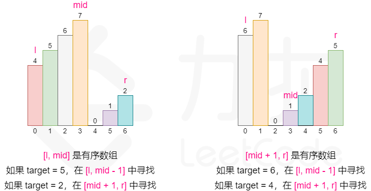

# LeetCode算法题解

## 01.两数之和

[题目描述](https://leetcode-cn.com/problems/two-sum/)

> 标签: 数组、哈希表

给定一个整数数组 `nums` 和一个整数目标值 `target`，请你在该数组中找出 和为目标值 `target`  的那 两个 整数，并返回它们的数组下标。

你可以假设每种输入只会对应一个答案。但是，数组中同一个元素在答案里不能重复出现。

你可以按任意顺序返回答案。

示例 1：

```
输入：nums = [2,7,11,15], target = 9
输出：[0,1]
解释：因为 nums[0] + nums[1] == 9 ，返回 [0, 1] 。
```

示例 2：
```
输入：nums = [3,2,4], target = 6
输出：[1,2]
```

示例 3：
```
输入：nums = [3,3], target = 6
输出：[0,1]
```
### 方法一：暴力枚举

思路以及算法

最容易想到的方法是枚举数组中的每一个数`x`,寻找数组中是否存在`target-x`。

当我们使用遍历整个数组的方式寻找`target-x`时候，需要注意到每一个位于`x`之前的元素都已经和x匹配过，因此不能进行重复匹配。而每一个元素不能被使用两次，所以我们只需要在x后面的元素中寻找`target-x`。

但是这个算法的时间复杂度是 O(n^2)。我们想要实现一个O(n)时间复杂度的算法。

```js
/**
 * @param {number[]} nums
 * @param {number} target
 * @return {number[]}
 */
let twoSum = function (nums, target) {
  let n = nums.length;
  for (let i = 0; i < n; i++) {
    for (let j = i + 1; j < n; j++) {
      if (nums[i] + nums[j] === target) {
        return [i, j]
      }
    }
  }
  return []
}
```
复杂度分析:
- 时间复杂度：O(n^2) ,其中 n 是数组中的元素数量。最坏情况下数组中任意两个数都要被匹配一次.
- 空间复杂度：O(1)。

### 方法二：借助哈希表

由于暴力搜索的方法是遍历所有的两个数字的组合，然后算其和，这样虽然节省了空间，但是时间复杂度高，一般来说，为了减少时间的复杂度，需要使用空间来换，这里我们想要使用线性的时间复杂度来解决问题，也就是说，只能遍历一个数字，而另外一个数字呢，可以事先将其存储起来，使用一个Map数据结构，来建立数字和坐标之间的映射关系，由于Map是常数级查找效率, 这样在遍历数组的时候, 用target减去遍历到的数字，就是另外一个需要的数字了，直接在Map中查找其是否存在即可，需要注意的是，判断查找的数字不是第一个数字，比如target是4，遍历得到了一个2，那么另外一个2不能是之前的那个2，整个实现步骤为: 先遍历一遍数组，建立Map映射，然后再遍历一遍，开始查找，找到则记录index.

```js
/**
 * @param {number[]} nums
 * @param {number} target
 * @return {number[]}
 */
let twoSum = function (nums, target) {
  let result = [];
  let map = new Map();
  // 遍历一遍数组, 将数组中每个值和对应的索引 做一个映射
  for (let i = 0; i < nums.length; i++) {
    map.set(nums[i], i);
  }
  // 再遍历一遍数组
  for (let i = 0; i < nums.length; i++) {
    // 循环每一个元素的时候 都将目标值算出来
    let anotherOne = target - nums[i];
    // 检查 map 中是否包含这个元素，且对应的索引不能是当前的这个索引
    if (map.has(anotherOne) && map.get(anotherOne) !== i) {
      // 找到则放进数组
      result.push(i);
      result.push(map.get(anotherOne))
      break;
    }
  }
  // 返回结果
  return result
}
```

复杂度分析
- 时间复杂度: O(N), 其中 N 是数组中的元素数量。对于每一个元素x,我们可以 O(1)地寻找 target - x。
- 空间复杂度: O(N), 其中 N 是数组中的元素数量。主要为哈希表的开销。

### 方法三：基于哈希表只遍历一遍
```js
/**
 * @param {number[]} nums
 * @param {number} target
 * @return {number[]}
 */
let twoSum = function (nums, target) {
  const map = new Map();
  for (let i = 0; i < nums.length; i++) {
    // 遍历到当前元素的时候, 判断map中是否存在目标值
    if (map.has(target - nums[i])) {
      // 只循环一遍能够保证 索引不重复
      return [i, map.get(target - nums[i])]
    }
    map.set(nums[i], i)
  }
  return [];
}
```

复杂度分析
- 时间复杂度: O(N), 其中 N 是数组中的元素数量。对于每一个元素 x，我们可以 O(1) 地寻找target - x。
- 空间复杂度: O(N), 其中 N 是数组中的元素数量。主要为哈希表的开销。

## 02.两数相加
[题目描述](https://leetcode-cn.com/problems/add-two-numbers/)

> 递归、链表、数学

这道题目是一道比较基础的链表方面的题目, 解题思路就是建立一个新链表, 然后把输入的两个链表从头往后撸, 每两个相加, 添加一个新节点到新链表后面。

为了避免两个输入链表同时为空，我们建立一个 `dummyHead` 结点，将两个结点相加生成的新结点按顺序加到 `dummyHead` 结点之后，由于 `dummyHead` 结点本身不能变，所以我们用一个指针 `cur` 来指向新链表的最后一个结点。

可以开始让两个链表相加了，这道题好就好在**最低位在链表的开头**，所以我们可以在遍历链表的同时按从低到高的顺序直接相加。`while` 循环的条件两个链表中只要有一个不为空就行，由于链表可能为空，所以我们在取当前结点值的时候，先判断一下，若为空则取 0，否则取结点值。然后把两个结点值相加，同时还要加上进位 carry。

然后更新 `carry`，直接 `sum/10` 即可，然后以 `sum % 10` 为值建立一个新结点，连到 `cur` 后面，然后 `cur` 移动到下一个结点。之后再更新两个结点，若存在，则指向下一个位置。while 循环退出之后，最高位的进位问题要最后特殊处理一下，若 carry 为 1，则再建一个值为 1 的结点，代码如下：

```js
/**
 * Definition for singly-linked list.
 * function ListNode(val, next) {
 *     this.val = (val===undefined ? 0 : val)
 *     this.next = (next===undefined ? null : next)
 * }
 */
/**
 * @param {ListNode} l1
 * @param {ListNode} l2
 * @return {ListNode}
 */
var addTwoNumbers = function (l1, l2) {
  // 创建虚拟头节点
  let dummyHead = new ListNode(-1);
  // 将虚拟头结点赋值被cur 之后这个cur会不断地向后移动 
  let cur = dummyHead;
  // 总和
  let sum = 0;
  // 进位
  let carry = 0;
  // 这里使用或运算符, 因为两个链表的长度可能会不一样 
  while (l1 || l2) {
    // 首先sum就是两个节点的值添加上进制
    sum = (l1 ? l1.val : 0) + (l2 ? l2.val : 0) + carry;
    // 进位 很显然 如果sum 大于10 说明进制为1 否则为 0
    carry = sum >= 10 ? 1 : 0
    // 新的链表的下一个节点: 和对10取余
    cur.next = new ListNode(sum % 10);
    // 将cur移动到下一个节点
    cur = cur.next;
    // l1 和 l2 都存在的情况下 也都往后面移动
    l1 && (l1 = l1.next);
    l2 && (l2 = l2.next);
  }
  // 如果最后两个数相加完毕之后还有可能有进制
  carry && (cur.next = new ListNode(carry));
  // 最后将新链表的头结点返回出去就行
  return dummyHead.next;
}; 
```

复杂度分析

- 时间复杂度：O(max(m,n))，其中 m 和 n 分别为两个链表的长度。我们要遍历两个链表的全部位置，而处理每个位置只需要 O(1) 的时间。
- 空间复杂度：O(1)。注意返回值不计入空间复杂度。

## 33.搜索旋转排序数组
整数数组 nums 按照升序排列，数组中的值互不相同。

在传递给函数之前，nums 在预先未知的某个下标 `k（0 <= k < nums.length）`上进行了 旋转，使数组变为 `[nums[k], nums[k+1], ..., nums[n-1], nums[0], nums[1], ..., nums[k-1]]`（下标 从 0 开始 计数）。例如， `[0,1,2,4,5,6,7]` 在下标 3 处经旋转后可能变为 `[4,5,6,7,0,1,2]` 。

给你 旋转后 的数组 nums 和一个整数 target ，如果 nums 中存在这个目标值 target ，则返回它的下标，否则返回 -1 。

示例 1：
```
输入：nums = [4,5,6,7,0,1,2], target = 0
输出：4
```

示例 2：
```
输入：nums = [4,5,6,7,0,1,2], target = 3
输出：-1
```

示例 3：
```
输入：nums = [1], target = 0
输出：-1
```

解题思路：

::: tip
遇到有序数组这种描述，应该可以进行模式识别————对于有序数组，可以使用二分查找的方法查找元素。
:::

但是这道题目中，数组本身不是有序的，进行旋转后只保证了数组的**局部是有序的**，这个还能进行二分查找吗？答案是可以的。

可以发现的是，我们将数组从中间分成左右两部分的时候，一定有一部分数组是有序的。拿示例来看，我们从 6 这个位置分开以后数组变成了 [4,5,6] 和 [7,0,1,2],其中左边  [4,5,6] 这个部分的数组是有序的，其他的也是如此。

这给了我们一些提示，可以在常规二分查找的时候查看当前 `mid` 为分割位置分割出来的两个部分 `[l,mid]` 和 `[mid+1,r]` 哪个部分是有序的，并根据有序的那个部分确定我们该如何改变二分查找的上下界，因为我们能够根据有序的那部分判断出 `target` 在不在这个部分：
>- 如果 [l, mid-1] 是有序数组，且 target的大小满足 `[ nums[l], nums[mid])`, 则我们应该将搜素范围缩小至 [l,mid-1],否则在[mid+1,r]中寻找。
>- 如果 [mid,r] 是有序数组，且 `target` 大小满足 （nums[mid+1],nums[r]],则我们应该将搜索范围缩小至 [mid+1,r],否则在[l,mid-1] 中寻找。



需要注意的是，二分的写法有很多种，所以在判断 target 大小与有序部分的关系时可能会出现细节上的差别。

```js
var search = function (nums, target) {
  if (!nums || nums.length === 0) return -1
  let start = 0
  let end = nums.length - 1
  let mid
  while (start <= end) {
    mid = parseInt((start + end) / 2, 10)
    // 首尾中全部验证
    if (nums[mid] === target) return mid
    if (nums[start] === target) return start
    if (nums[end] === target) return end
    // 说明前半部分有序
    if (nums[start] < nums[mid]) {
      // 说明目标值存在于有序部分，将末尾设置为mid
      // 继续执行二分查找
      if (nums[start] < target && target < nums[mid]) {
        end = mid - 1
      } else { // 说明目标值存在于后半段
        start = mid + 1
      }
    } else {// 说明后半部分有序
      // 判断目标值是否在后半部分
      if (nums[mid] < target && target < nums[end]) {
        start = mid + 1
      } else {
        end = mid - 1
      }
    }
  }
  return -1
}
```
复杂度分析
- 时间复杂度： `O(log⁡n)`，其中 n 为`nums`数组的大小。整个算法时间复杂度即为二分查找的时间复杂度`O(log⁡n)`。
- 空间复杂度： `O(1)` 。我们只需要常数级别的空间存放变量。


