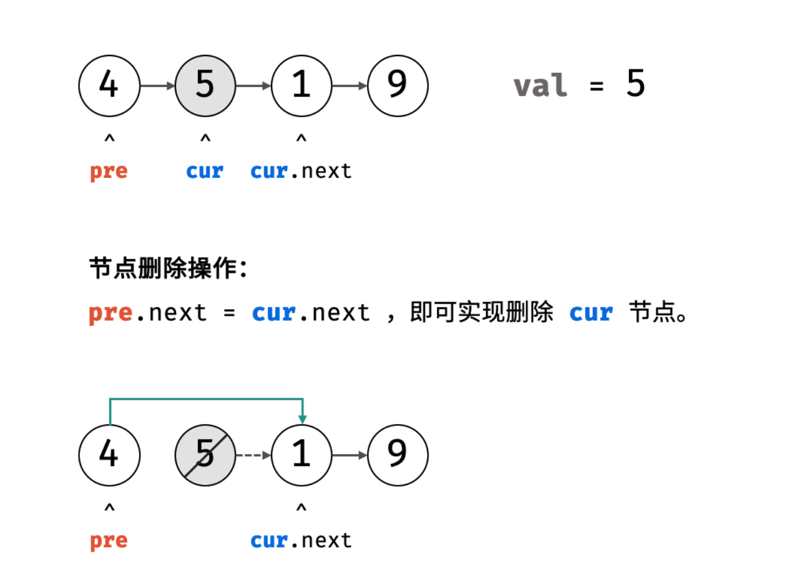
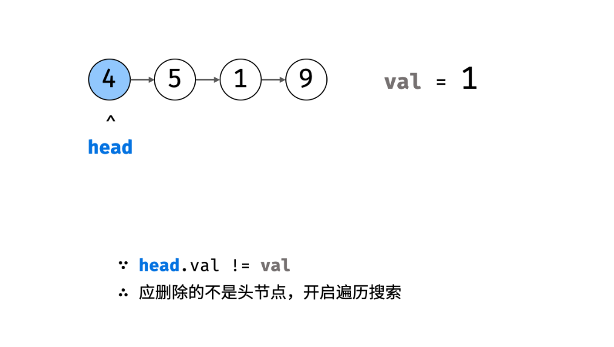
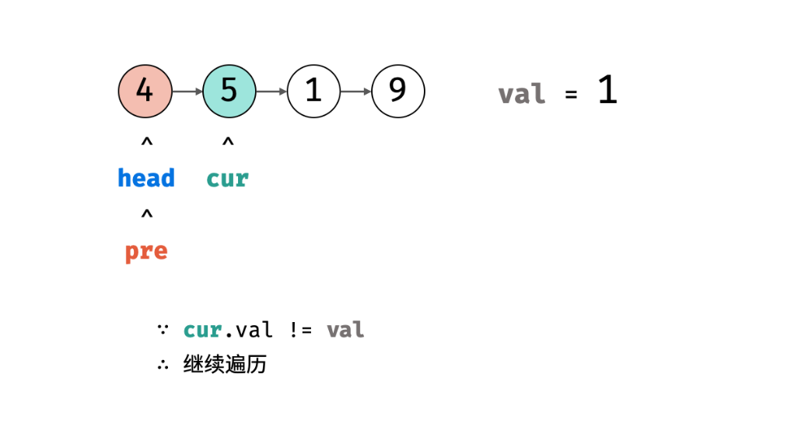
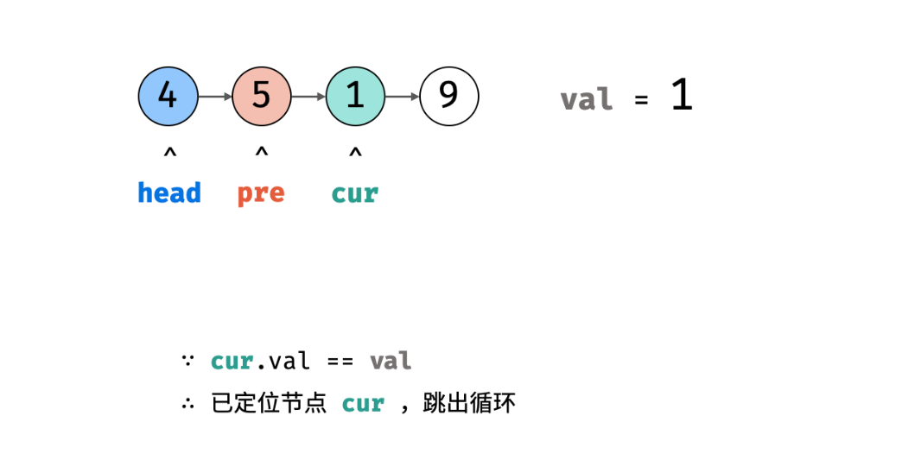
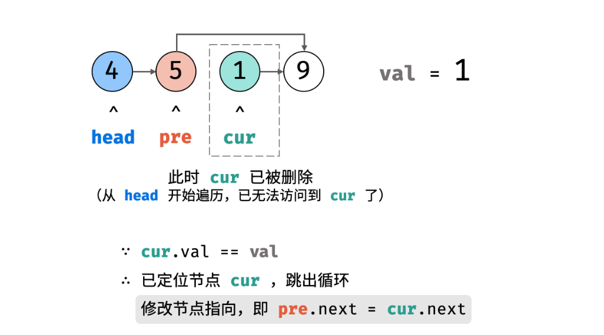
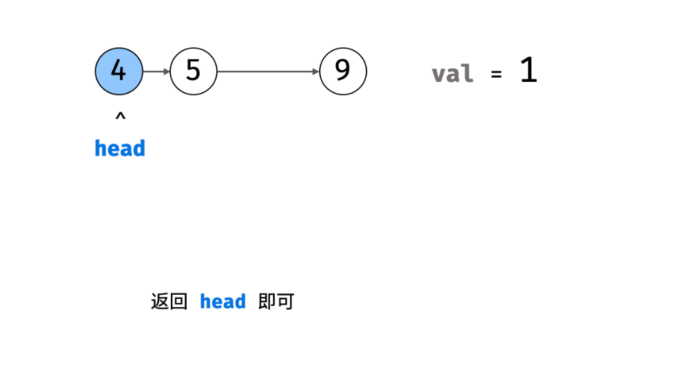

# NC233 加起来和为目标值的组合(四)

## [题目描述](https://www.nowcoder.com/practice/f9f78ca89ad643c99701a7142bd59f5d?tpId=196&rp=1&ru=%2Fexam%2Foj&qru=%2Fexam%2Foj&sourceUrl=%2Fexam%2Foj&difficulty=&judgeStatus=&tags=&title=%E5%88%A0%E9%99%A4%E9%93%BE%E8%A1%A8&gioEnter=menu)

:::tips
标签：链表
:::

## 算法思路
本题删除值为val的节点需要分为两步：定位节点、修改引用。
- 1、定位节点：遍历链表，直到 `head.val === val` 时候跳出，就可以定位目标节点。
- 2、修改引用：设节点 `cur` 的前驱节点为 `pre` , 后继节点为 `cur.next`; 则执行 `pre.next = cur.next`, 就可以实现删除 `cur` 节点。



算法流程：
- 1、特例处理：当应删除头节点 head 时候，直接返回 `head.next` 即可。
- 2、初始化：pre = head, cur = head.next
- 3、定位节点： 当 cur 为空或者 cur 节点等于 val 的时候跳出
  - a.保存当前节点的索引,即 pre = cur
  - b.遍历下一个节点，即 cur = cur.next
- 4、删除节点：如果 cur 指向某个节点，则执行 pre.next = cur.next; 如果 cur 指向 null，代表链表中不包含值为 val 的节点。
- 5、返回值：返回链表头部节点 head 即可。








[详细步骤图示](https://leetcode.cn/problems/shan-chu-lian-biao-de-jie-dian-lcof/solutions/167212/mian-shi-ti-18-shan-chu-lian-biao-de-jie-dian-sh-2/)


```js
/**
 * Definition for singly-linked list.
 * function ListNode(val) {
 *     this.val = val;
 *     this.next = null;
 * }
 */
var deleteNode = function (head, val) {
  if (head === null) {
    return null;
  }
  // 如果需要删除的节点是头节点，直接返回head.next
  if (head.val === val) {
    return head.next;
  }
  
  // 创建两个指针
  let pre = head;
  let cur = head.next;
  
  while (cur !== null && cur.val !== val) {
    pre = cur;
    cur = cur.next;
  }

  if (cur !== null) {
    pre.next = cur.next;
  }
  
  return head;
};
```


