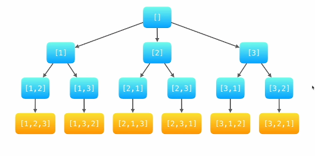

## 描述
[题目描述](https://www.nowcoder.com/practice/4bcf3081067a4d028f95acee3ddcd2b1?tpId=196&tqId=37074&rp=1&ru=/exam/oj&qru=/exam/oj&sourceUrl=%2Fexam%2Foj%3Ftab%3D%25E7%25AE%2597%25E6%25B3%2595%25E7%25AF%2587%26topicId%3D196&difficulty=undefined&judgeStatus=undefined&tags=&title=)

## 题解
手写模拟的过程
- 以1开头的排列，它们是 [1,2,3] ,[1,3,2]
- 以2开头的排列, 它们是 [2,1,3], [2,3,1]
- 以3开头的排列， 它们是 [3,1,2], [3,2,1]

- 按顺序枚举每一个位置可能出现的数字：
- 前面已经出现的数字在接下来要选择的数字中不能出现；

把这种思考过程转化为一张图表示


这道题目使用深度优先搜索的算法解答的时候：
- 每一个节点表示了求解问题的不同阶段
- 深度优先遍历在回到上一层节点的时候需要 "状态重置"

树形结构的查找选择递归这种形式，什么时候结束呢？我们可以设置一个变量，记录节点的元素的长度和给定的数组的长度相同的时候结束。

需要设置的状态变量：
- 递归到了第几层: depth
- 已经选择了哪些数：path
- 布尔数组 used

```js
var permute = function (nums) {
  // 初始化的5个变量自己还记得
  let len = nums.length;
  let res = [];
  let used = {};
  let path = [];
  dfs(nums, len, 0, used, path, res);
  return res
};

/**
 * 深度优先搜索 递归 + 回溯算法的解析
 */
function dfs(nums, len, depth, used, path, res) {
  // dfs 需要有递归终止条件
  if (depth === len) {
    res.push(path.slice())
    return
  }
  // 因为是递归所以需要对每一个数进行遍历
  for (const num of nums) {
    if (used[num]) { // 如果在map中存在说明已经访问过了，
      continue
    }
    path.push(num);
    used[num] = true;
    dfs(nums,len,depth+1,used,path,res)
    path.pop(num);
    used[num] = false;
  }
  return res
}
```


