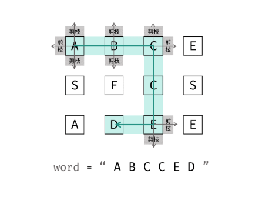

## 题目描述

给定一个 m*n 二维字符网络 board 和 一个字符串单词 word 如果 word 存在于网络中，返回true 否则返回false.

单词必须按照字母排序，通过相邻的单元格字母构成，其中“相邻”单元格是那些水平相邻或垂直相邻的单元格，同一个单元格内的字母不允许被重复使用。

例如，在下面的 3×4 的矩阵中包含单词 "ABCCED"（单词中的字母已标出）。

示例 1：
```js
输入：board = [["A","B","C","E"],["S","F","C","S"],["A","D","E","E"]], word = "ABCCED"
输出：true
示例 2：

输入：board = [["a","b"],["c","d"]], word = "abcd"
输出：false
```

## 解题方案
思路：
- 标签：深度优先搜索 + 剪枝
  - 深度优先搜索：可以理解为暴力法遍历矩阵中所有字符串可能性，DFS通过递归，先朝着一个方向搜索到底，再回溯到上一个节点，沿着另一个方向搜素，以此类推。
  - 剪枝：在搜索中，遇到 这条路不可能和目标字符串匹配成功 的情况 （例如：此矩阵元素和目标字符不同、此元素已经被访问），则应立即返回，称之为 `可行性剪枝`。



## 算法流程
- 递归参数：当前元素在矩阵 board 中的行列索引i和j, 当前目标字符串 word 中的索引k。
- 终止条件：
  - 1、返回false：
    - 行或列索引越界
    - 当前矩阵元素与目标字符串不同
    - 当前矩阵元素已经访问过
  - 2、返回true：
    - k = length(board) - 1, 即字符串已经全部匹配。

- 递推工作：
  - 1、标记当前矩阵元素：将board[i][j] 修改为 `''`, 代表已经访问过，防止之后搜索时候重复访问。
  - 2、搜索下一个单元格：朝当前元素上、下、左、右 四个方向开始下一层的递归，使用 或 连接（代表只需要找到一条可行路径就直接返回，不再做后续的DFS）, 并记录结果res。
  - 3、还原当前矩阵元素：将 board[i][j] 元素还原至初始值，即word[k]。

- 返回值：返回布尔量res，代表是否搜索到目标字符串。


```js
/**
 * 代码中的类名、方法名、参数名已经指定，请勿修改，直接返回方法规定的值即可
 * @param matrix char字符型二维数组
 * @param word string字符串
 * @return bool布尔型
 */
function hasPath(matrix, word) {
  // 边界条件的处理，矩阵为空不可能找到匹配
  if (!matrix || !matrix.length) {
    return false;
  }
  let column = matrix[0].length;
  let row = matrix.length;

  for (let i = 0; i < row; i++) {
    for (let j = 0; j < column; j++) {
      //让矩阵的每个位置都匹配下word(从第一个字符开始)
      if (dfsHelper(matrix, word, i, j, 0)) {
        return true;
      }
    }
  }
  return false;
}

function dfsHelper(board, word, i, j, k) {
  // 中止条件，先检查是不是word已经匹配完成
  if (k == word.length) {
    return true;
  }
  
  //检查4个边界
  if (i >= board.length || j >= board[0].length || j < 0 || i < 0) {
    return false;
  }
  //如果char和矩阵当前元素不同，则返回false
  //递归是为ture还要继续，false才返回
  if (word.charAt(k) !== board[i][j]) {
    return false;
  }
  let old = board[i][j];
  board[i][j] = '0';
  // 查询子树, 找下一个字符k+1
  let re = dfsHelper(board, word, i, j + 1, k + 1) ||
    dfsHelper(board, word, i + 1, j, k + 1) ||
    dfsHelper(board, word, i, j - 1, k + 1) ||
    dfsHelper(board, word, i - 1, j, k + 1);

  board[i][j] = old;
  return re;//结果是子树的结果(k=word.length)
}

module.exports = {
  hasPath: hasPath,
};

```

