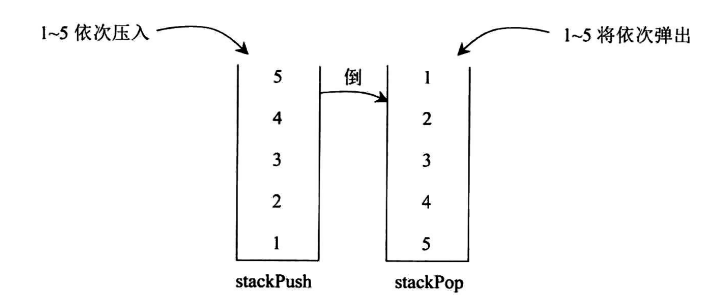

# 剑指offer09.用两个栈实现队列

用两个栈实现一个队列。队列的声明如下，请实现它的两个函数 `appendTail` 和 `deleteHead`，分别完成:
- 队列尾部插入整数。
- 在队列头部删除整数的功能。
 
若队列中没有元素，deleteHead 操作返回 -1。

示例 1：
```
输入：
["CQueue","appendTail","deleteHead","deleteHead"]
[[],[3],[],[]]
输出：[null,null,3,-1]
```

示例 2：
```
输入：
["CQueue","deleteHead","appendTail","appendTail","deleteHead","deleteHead"]
[[],[],[5],[2],[],[]]
输出：[null,-1,null,null,5,2]
```

栈的特点是**先进后出**，而队列的特点是**先进先出**，我们用两个栈正好能把顺序反过来实现类似队列的操作。

具体的实现是：
- 一个栈作为压入栈，在压入数据时候只往这个栈中压入，记为 stackPush。
- 另一个栈只作为弹出栈，在弹出数据的时候只从这个栈弹出，记为 stackPop。

数据压入栈的时候，顺序是**先进后出**的，那么只要把stackPush的数据再压入stackPop中，顺序就变回来了。例如，将1~5依次压入stackPush，那么从stackPush的栈顶到栈底为 5~1, 此时依次再将5~1倒入stackPop，那么从stackPop的栈顶到栈底就变成了 1~5, 再从stackPop弹出时，顺序就像队列一样



听起来很简单，实际上必须做到以下两点。

- 1、如果stackPush 要往stackPop 中压入数据，那么必须一次性把stackPush中的数据全部压入。
- 2、如果stackPop不为空，stackPush 绝对不能向stackPop中压入数据。

违反以上两点都会发生错误。

违反1的情况举例子: 1-5依次压入stackPush，stackPush的栈顶到栈底为5-1, 从stackPush压入stackPop时候，只将5和4压入了stackPop时候，此时stackPush还剩下1、2、3没有压入。此时如果用户想要进行弹出操作，那么会先将4最先弹出，与预想的队列的顺序就是不一样的。

违反2的情况举例，1-5依次压入stackPush，stackPush的栈顶到栈底为5-1,  从stackPush将所有数据压入stackPop，此时stackPop 从栈顶到栈底就是5-1，此时又有6-10依次压入stackPush，stackPop不为空，stackPush不能向其压入数据，如果违反了2压入stackPop，从stackPop的栈顶到栈底就是 6-10  1-5 此时进行弹出操作，6最先被弹出，和预期结果不一致。

```js
var CQueue = function() {
  this.pushStack = [];
  this.popStack = [];
};

/** 
 * @param {number} value
 * @return {void}
 */
CQueue.prototype.appendTail = function(value) {
  // 将value数据放进去
  this.pushStack.push(value)
  if (this.popStack.length === 0) {
    while (this.pushStack.length) {
      this.popStack.push(this.pushStack.pop())
    }
  }
};

/**
 * @return {number}
 */
CQueue.prototype.deleteHead = function() {
  if (this.popStack.length === 0 && this.pushStack.length === 0) {
    return -1;
  } else {
    if (this.popStack.length === 0) {
      while (this.pushStack.length) {
        this.popStack.push(this.pushStack.pop())
      }
    } 
  }
  return this.popStack.pop();
};

/**
 * Your CQueue object will be instantiated and called as such:
 * var obj = new CQueue()
 * obj.appendTail(value)
 * var param_2 = obj.deleteHead()
 */
```