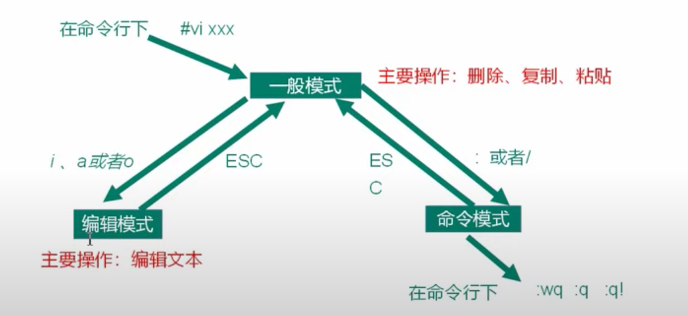

# Lunix

## Linux的概述：

先了解下Unix

Unix是一个强大的多用户、多任务操作系统。于1969年在AT&T的贝尔实验室开发。UNIX的商标权由国际开放标准组织（The Open Group）所拥有。UNIX操作系统是商业版，需要收费，价格比Microsoft Windows正版要贵一些。

Linux的概述：

Linux是基于Unix的Linux是一种自由和开放源码的操作系统，存在着许多不同的Linux版本，但它们都使用了Linux内核。Linux可安装在各种计算机硬件设备中，比如手机、平板电脑、路由器、台式计算机

诞生于1991 年10 月5 日。是由芬兰赫尔辛基大学学生Linus Torvalds和后来加入的众多爱好者共同开发完成。

## 目录规范
- bin 存放的是二进制的命令目录
- sbin 系统级别的二进制目录
- lib 当前的库目录 等同于win上面的system32目录
- lib64 64位比较特殊的库文件
- boot 引导分区目录
- dev 设备目录 linux中把硬件也当成文件处理 一切皆文件
- etc 主要放置配置文件 一般来说，安装数据库的配置文件就会放在这里
- opt 第三方软件的存放目录，约定俗成
- media 可识别媒体设备
- mnt 和media差不多
- proc 进程目录，系统的进程的映射
- sys 存放系统硬件信息
- tmp 临时存放目录
- var 一般存放一些日志文件
- home 普通用户的家目录 可以操作

## vim的操作使用
- VI 是 Unix 操作系统和类 Unix 操作系统中最通用的文本编辑器。
- VIM 编辑器是从 VI 发展出来的一个性能更强大的文本编辑器。可以主动的以字体颜 色辨别语法的正确性，方便程序设计。VIM 与 VI 编辑器完全兼容。



### 操作：删除、复制、粘贴
  
在一般模式下，`yy`命令就是复制的命令，`p`是粘贴的命令, `u`是撤销的命令。`dd` 是删除的命令

**复制多行**：复制的时候可能会有复制多行的需求，这个时候就需要在yy前面加上数字，比如`6yy`代表的是同时复制6行。

**复制光标到结束**：有时候我们并不想复制整行的文本，而是想复制一行中的某一部分，这个时候我们首先按下y,然后再按下$符号，这样就能复制从光标开始到后面的部分。

**复制光标到开头**：同样的，^在计算机系统中表示的是开头的意思，配合着y可以做到复制光标到开头的部分。

**复制某一个单词**：如果想要复制某一个单词，我们可以使用w配合y进行操作，这里的w代表的是world的意思。

粘贴的时候会在**光标**的下一行进行粘贴，5pp 这个命令的意思是 粘贴5行。

如果想要删除光标下面的好几行需要在dd前面添加一个数字： 3dd 这就代表删除多行。

**删除某一个单词**：删除某一个单词需要d配合w来操作，这样就能实现，删除光标后面的部分。

**剪切操作**： 如果想要做类似于那种剪切的操作，有两种模式模式，一种是x(小写的x),这种方式是删除光标当前的位置，一种是X，删除光标之前的位置。

**快速移动**：有时候，我们期望能够快速的移动到行尾，或者行头，这个时候可以使用 `shift + ($)` 或者 `shift + (^)`来操作。

**快速跳转到当前词的词尾部**：如果我们想要跳转到当前词的词尾部，可以使用e这个词来控制。

**快速跳转到当前词的词头部**：如果我们想要跳转到当前词的词头部，可以使用b这个词来控制。

**快速跳转到整篇文档的开头**：我们可以使用g这个小写字母来操作

**快速跳转到整篇文档的末尾**：我们可以使用G这个大写字母来操作，或者使用大写L来进行操作。

想要跳转到指定的行号，我们需要借助一个命令，需要在编辑模式下使用，`set nu`, 这样就进入了编辑模式，进去然后，输入行号，再按`shift + g`,就能跳转到指定的行号。

### 编辑模式下的操作
进入编辑模式除了按住i这个小写字母之外，还可以按住o这个小写字母。i的插入操作是在当前光标处插入数据，o的话是在光标下一行插入数据。

### 命令模式下的常用操作
- :w 保存
- :q 退出
- :wq 保存并退出 有时候也会加上!,意思是对于一些制度文件也支持保存。
- :q! 不保存，强制退出
- :set nu 显示行号
- :set nonu 关闭行号
- :noh 取消高亮显示
- /xxx 按下回车之后，就可以在文档中查找所有的单词, 这个时候按下n就可以定位到单词之中。如果想要向上查找，就使用N。
- :s/old/new 替换当前行匹配到的第一个old为new
- :s/old/new/g 替换当前行匹配到的所有old为new

## Linux的网络配置

### 配置网络 ip 地址
- ifconfig (功能描述:显示所有网络接口的配置信息)

### ping 测试主机之间网络连通性
- ping 目的主机 (功能描述:测试当前服务器是否可以连接目的主机)

### 修改hosts映射文件
打开 `/etc/hosts` 
- vim /etc/hosts

```bash
192.168.2.100 hadoop100
192.168.2.101 hadoop101
192.168.2.102 hadoop102
192.168.2.103 hadoop103
192.168.2.104 hadoop104
192.168.2.105 hadoop105
```

## Linux的系统管理

计算机中，一个正在执行的程序或命令，被叫做“进程”(process)。 启动之后一只存在、常驻内存的进程，一般被称作“服务”(service)。

### 查看防火墙状态
```bash
systemctl status firewalld 
```

我在阿里云服务器上输入命令,会输出下面的
```
firewalld.service - firewalld - dynamic firewall daemon
  Loaded: loaded (/usr/lib/systemd/system/firewalld.service; disabled; vendor >
  Active: inactive (dead)
  Docs: man:firewalld(1)
```

这个命令是关于firewalld服务的系统服务单元文件的输出。firewalld是一个动态防火墙管理工具，它用于管理Linux系统上的防火墙规则和网络连接。根据输出信息：

- `Loaded` 行指示firewalld服务单元文件的位置：`/usr/lib/systemd/system/firewalld.service`。
- `Active` 行指示firewalld服务当前的状态为`inactive (dead)`，表示该服务当前处于非活动状态且已停止。
- `Docs` 行提供了有关firewalld命令的man页文档的参考信息：`man:firewalld(1)`。

根据这些信息，你的阿里云服务器上并未启用firewalld服务，因此该服务当前处于停止状态。如果你希望启用该服务并配置防火墙规则，请参考相关文档或咨询阿里云服务器的支持。

### 临时关闭防火墙
systemctl stop firewalld

### 查看防火墙开机启动状态
enable firewalld.service

### 设置开机时关闭防火墙
systemctl disable firewalld.service


## Linux的常用命令
Shell 可以看作是一个命令解释器，为我们提供了交互式的文本控制台界面。我们可以 通过终端控制台来输入命令，由 shell 进行解释并最终交给内核执行。 本章就将分类介绍 常用的基本 shell 命令。

当我登录阿里云服务器显示如下信息：
```js
root @ iZuf6j0zu9bm2b8n7do53iZ in ~
```
- root 当前登录的用户
- @iZuf6j0zu9bm2b8n7do53iZ 主机名
- ~ 当前工作目录,默认是当前用户的家目录，root就是/root

### man: 获取帮助信息
- man [命令或者配置文件]
- man ls 查看ls命令的帮助信息

### cd：切换目录
- cd - 直接跳转到上一次的目录，这个命令在两个文件目录间隔比较远的时候用处很大

### ls: 查询目录中的内容
- ls [选项] [文件或者目录]
  -a 显示所有文件，包括隐藏文件
  -l 显示详细信息
  -h 人性化的方式显示文件大小
  -i 显示inode,也就是i节点，每个节点都有ID号

### mkdir: 创建目录
- mkdir -p [目录名称] 这里的 -p 代表递归创建

### rmdir: 删除目录
- rmdir -p [目录名称] 这里的 -p 代表的递归删除

### touch: 新建文件，或者修改文件的时间属性
Linux touch命令用于修改文件或者目录的时间属性，包括存取时间和更改时间。若文件不存在，系统会建立一个新的文件。
ls -l 可以显示档案的时间记录。

### pwd: 打印当前的路径

### rmdir：删除空目录
- rmdir [目录名] 如果目录里面包含内容删除的时候会报错

### rm  [文件或者目录]: 递归强制删除所有目录
- -r 递归删除
- -f 强制删除 

```sh
rm -rf node_modules 删除目录
rm -rf ./* 删除当前目录下面的所有文件
```

### cp:【选项】source desk 复制文件或者目录到指定位置 
- -a 比较全能的命令 可以复制目录、文件 可以连带复制属性 还可以复制链接属性
- -r 递归复制，

### mv 重命名一个文件或者移动一个文件到另一个目录: 
- 同级目录下就是改名，不是同级目录就是移动
```sh
# $mv sourcename  targetname
# 创建一个文件夹, 命名为 ny-nginx 突然发现是写错了
$mkdir ny-nginx
# 修改文件名称 改为 my-nginx
$mv ny-nginx my-nginx 
```

### cat 查看文件内容，适用于行数比较小的文件查看
- -n 这个参数可以显示行号

### more 分屏显示文件内容
more 指令是一个基于 VI 编辑器的文本过滤器，它以全屏幕的方式按页显示文本文件的内容。

### > 输出重定向 >> 追加
- ls -l > 文件   列表的内容写入文件a.txt中（覆盖写）
- ls -al >> 文件  列表的内容追加到文件aa.txt的末尾

### echo 输出内容到控制台
```shell
echo "hello\tworld"
hello	world
```
- echo “内容” >> 文件 将内容追加到文件的末尾

### head 显示文件头部内容
head 用于显示文件的开头部分内容，默认情况下 head 指令显示文件的前 10 行内容。


查看文件的头2行：
```sh
head -n 2 smartd.conf
```

### tail 输出文件尾部内容
tail 用于输出文件中尾部的内容，默认情况下 tail 指令显示文件的后 10 行内容。
- tail 文件  查看文件尾部10行内容
- tail -n 5 文件  查看文件尾部5行内容，5可以是任意行数
- tail -f 文件  实时追踪该文档的所有更新, 这个命令在查询日志的时候非常好用


### history 输出历史命令
这个命令在有些场景下，查找之前使用的命令非常有效果

### date 显示当前时间
- date: 显示当前时间
- date +%Y 显示当前年份
- date +%m 显示当前月份
- date +%d 显示当前是哪一天
- date "+%Y-%m-%d %H:%M:%S" 显示年月日时分秒


## Linux的文件权限类

### 文件属性
Linux系统是一种典型的多用户系统，不同的用户处于不同的地位，拥有不同的权限。 为了保护系统的安全性，Linux系统对不同的用户访问同一文件(包括目录文件)的权限做 了不同的规定。在Linux中我们可以使用ll或者ls -l命令来显示一个文件的属性以及文件所属 的用户和组。


如果没有权限，就会出现减号[ - ]而已。从左至右用0-9这些数字来表示:

- (1) 0首位表示类型 在Linux中第一个字符代表这个文件是目录、文件或链接文件等等 - 代表文件 d 代表目录 l 链接文档(link file);
- (2) 第1-3位确定属主(该文件的所有者)拥有该文件的权限。---User 
- (3) 第4-6位确定属组(所有者的同组用户)拥有该文件的权限，---Group
- (4) 第7-9位确定其他用户拥有该文件的权限 ---Other

rwx 作用文件和目录的不同解释：
- 作用到文件：
```
[r]代表可读(read): 可以读取，查看
[w]代表可写(write): 可以修改，但是不代表可以删除该文件，删除一个文件的前提条件是对该文件所在的目录有写权限，才能删除该文件.
[x]代表可执行(execute):可以被系统执行
```

- 作用到目录：
```
[r]代表可读(read): 可以读取，ls查看目录内容
[w]代表可写(write): 可以修改，目录内创建+删除+重命名目录
[x]代表可执行(execute):可以进入该目录
```

### chmod 改变权限


第一种方式改变权限：
```
chmod [{ugoa}{+-=}{rwx}]文件或目录
```

第二种方式变更权限：
```
chmod [mode=421 ] [文件或目录]
```

u:所有者 g:所有组 o:其他人 a:所有人(u、g、o的总和)

```sh
# 修改文件使其所属主用户具有执行权限
[root@101 ~]# cp xiyou/dssz/houge.txt ./
[root@101 ~]# chmod u+x houge.txt

# 修改文件使其所属组用户具有执行权限
[root@101 ~]# chmod g+x houge.txt

# 修改文件所属主用户执行权限,并使其他用户具有执行权限
[root@101 ~]# chmod u-x,o+x houge.txt

# 采用数字的方式，设置文件所有者、所属组、其他用户都具有可读可写可执行权限
[root@101 ~]# chmod 777 houge.txt
```

## 搜索查找类：

### find:查找文件或者目录
find 指令将从指定目录向下递归地遍历其各个子目录，将满足条件的文件显示在终端

```
find [搜索范围][选项]
-name 按照指定的文件名查找模式查找文件
```

实操案例：
```sh
# 按文件名: 根据名称查找/目录下的filename.txt文件。
find xiyou/ -name "*.txt" 

# 按文件大小:在/home目录下查找大于200m的文件(+n 大于 -n小于 n等于)
find /home -size +204800
```

## 压缩和解压类

### gzip/gunzip压缩
- gzip file :压缩文件，只能将文件压缩成*.gz文件
- gunzip 文件.gz :解压文件

这个命令只能压缩文件，不能压缩目录，并且不会保留原来的文件，同时压缩多个文件会产生多个压缩包

```sh
# gzip 压缩
[root@101 ~]# gzip houge.txt
[root@101 ~]# ls
houge.txt.gz

# gunzip解压缩文件
[root@101 ~]# gunzip houge.txt.gz
[root@101 ~]# ls
houge.txt
```

### zip/unzip 压缩

- zip [选项] xxx.zip 压缩文件和目录 -r 代表的是压缩目录
- uzip [选项] xxx.zip 解压 -d 代表的是解压后存放的目录

```sh
# 压缩 houge.txt 和bailongma.txt，压缩后的名称为mypackage.zip
[root@hadoop101 opt]# touch bailongma.txt
[root@hadoop101 ~]# zip mypackage.zip houge.txt bailongma.txt
  adding: houge.txt (stored 0%)
  adding: bailongma.txt (stored 0%) 
[root@hadoop101 opt]# ls
houge.txt bailongma.txt mypackage.zip

# 解压 mypackage.zip
[root@hadoop101 opt]# unzip mypackage.zip
  Archive:  houma.zip
  extracting: houge.txt
  extracting: bailongma.txt 
[root@hadoop101 ~]# ls
houge.txt bailongma.txt mypackage.zip

# 解压mypackage.zip到指定目录-d
[root@hadoop101 opt]# unzip  mypackage.zip -d /opt
```

### tar打包命令： 
- tar [选项] XXX.tar.gz 将要打包进去的内容
```
选项 功能
-c 产生.tar 打包文件
-v 显示详细信息
-f 指定压缩后的文件名 
-z 打包同时压缩
-x 解包.tar 文件
-C 解压到指定目录
```
实操案例：
```sh
# 压缩多个文件
[root@hadoop101 opt]# tar -zcvf houma.tar.gz houge.txt bailongma.txt
houge.txt
bailongma.txt 
[root@101 opt]# ls
houma.tar.gz houge.txt bailongma.txt

# 压缩目录
[root@hadoop101 ~]# tar -zcvf xiyou.tar.gz xiyou/
xiyou/
xiyou/mingjie/
xiyou/dssz/
xiyou/dssz/houge.txt

# 解压到当前目录
[root@101 ~]# tar -zxvf houma.tar.gz

# 解压到指定目录
[root@101 ~]# tar -zxvf houma.tar.gz -C /opt
```

## 磁盘查看分区类：
- du 查看文件和目录占用的磁盘空间 dist usage

选项的说明：
-h: 以人们比较容易阅读的格式展示
-s: 只显示总和

```sh
# 查看当前用户主目录占用的磁盘空间大小
[root@101 ~]# du -sh
```

- df 查看磁盘空间的使用情况 dist free 

选项的说明：
-h: 以人们比较容易阅读的格式展示

```sh
[root@101 ~]# df -h
Filesystem Size  Used Avail Use% Mounted on
/dev/sda2  15G   3.5G  11G  26%  /
tmpfs      939M  224K  939M   1% /dev/shm
/dev/sda1  190M   39M  142M  22% /boot
```


## 进程管理类：
进程是正在执行的一个程序或命令，每一个进程都是一个运行的实体，都有自己的地址空间，并占用一定的系统资源

### ps 查看当前系统进程状态
- ps aux | grep xxx 查看系统中的所有进程
- ps -ef | grep xxx 可以查看子进程和父进程之间的关系

### ps aux 显示的信息说明：
- USER:该进程是由哪个用户产生的
- PID:进程的 ID 号
- %CPU:该进程占用 CPU 资源的百分比，占用越高，进程越耗费资源
- %MEM:该进程占用物理内存的百分比，占用越高，进程越耗费资源;
- VSZ:该进程占用虚拟内存的大小，单位 KB
- RSS:该进程占用实际物理内存的大小，单位 KB
- TTY:该进程是在哪个终端中运行的。对于 CentOS 来说，tty1 是图形化终端,ty2-tty6 是本地的字符界面终端。pts/0-255 代表虚拟终端
- STAT:进程状态。常见的状态有:R:运行状态、S:睡眠状态、T:暂停状态、Z:僵尸状态、s:包含子进程、l:多线程、+:前台显示
- START:该进程的启动时间
- TIME:该进程占用 CPU 的运算时间，注意不是系统时间
- COMMAND:产生此进程的命令名

### ps -ef 显示的信息说明：
- UID:用户 ID
- PID:进程 ID
- PPID:父进程 ID
- C:CPU 用于计算执行优先级的因子。数值越大，表明进程是 CPU 密集型运算， 执行优先级会降低;数值越小，表明进程是 I/O 密集型运算，执行优先级会提高 STIME:进程启动的时间
- TTY:完整的终端名称
- TIME:CPU 时间
- CMD:启动进程所用的命令和参数

### kill 终止进程
- kill [选项] 进程号：通过进程号杀死进程
- killall 进程名称 通过进程名称杀死进程，也支持通配符

```sh
[root@101 ~]# kill -9 5102
[root@101 ~]# killall firefox
```

### pstree 查看进程树
- pstree [选项]

```sh
# 显示进程pid
[root@101 ~]# pstree -p 

# 显示进程所属用户
[root@101 ~]# pstree -u
```

### top 实时监控系统进程状态
- top [选项]
  - d 秒数 指定 top 命令每隔几秒更新。
  - i 使 top 不显示任何闲置或者僵死进程
  - p 通过指定监控进程ID来仅仅监控某个进程的状态

## scp 跨机远程拷贝

scp是secure copy的简写，用于在Linux下进行远程拷贝文件的命令，和它类似的命令有cp，不过cp只是在本机进行拷贝不能跨服务器，而且scp传输是加密的。当你服务器硬盘变为只读 read only system时，用scp可以帮你把文件移出来。

> 类似的工具有rsync；scp消耗资源少，不会提高多少系统负荷，在这一点上，rsync就远远不及它了。rsync比scp会快一点，但当小文件多的情况下，rsync会导致硬盘I/O非常高，而scp基本不影响系统正常使用。

### 命令格式
```sh
$scp [参数] [原路径] [目标路径]
```

### 使用示例

#### 1、从远处复制文件到本地目录
```sh
$scp root@10.6.159.147:/opt/soft/demo.tar /opt/soft/
```

说明： 从10.6.159.147机器上的/opt/soft/的目录中下载demo.tar 文件到本地/opt/soft/目录中

#### 2、从远处复制到本地
```sh
$scp -r root@10.6.159.147:/opt/soft/test /opt/soft/
```
说明： 从10.6.159.147机器上的/opt/soft/中下载test目录到本地的/opt/soft/目录来。

#### 3、上传本地文件到远程机器指定目录
```sh
$scp /opt/soft/demo.tar root@10.6.159.147:/opt/soft/scptest
```
说明： 复制本地opt/soft/目录下的文件demo.tar 到远程机器10.6.159.147的opt/soft/scptest目录

#### 4、上传本地目录到远程机器指定目录
```sh
$scp -r /opt/soft/test root@10.6.159.147:/opt/soft/scptest
```
说明： 上传本地目录 /opt/soft/test到远程机器10.6.159.147上/opt/soft/scptest的目录中

