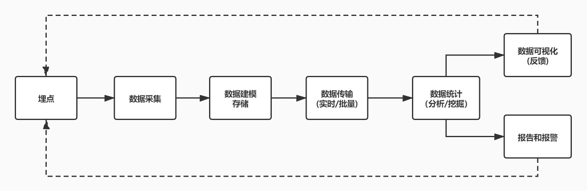

# 前端监控

## 前端监控的目标

### 稳定性
每一个平台的形成都源于广泛的需求，抽象出这些需求的公共特性所形成的产品叫做平台。

我们在实际业务中很想知道线上前端页面报错的情况，想知道页面的性能如何，也想知道使用我们产品的人到底使用的是什么设备，这就是监控平台形成的前提条件，也是必要条件。也是值得前端深入研究的领域。

|错误名称|备注|
|--|--|
|JS错误	|JS执行错误或者promise异常
|资源异常	|script、link等资源加载异常
|接口错误	|ajax或fetch请求接口异常
|白屏	|页面空白

### 用户体验
在产品线上运行阶段，稳定性问题是最重要的问题，一旦出现稳定性问题，用户体验就非常不好。

有一种情况是在后端接口突然上线的情况下，某个接口反馈数据格式错误。如果数据格式无法被前端解析，就会造成解析错误，直接导致整个网页没有任何内容，影响用户体验，如果没有监控平台的话。当我们发现问题的时候，可能就已经损失一大部分用户了。

|错误名称|	备注|
|---|----------|
|加载时间	|各个阶段的加载时间|
|TTFB(time to first byte)(首字节时间)	|是指浏览器发起第一个请求到数据返回第一个字节所消耗的时间，这个时间包含了网络请求时间、后端处理时间|
|FP(First Paint)(首次绘制)	|首次绘制包括了任何用户自定义的背景绘制，它是将第一个像素点绘制到屏幕的时刻
|FCP(First Content Paint)(首次内容绘制)	|首次内容绘制是浏览器将第一个DOM渲染到屏幕的时间,可以是任何文本、图像、SVG等的时间
|FMP(First Meaningful paint)(首次有意义绘制) |	首次有意义绘制是页面可用性的量度标准
|FID(First Input Delay)(首次输入延迟)|	用户首次和页面交互到页面响应交互的时间
|卡顿	|超过50ms的长任务

### 业务
|错误名称	|备注|
|--|--|
|PV|	page view 即页面浏览量或点击量|
|UV|	指访问某个站点的不同IP地址的人数|
|页面的停留时间	|用户在每一个页面的停留时间|

## 前端监控的流程
- 前端埋点
- 数据上报
- 分析和计算 将采集到的数据进行加工汇总
- 可视化展示 将数据按各种维度进行展示
- 监控报警 发现问题后按一定的条件触发报警

