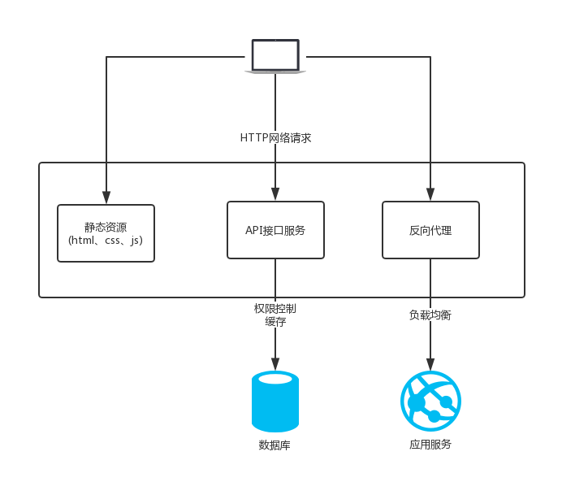

# nginx基础

## 1.nginx使用场景
- 静态资源服务器
- 反向代理服务器
- API接口服务



## 2.nginx优势
- 高并发高性能
- 可扩展性好
- 高可靠性
- 热部署
- 开源许可证


## 3.环境
为了保证可被外界访问，可以先关闭阿里云的防火墙

### 3.1 关闭防火墙

| 功能      | 命令 |
| ----------- | ----------- |
| 停止防火墙    | systemctl stop firewalld.service   |
| 永久关闭防火墙 | systemctl disable firewalld.service |

### 3.2 安装依赖的模块

```sh
yum  -y install gcc gcc-c++ autoconf pcre pcre-devel make automake openssl openssl-devel
```

|     软件包   |    描述     |
| ----------- | ----------- |
| gcc    | gcc是指整个gcc的这一套工具集合，它分为gcc前端和gcc后端（我个人理解为gcc外壳和gcc引擎），gcc前端对应各种特定语言（如c++/go等）的处理（对c++/go等特定语言进行对应的语法检查, 将c++/go等语言的代码转化为c代码等），gcc后端对应把前端的c代码转为跟你的电脑硬件相关的汇编或机器码|
| gcc-c++ | 而就软件程序包而言，gcc.rpm就是那个gcc后端，而gcc-c++.rpm就是针对c++这个特定语言的gcc前端|
| autoconf | autoconf是一个软件包，以适应多种Unix类系统的shell脚本的工具|
| pcre     | PCRE(Perl Compatible Regular Expressions)是一个Perl库，包括 perl 兼容的正则表达式库|
| vim|  Vim是一个类似于Vi的著名的功能强大、高度可定制的文本编辑器|
|wget | wget 是一个从网络上自动下载文件的自由工具，支持通过 HTTP、HTTPS、FTP 三个最常见的 TCP/IP协议 下载，并可以使用 HTTP 代理|
## 4.nginx的架构

### 4.1 轻量
- 源代码只包含核心模块
- 其他非核心功能都是通过模块实现的，可以自由选择

### 4.2 架构
- nginx 采用的是多进程(单线程)和多路IO复用模型
  
#### 4.2.1 工作流程
- 1、nginx启动后，会有一个`master`进程和多个相互独立的`worker`进程。
- 2、接收来自外界的信号，向各 `worker`进程发送信号，每个进程都有可能来处理这个连接。
- 3、master进程能监控worker进程的运行状态，当worker进程退出后 （异常情况下），会自动启动新的worker进程。


- worker 进程数，一般会设置成机器的cpu核数，因为更多的worker数，只会导致进程相互竞争cpu，从而带来不必要的上下文切换
- 使用多进程模型，不仅能够提高并发率，而且多个进程之间相互独立，一个worker进程挂了不会影响到其他的worker进程

## 5.nginx的安装

### 5.1 版本的分类
- Mainline version 开发版本
- Stable version 稳定版本
- Legacy versions  历史版本

### 5.2 CentOS下使用 YUM 安装

创建 `nginx.repo` 文件, 在终端中执行如下命令:

```
vi /etc/yum.repos.d/nginx.repo
```

写入下面配置

```
[nginx]
name=nginx repo
baseurl=http://nginx.org/packages/centos/7/$basearch/
gpgcheck=0
enabled=1
```
执行安装命令

```bash
yum install nginx -y //安装nginx
```
查看安装情况

```bash
nginx -v //查看安装的版本
nginx -V //查看编译时的参数
```

### 5.3 macos 下面的安装：

homebrew是Mac中的一款软件包管理工具，通过brew可以很方便的在Mac中安装软件或者是卸载软件。

有关brew常用的指令如下：

```
brew搜索软件命令： brew search nginx
brew安装软件命令： brew install nginx
brew卸载软件命令: brew uninstall nginx
brew升级命令： sudo brew update
查看安装信息(比如查看安装目录等) sudo brew info nginx
查看已经安装的软件：brew list
```

使用brew安装nginx，如下命令所示：
```sh
brew install nginx
```

查看nginx的配置信息，如下命令：

```sh
brew info nginx
```


## 6.目录

### 6.1 安装目录

查看nginx安装的配置文件和目录。

```
rpm -ql nginx
```
显示如下信息：
```
$ rpm -ql nginx
/etc/logrotate.d/nginx
/etc/nginx/fastcgi.conf
/etc/nginx/fastcgi.conf.default
/etc/nginx/fastcgi_params
/etc/nginx/fastcgi_params.default
/etc/nginx/koi-utf
/etc/nginx/koi-win
/etc/nginx/mime.types
/etc/nginx/mime.types.default
/etc/nginx/nginx.conf
/etc/nginx/nginx.conf.default
/etc/nginx/scgi_params
/etc/nginx/scgi_params.default
/etc/nginx/uwsgi_params
/etc/nginx/uwsgi_params.default
/etc/nginx/win-utf
/usr/bin/nginx-upgrade
/usr/lib/systemd/system/nginx.service
/usr/lib64/nginx/modules
/usr/sbin/nginx
/usr/share/doc/nginx-1.20.1
/usr/share/doc/nginx-1.20.1/CHANGES
/usr/share/doc/nginx-1.20.1/README
/usr/share/doc/nginx-1.20.1/README.dynamic
/usr/share/doc/nginx-1.20.1/UPGRADE-NOTES-1.6-to-1.10
/usr/share/licenses/nginx-1.20.1
/usr/share/licenses/nginx-1.20.1/LICENSE
/usr/share/man/man3/nginx.3pm.gz
/usr/share/man/man8/nginx-upgrade.8.gz
/usr/share/man/man8/nginx.8.gz
/usr/share/nginx/html/404.html
/usr/share/nginx/html/50x.html
/usr/share/nginx/html/en-US
/usr/share/nginx/html/icons
/usr/share/nginx/html/icons/poweredby.png
/usr/share/nginx/html/img
/usr/share/nginx/html/index.html
/usr/share/nginx/html/nginx-logo.png
/usr/share/nginx/html/poweredby.png
/usr/share/vim/vimfiles/ftdetect/nginx.vim
/usr/share/vim/vimfiles/ftplugin/nginx.vim
/usr/share/vim/vimfiles/indent/nginx.vim
/usr/share/vim/vimfiles/syntax/nginx.vim
/var/lib/nginx
/var/lib/nginx/tmp
/var/log/nginx
/var/log/nginx/access.log
/var/log/nginx/error.log
```


### 6.2 日志切割文件所在的位置
- ngxin 日志切割文件
```
/etc/logrotate.d/nginx
```

### 6.3 主配置文件所在的目录

| 路径      | 用途 |
| ----------- | ----------- |
| /etc/nginx/nginx.conf    | 核心配置文件   |
| /etc/nginx/conf.d/default.conf | 默认http服务器配置文件|


nginx.conf  核心配置文件详解：

```shell
user nginx; # 启动nginx的用户
worker_processes auto; # work 进程数量 一般要和cpu的核数相等 
error_log /var/log/nginx/error.log; # 错误日志
pid /run/nginx.pid; # 进程ID写入的文件

# Load dynamic modules. See /usr/share/doc/nginx/README.dynamic.
include /usr/share/nginx/modules/*.conf;

# nginx 架构和node很像
events {
  worker_connections 1024; # 工作进程的最大连接数
}
http {
    # 定义日志的格式
    log_format  main  '$remote_addr - $remote_user [$time_local] "$request" '
                      '$status $body_bytes_sent "$http_referer" '
                      '"$http_user_agent" "$http_x_forwarded_for"';

    access_log  /var/log/nginx/access.log  main;

    sendfile            on;
    tcp_nopush          on;
    tcp_nodelay         on;
    keepalive_timeout   65;
    types_hash_max_size 4096;

    include             /etc/nginx/mime.types; # 包含的mime文件
    default_type        application/octet-stream; # file.xyz 类型文件不认识时候 默认就是二进制文件

    # Load modular configuration files from the /etc/nginx/conf.d directory.
    # See http://nginx.org/en/docs/ngx_core_module.html#include
    # for more information.
    include /etc/nginx/conf.d/*.conf; # 其他的日志文件

    server {
      listen       80;
      listen       [::]:80;
      server_name  _;
      root         /usr/share/nginx/html;

      # Load configuration files for the default server block.
      include /etc/nginx/default.d/*.conf;

      error_page 404 /404.html; # 错误页面 
      location = /404.html {
        # 这个部分可以自己设置 指向自己设定的 404html
      }

      error_page 500 502 503 504 /50x.html; # 服务端的错误码
      location = /50x.html {
        # 这个部分配置root 指向自己设定的 50html
      }
    }
}
```

### 6.4 守护进程命令
```shell
# 启动nginx
systemctl start nginx.service

# 停止nginx
systemctl stop nginx.service

# 重新启动nginx
systemctl restart nginx.service
```

### 6.5 nginx 模块目录
- nginx安装的模块

| 路径      | 用途 |
| ----------- | ----------- |
| /etc/nginx/modules| 最基本的共享库和内核模块|


### 6.6 文档
- nginx的手册和帮助文件

| 路径      | 用途 |
| ----------- | ----------- |
| /usr/share/doc/ nginx-1.20.1| 帮助文档|

### 6.7 缓存目录

| 路径      | 用途 |
| ----------- | ----------- |
| /var/cache/nginx| nginx的缓存目录|

### 6.8 可执行命令
- nginx服务的启动管理的可执行文件

| 路径      | 用途 |
| ----------- | ----------- |
| /usr/sbin/nginx| 可执行命令|
| /usr/sbin/nginx-debug| 调试执行可执行命令|

## 7 nginx的中间件架构

### 7.1 HTTP请求


- request：包括请求行、请求头部、请求数据
- response: 包括状态行、消息报头、响应正文

### 7.2 nginx的日志类型

- error.log
- access_log: 通过访问日志，可以知晓用户的地址，网站的哪些部分最受欢迎，用户的浏览时间，对大多数用户用的的浏览器做出针对性优化。

nginx 会把每个用户访问网站的日志信息记录到指定的日志文件里，供网站管理员分析用户浏览行为等, 这个指定的日志文件就是 access_log。
其中log_format定义了日志输出的格式，输出哪些字段。

日志格式设定：

```shell
log_format main '$remote_addr - $remote_user [$time_local] "$request" '
'$status $body_bytes_sent "$http_referer" '
'"$http_user_agent" $http_x_forwarded_for';
```

log_format 格式变量的含义：
```shell
$remote_addr  #记录访问网站的客户端地址
$remote_user  #远程客户端用户名
$time_local  #记录访问时间与时区
$request  #用户的http请求起始行信息
$status  #http状态码，记录请求返回的状态码，例如：200、301、404等
$body_bytes_sent  #服务器发送给客户端的响应body字节数
$http_referer  #记录此次请求是从哪个连接访问过来的，可以根据该参数进行防盗链设置。
$http_user_agent  #记录客户端访问信息，例如：浏览器、手机客户端等
$http_x_forwarded_for  #当前端有代理服务器时，设置web节点记录客户端地址的配置，此参数生效的前提是代理服务器也要进行相关的x_forwarded_for设置
```

日志格式用一对单引号包起来，多个日志格式段用可以放在不同的行，最后用分号(;)结尾，单引号中的双引号("),空白符，中括号([)等字符原样输出，比较长的字符串通常用双引号(")包起来，看起来不容易更加清楚，$开始的变量会替换为真实的值。


