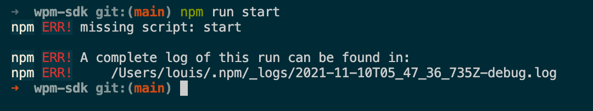

## 1.1 初识 npm script

首先介绍创建 package.json 文件的科学方法，目标是掌握 npm init 命令。然后通过在终端中运行自动生成的test命令，详细说明 npm脚本的执行流程。然后，动手给项目添加 eslint 命令，熟悉创建自定义命令的基本流程。

### 用npm init 快速创建项目

npm 为我们提供了快速创建 package.json 文件的命令 npm init，执行该命令会问几个基本问题，如包名称、版本号。作者信息。入口文件、仓库地址、许可协议等，多数问题已经提供了默认值，你可以在问题后面敲回车接收默认值。

```
package name: (hello-npm-script)
version: (0.1.0)
description: hello npm script
entry point: (index.js)
test command:
git repository:
keywords: npm, script
license: (MIT)
```

上面的例子指定了描述（description）和关键字（keywords）两个字段，基本问题问完之后 npm 会把 package.json 文件内容打出来供你确认:

```json
{
  "name": "hello-npm-script",
  "version": "0.1.0",
  "description": "hello npm script",
  "main": "index.js",
  "scripts": {
    "test": "echo \"Error: no test specified\" && exit 1"
  },
  "keywords": [
    "npm",
    "script"
  ],
  "author": "",
  "license": "MIT"
}
```
按回车键就能把 package.json 的内容写到文件系统中，如果要修改 package.json，可以直接使用编辑器编辑，或者再次运行npm init，npm 默认不会覆盖修改里面已经存在的信息。

::: tip
嫌上面的初始化方式太啰嗦？你可以使用 npm init -f（意指 --force，或者使用 --yes）告诉 npm 直接跳过参数问答环节，快速生成 package.json。
:::

初始化 package.json 时候的字段默认值是可以自己设置的，可以用下面的命令去修改默认配置：
```shell
npm config set init.author.email "wangshijun2010@gmail.com"
npm config set init.author.name "wangshijun"
npm config set init.author.url "http://github.com/wangshijun"
npm config set init.license "MIT"
npm config set init.version "0.1.0"
```

::: tip
将默认配置和 -f 参数结合使用，能让你用最短的时间创建 package.json，快去自己试试吧。
:::


### 用npm run 执行任意命令

使用 npm init 创建的 package.json 文件中包含了 script 字段：

```json
"scripts": {
  "test": "echo \"Error: no test specified\" && exit 1"
},
```

在终端中运行 npm run test 能看到Error: no test specified 的输出，npm run test 可以简写为 npm test，或更简单的 npm t，得到的结果是几乎相同的。npm test 顾名思义，就是运行项目测试，实际用法在实战环节会有介绍。

和 test 类似，start也是npm内置支持的命令。但是需要先在 scripts 字段中声明该脚本的实际内容，如果没声明就执行 npm start，会直接报错。如下图所示：



那么 npm 是如何管理和执行各种 scripts的呢？作为 npm 内置的核心功能之一，npm run 实际上是 `npm run-script` 命令的简写。当我们运行 `npm run xxx` 时，基本步骤如下：

- 1、从  package.json 文件中读取 scripts 对象里面的全部配置；
- 2、以传递给 npm run 的第一个参数为键，本例子中为 xxx, 在scripts 对象里面获取对应的值作为接下来要执行的命令，如果没有找到直接就报错。
- 3、在系统默认的shell中执行上述命令，系统默认的shell通常bash，windows 环境下可能略有不同，稍后再讲。

注意：上面这是简化的流程，更复杂的钩子机制后面章节单独介绍。

举例来说，如果 package.json 文件内容如下：

```json
{
  "name": "hello-npm-script",
  "devDependencies": {
    "eslint": "latest"
  },
  "scripts": {
    "eslint": "eslint **.js"
  }
}
```
如果不带任何参数执行 npm run，它会列出可执行的所有命令，比如下面这样：
```
Available scripts in the myproject package:
  eslint
    eslint **.js
```
如果运行 npm run eslint，npm 会在 shell 中运行 eslint **.js。

有没有好奇上面的 eslint 命令是从哪里来的，其实，npm 在执行指定 script 之前会把 node_modules/.bin 加到环境变量 $PATH 的前面，这意味着任何内含可执行文件的 npm 依赖都可以在 npm script 中直接调用，换句话说，你不需要在 npm script 中加上可执行文件的完整路径，比如 `./node_modules/.bin/eslint **.js`。
