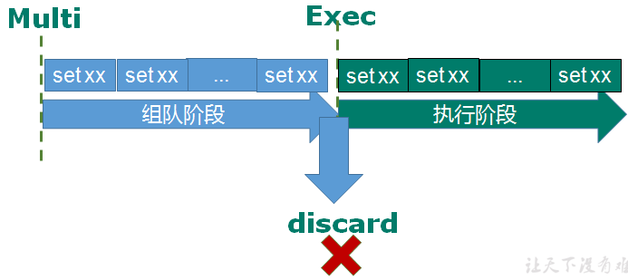
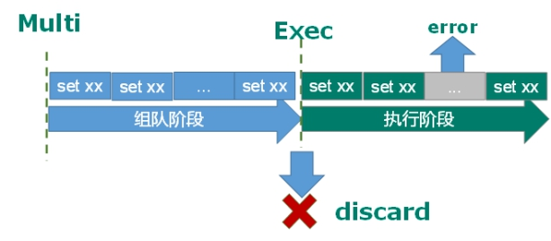
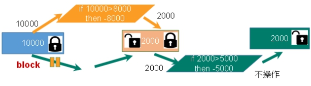
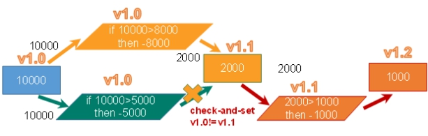

# redis
[参考文档](http://www.zhufengpeixun.com/strong/html/33.redis.html)


## redis 简介
Redis 是完全开源免费的，遵守BSD协议，是一个高性能的key-value数据库。

## redis的优势
- 性能极高 – Redis能读的速度是110000次/s,写的速度是81000次/s 。
- 丰富的数据类型 – Redis支持二进制的字符串、列表、哈希值、集合和有序集合等数据类型操作。
- 原子性 – Redis的所有操作都是原子性的，意思就是要么成功执行要么失败完全不执行。
- 单个操作是原子性的。多个操作也支持事务，即原子性，通过MULTI和EXEC指令包起来。
- 丰富的特性 – Redis还支持 发布/订阅, 通知, key 过期等等特性。

## 数据类型
- 字符串
- 哈希值
- 链表
- 集合
- 有序列表

## 字符串(String)
String是Redis最基本的类型，你可以理解成与Memcached一模一样的类型，一个key对应一个value。String类型是二进制安全的。意味着Redis的string可以包含任何数据。比如jpg图片或者序列化的对象。String类型是Redis最基本的数据类型，一个Redis中字符串value最多可以是512M。

### SET 设置值
```bash
# SET key value  设置指定key的值
set name '褚鹏飞'

# GET key 获取指定key的值
get name

# SETEX key seconds value 设置指定key的值，并将 key 的过期时间设为 seconds 秒
set age "18" 

# 只有在 key 不存在时  设置 key 的值
SETNX key value

SETNX userId "001"

SETNX userId "002"

# 这里拿到的值是 "001"
GET userId 
```
这里有一个点需要注意，如果我们对同一个key进行两次set，值会被覆盖。

### GET 获取值
```js
get name
```

当我们给相同的key重复设置值，就会把之前的值覆盖掉。

### GETRANGE 获取子串
Redis Getrange 命令用于获取存储在指定 key 中字符串的子字符串。字符串的截取范围由 start 和 end 两个偏移量决定(包括 start 和 end 在内)。

```js
// GETRANGE key start end 
getrange name 1 2
"鹏飞"
```

### INCR 递增
```js
SET page_view 20
INCR page_view 
GET page_view  // "21" 数字值在 redis 中以字符串的形式保存 
```

### 键的常用操作
```sh
DEL key  删除某一个键 
DEL user // 删除 user 这个键

EXISTS key 判断一个key是否存在
EXISTS user // 删除之后返回0

EXPIRE key seconds 设置过期时间
EXPIRE user 10  // 设置user 这个键10秒钟 就过期

TTL key 以秒为单位返回给定key的剩余生存时间
TTL user // 查看user的还有多久过期

TYPE key 返回key所存储的值的类型
TYPE user // 返回string

// 通用命令
keys * 

// 检查给定 key 是否存在
EXISTS 001

// 返回 key 所储存的值的类型
TYPE 001

// 返回给定 key 的剩余生存时间(TTL, time to live)，以秒为单位 返回-1永久
TTL 001

// 该命令用于在 key 存在是删除 key
DEL name

```
还有一些常用的处理键值对的方法：
[Redis字符串命令](https://www.runoob.com/redis/redis-strings.html)

## 哈希值(Hash)
主要用于存储对象

### HSET HMSET 设置值

```shell
# HSET key field value 	将哈希表 key 中的字段 field 的值设为 value
# HGET key field 	获取存储在哈希表中指定字段的值
# HDEL key field	删除存储在哈希表中的指定字段
# HKEYS key 		获取哈希表中所有字段
# HVALS key 		获取哈希表中所有值
# HGETALL key 		获取在哈希表中指定 key 的所有字段和值

// 设置用户 的名字
HSET 001 name 小明

// 设置用户 的年龄
HSET 001 age 10

// 获取用户名字
HGET 001 name

// 获取用户年龄
HGET 001 age

// 删除年龄
HDEL 001 age

// 获取指定key中的所有字段
HKEYS 001

// 获取指定key的所有的value
HVALS 001

// 获取所有字段和值
HGETALL 001

// 获取不存在的key 返回空
HGET 002 age
```

## 列表(List)
Redis列表是简单的**字符串**列表，按照插入顺序排序。你可以添加一个元素到列表的头部（左边）或者尾部（右边）

它的底层实际是个双向链表，对两端的操作性能很高，通过索引下标的操作中间的节点性能会较差。

```sh
# LPUSH key value1 [value2] 	将一个或多个值插入到列表头部
# LRANGE key start stop 		获取列表指定范围内的元素
# RPOP key 			            移除并获取列表最后一个元素
# LLEN key 			            获取列表长度
# BRPOP key1 [key2 ] timeout 	移出并获取列表的最后一个元素， 如果列表没有元素会阻塞列表直到等待超时或发现可弹出元素为止

redis 127.0.0.1:6379> LPUSH runoobkey redis
(integer) 1
redis 127.0.0.1:6379> LPUSH runoobkey mongodb
(integer) 2
redis 127.0.0.1:6379> LPUSH runoobkey mysql
(integer) 3
redis 127.0.0.1:6379> LRANGE runoobkey 0 10

1) "mysql"
2) "mongodb"
3) "redis"
```

在以上实例中我们使用了 LPUSH 将三个值插入了名为 runoobkey 的列表当中。

### 列表命令
[常见的列表命令](https://www.runoob.com/redis/redis-lists.html)


## 集合(Set)
Redis 的 Set 是 String 类型的无序集合。集合成员是唯一的，这就意味着集合中不能出现重复的数据。

集合对象的编码可以是 intset 或者 hashtable。

Redis 中集合是通过哈希表实现的，所以添加，删除，查找的复杂度都是 O(1)。

```sh
# SADD key member1 [member2] 	向集合添加一个或多个成员
# SMEMBERS key 		            返回集合中的所有成员
# SCARD key 			        获取集合的成员数
# SINTER key1 [key2] 		    返回给定所有集合的交集
# SUNION key1 [key2] 		    返回所有给定集合的并集
# SDIFF key1 [key2] 		    返回给定所有集合的差集
# SREM key member1 [member2] 	移除集合中一个或多个成员

redis 127.0.0.1:6379> SADD runoobkey redis
(integer) 1
redis 127.0.0.1:6379> SADD runoobkey mongodb
(integer) 1
redis 127.0.0.1:6379> SADD runoobkey mysql
(integer) 1
redis 127.0.0.1:6379> SADD runoobkey mysql
(integer) 0
redis 127.0.0.1:6379> SMEMBERS runoobkey

1) "mysql"
2) "mongodb"
3) "redis"

// Redis 操作 set
// 添加三个元素
SADD myset redis mongo node

// 查看所有的成员 可以看到返回的顺序和加入的顺序是不一样的
SMEMBERS myset

// 获取集合的成员数量 3
SCARD myset

// 返回给定所有集合的交集
SADD myset2 redis mongo java ts

// 返回 redis 和 mongo
SINTER myset myset2

// 返回给定的所有集合的并集 
SUNION myset myset2

// 返回给定所有集合的差集 node 
// 不同的顺序获得的结果是不一样的
SDIFF myset myset2
SDIFF myset2 myset
```
在以上实例中我们通过 SADD 命令向名为 runoobkey 的集合插入的三个元素。

### 集合中的常见命令：

- 查看集合中的所有成员 SMEMBERS key
- 获取集合的成员数量  SCARD key
- 返回给定所有集合的交集 SINTER key1 [key2]
- 返回所有给定集合的并集 SUNION key1 [key2]
- 返回第一个集合与其他集合之间的差异。SDIFF key1 [key2]


## 有序集合(Zset)

Redis 有序集合和集合一样也是 string 类型元素的集合,且不允许重复的成员。

不同的是每个元素都会关联一个 double 类型的分数。redis 正是通过分数来为集合中的成员进行从小到大的排序。

有序集合的成员是唯一的,但分数(score)却可以重复。

```sh
# ZADD key score1 member1 [score2 member2] 	向有序集合添加一个或多个成员，或者更新已存在成员的分数
# ZRANGE key start stop [WITHSCORES] 		通过索引区间返回有序集合中指定区间内的成员
# ZINCRBY key increment member 			    有序集合中对指定成员的分数加上增量 increment
# ZREM key member [member ...] 			    移除有序集合中的一个或多个成员

redis 127.0.0.1:6379> ZADD runoobkey 1 redis
(integer) 1
redis 127.0.0.1:6379> ZADD runoobkey 2 mongodb
(integer) 1
redis 127.0.0.1:6379> ZADD runoobkey 3 mysql
(integer) 1
redis 127.0.0.1:6379> ZADD runoobkey 3 mysql
(integer) 0
redis 127.0.0.1:6379> ZADD runoobkey 4 mysql
(integer) 0
redis 127.0.0.1:6379> ZRANGE runoobkey 0 10 WITHSCORES

1) "redis"
2) "1"
3) "mongodb"
4) "2"
5) "mysql"
6) "4"


// Redis操作zset
ZADD zsetkey 1 redis

ZADD zsetkey 2 mongo

// 获取所有成员 返回从小到大的排列
ZRANGE zsetkey 0 -1 withscores

// 会放在 redis 和 mongo 中间
ZADD zsetkey 1.5 node

// redis 加上5 变成了 6
ZINCRBY zsetkey 5 redis

// 移除元素
ZREM zsetkey redis
```
## express 中使用ioredis

```js
const express = require('express');
const Redis = require('ioredis');

const app = express();
const port = 3000;

// 创建一个连接到本地 Redis 服务器的客户端
const redis = new Redis();

app.use(express.json());

// 设置一个示例路由，将数据存储到 Redis 中
app.post('/set-data', async (req, res) => {
  try {
    const { key, value } = req.body;

    // 使用 SET 命令将数据存储到 Redis 中
    await redis.set(key, value);

    res.status(200).json({ success: true, message: 'Data stored successfully.' });
  } catch (error) {
    console.error(error);
    res.status(500).json({ success: false, message: 'Internal Server Error' });
  }
});

// 设置一个示例路由，从 Redis 中获取数据
app.get('/get-data/:key', async (req, res) => {
  try {
    const key = req.params.key;

    // 使用 GET 命令从 Redis 中获取数据
    const value = await redis.get(key);

    if (value !== null) {
      res.status(200).json({ success: true, data: { key, value } });
    } else {
      res.status(404).json({ success: false, message: 'Data not found.' });
    }
  } catch (error) {
    console.error(error);
    res.status(500).json({ success: false, message: 'Internal Server Error' });
  }
});

app.listen(port, () => {
  console.log(`Server  on http://localhost:${port}`);
});

```

## redis 配置文件

redis的配置文件是：`redis.conf`

### 网络相关的配置

**bind=127.0.0.1** 只能接受本机的访问请求, 不写的情况下，无限制接受任何ip地址的访问, 生产环境肯定要写你应用服务器的地址；服务器是需要远程访问的，所以需要将其注释掉。

**protected-mode**: 本机访问限制  默认是yes，设置为no。

**port**: 端口 默认是6379，这个没有什么可说的，就是redis的默认配置。

timeout: 一个空闲的客户端维持多少秒会关闭, 默认值是0，表示永远不关闭

tcp-keepalive：对访问客户端的一种心跳检测，每个n秒检测一次，单位为秒，如果设置为0，则不会进行Keepalive检测，建议设置成60 。

loglevel： 指定日志记录级别，Redis总共支持四个级别：debug、verbose、notice、warning，默认为notice。

密码：访问密码的查看、设置和取消，在命令中设置密码，只是临时的。重启redis服务器，密码就还原了。永久设置，需要再配置文件中进行设置。

maxclients：设置redis同时可以与多少个客户端进行连接。默认是10000个

maxmemory：建议必须设置，否则，将内存占满，造成服务器宕机，设置redis可以使用的内存量。一旦到达内存使用上限，redis将会试图移除内部数据。移除规则可以通过maxmemory-policy来指定。

maxmemory-policy： 
- volatile-lru：使用LRU算法移除key，只对设置了过期时间的键；（最近最少使用）
- allkeys-lru：在所有集合key中，使用LRU算法移除key
- volatile-random：在过期集合中移除随机的key，只对设置了过期时间的键
- allkeys-random：在所有集合key中，移除随机的key
- volatile-ttl：移除那些TTL值最小的key，即那些最近要过期的key
- noeviction：不进行移除。针对写操作，只是返回错误信息


## Redis模拟手机验证码场景
- 输入手机号，点击发送后随机生成6位数字的验证码 2分钟有效
- 输入验证码，点击验证，返回成功或者失败
- 每个手机号每天只能输入3次

- 1、生成现有的验证码库生成一个6位数的验证码
- 2、把验证码放入redis中，设置过期时间为120秒
- 3、判断验证码是否一致，从redis中获取验证码和输入的验证码进行比较
- 4、每个手机每天只能发送3次。可以使用incr操作。做次数限制。

上面的设计实现中，将发送三次和验证码存入到不同的key中。

```java
package com.atguigu.jedis;

import redis.clients.jedis.Jedis;

import java.util.Random;

public class PhoneCode {

    public static void main(String[] args) {
        //模拟验证码发送
        verifyCode("13678765435");
        //模拟验证码校验
        //getRedisCode("13678765435","4444");
    }

    //3 验证码校验
    public static void getRedisCode(String phone,String code) {
        //从redis获取验证码
        Jedis jedis = new Jedis("192.168.44.168",6379);
        //验证码key
        String codeKey = "VerifyCode"+phone+":code";
        String redisCode = jedis.get(codeKey);
        //判断
        if(redisCode.equals(code)) {
            System.out.println("成功");
        }else {
            System.out.println("失败");
        }
        jedis.close();
    }

    //2 每个手机每天只能发送三次，验证码放到redis中，设置过期时间120
    public static void verifyCode(String phone) {
        //连接redis
        Jedis jedis = new Jedis("192.168.44.168", 6379);

        //拼接key
        //手机发送次数key
        String countKey = "VerifyCode"+phone+":count";
        //验证码key
        String codeKey = "VerifyCode"+phone+":code";

        //每个手机每天只能发送三次
        String count = jedis.get(countKey);
        
        if(count == null) {
            //没有发送次数，第一次发送
            //设置发送次数是1
            jedis.setex(countKey,24*60*60,"1");
        } else if(Integer.parseInt(count)<=2) {
            //发送次数+1
            jedis.incr(countKey);
        } else if(Integer.parseInt(count)>2) {
            //发送三次，不能再发送
            System.out.println("今天发送次数已经超过三次");
            jedis.close();
        }

        //发送验证码放到redis里面
        String vcode = getCode();
        jedis.setex(codeKey,120,vcode);
        jedis.close();
    }

    //1 生成6位数字验证码
    public static String getCode() {
        Random random = new Random();
        String code = "";
        for(int i=0;i<6;i++) {
            int rand = random.nextInt(10);
            code += rand;
        }
        return code;
    }
}

```

## Redis事务

Redis事务是一个单独的隔离操作：事务中的所有命令都会序列化、按顺序地执行。事务在执行的过程中，不会被其他客户端发送来的命令请求所打断。

Redis事务的主要作用就是串联多个命令防止别的命令插队。

### 事务中三个命令 Multi、Exec、discard

从输入Multi命令开始，输入的命令都会依次进入命令队列中，但不会执行，直到输入Exec后，Redis会将之前的命令队列中的命令依次执行。

组队的过程中可以通过discard来放弃组队。  




### 事务中的错误处理

事务中错误分为两种情况:
- 在组队阶段出现错误了
- 在执行阶段出现错误了


如果组队中某个命令出现了错误，执行的时候整个的所有队列都会被取消。


如果是执行阶段某个命令报出了错误，则只有报错的命令不会执行，而其他的命令都会执行，不会回滚。



### redis中的事务冲突问题

想象一个场景，很多人有你的账户，同时去参加双十一的抢购，但是你的账户里只有1万块钱。

- 一个请求想给金额减8000
- 一个请求想给金额减5000
- 一个请求想给金额减1000

如果大家都扣款成功，那账户余额肯定是不够用的。


为了解决这个问题，我们可以使用锁的机制：
- 悲观锁
- 乐观锁


**悲观锁(Pessimistic Lock)**, 顾名思义，就是很悲观，每次去拿数据的时候都认为别人会修改，所以每次在拿数据的时候都会上锁，这样别人想拿这个数据就会block直到它拿到锁。传统的关系型数据库里边就用到了很多这种锁机制，比如行锁，表锁等，读锁，写锁等，都是在做操作之前先上锁。



**乐观锁(Optimistic Lock)**, 顾名思义，就是很乐观，每次去拿数据的时候都认为别人不会修改，所以不会上锁，但是在更新的时候会判断一下在此期间别人有没有去更新这个数据，可以使用版本号等机制。乐观锁适用于多读的应用类型，这样可以提高吞吐量。Redis就是利用这种**check-and-set**机制实现事务的。



### 乐观锁的操作：
- watch
在执行`multi`之前，先执行`watch key1 [key2]`,可以监视一个(或多个) key ，如果在事务执行之前这个(或这些) key 被其他命令所改动，那么事务将被打断。

- unwatch
取消 WATCH 命令对所有 key 的监视。如果在执行 WATCH 命令之后，EXEC 命令或DISCARD,命令先被执行了的话，那么就不需要再执行UNWATCH了。


### redis事务的三个特性
- 单独的隔离操作：事务中的所有命令都会序列化、按顺序地执行。事务在执行的过程中，不会被其他客户端发送来的命令请求所打断。
- 没有隔离级别的概念：队列中的命令没有提交之前都不会实际被执行，因为事务提交前任何指令都不会被实际执行
- 不保证原子性：事务中如果有一条命令执行失败，其后的命令仍然会被执行，没有回滚 


