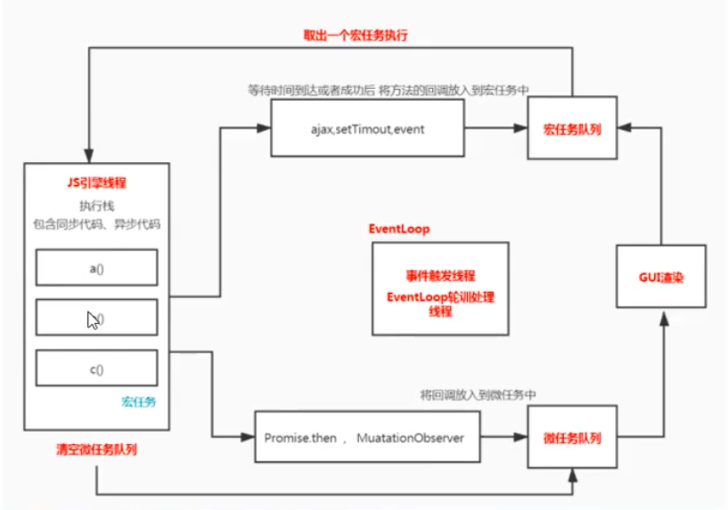

# eventLoop 事件循环

我们说js是**单线程**的, 说的是主线程，我们在写代码的时候，有时候会使用定时器，或者开个ajax的异步请求。其实都是新开的线程。

本质上来说，eventLoop解决的是js执行时候可能会调用异步方法，这些方法是怎样调度执行的。

## 进程
- 进程是计算机分配任务的最小单位。是对运行时程序的封装，进程有独立的地址空间，一个进程崩溃后，在一般情况下不会对其他进程产生影响

## 线程
- 线程是进程的子任务，是一个进程中的不同执行路径。线程有自己的堆栈和局部变量，但是线程没有自己的独立空间，一个线程死掉了，也就意味着整个进程死掉了。所以多进程的程序要比多线程程序更加健壮。

## 一些区别帮助理解：
- 一个程序至少有一个进程，一个进程至少有一个线程
- 线程的划分尺度小于进程，使得多线程程序的并发性高。
- 另外，进程在执行过程中拥有独立的内存单元，而多个线程共享内存，从而极大地提高了程序的运行效率。

[进程和线程的区别参考文章](https://blog.csdn.net/mxsgoden/article/details/8821936)

## 浏览器的进程
浏览器是一个多进程模型
- 每一个页卡都是进程（互补影响）
- 浏览器也有一个主进程 用户的界面
- 渲染进程 每个页卡里面 都有一个渲染进程
- 网路进程
- GPU进程 3d绘制
- 第三方的插件进程

js执行的时候，会从上到下执行，遇到函数会创建执行上下文放入到执行栈中，执行完毕后会出栈，执行时候可能会出现发生异步事件，内部会调用浏览器api。

当我们执行上下文栈都执行完毕后，等会可能api执行或者时间到达，会被维护在一个事件队列里面。

不停的扫描队列，将队列里面的任务拿出来放在上线文栈中执行。 setTimeout 是宏任务

当代码执行时候还会有一些任务 promise 为例，微任务，每次执行宏任务的时候，**都会单独创建一个微任务队列。**

微任务在执行完毕之后，浏览器会检测是否需要重新渲染。

每循环一次都会执行一个宏任务，并清空对应的微任务队列，每次循环完毕之后，都要看是否需要渲染，如果需要渲染才渲染。



```js
console.log('abc')

setTimeout(()=>{
  console.log('bcd')
},1000)

setTimeout(()=>{
  console.log('hjk')
},1000)
```

上面代码中, `console.log('abc')` 是主线程的代码，执行完毕之后，会遇到两个定时器函数，会将两个定时器放入异步队列中，主线程已经没有代码了，这个时候将定时器函数从异步队列中拿出来，依次执行（队列是有顺序的）

如果两个定时器时间不同，会等到先达到时间函数先执行。


## 常见的宏任务、微任务分类
- 宏任务：setTimeout setInterval postMessage MessageChannel setImmediate 
- 微任务：promise.then mutationObeserver 


## 看几个例子:

### 微任务和GUI渲染
请描述 下面代码打印什么，有什么现象？
```html
<!DOCTYPE html>
<html lang="zh-cmn-Hans">
<head>
  <meta charset="utf-8">
  <meta http-equiv="x-ua-compatible" content="IE=edge, chrome=1">
  <title></title>
</head>
<body>
  <script>
    document.body.style.background = 'red'
    console.log(1)
    Promise.resolve().then(()=>{
      console.log(2)
      document.body.style.background = "yellow"
    })
    console.log(3)
  </script>
</body>
</html>
```

颜色会从红色变成黄色吗？回答是不会，根据上面对于事件循环的理解，渲染这件事情是发生在微任务之后。主栈代码执行完毕之后，会清空微任务，虽然设置背景颜色的代码在第一行，但是并不会渲染，而是等到promsie执行完毕之后才渲染。


### 事件任务
```html
<button id="button">click</button>

<script>
  button.addEventListener('click',()=>{
    console.log('listener1');
    Promise.resolve().then(()=>console.log('micro task1'))
  })
  button.addEventListener('click',()=>{
    console.log('listener2');
    Promise.resolve().then(()=>console.log('micro task2'))
  })
</script>
```

上面代码中 如果是手动点击事件触发, 就会产生宏任务，此时打印的顺序就是：
listener1、micro task1、listener2、micro task2

假设我们不是通过点击事件触发的，而是通过普通函数的形式调用的。执行的顺序又会有些不同。

```js
<button id="button">click</button>
<script>
  button.addEventListener('click',()=>{
    console.log('listener1');
    Promise.resolve().then(()=>console.log('micro task1'))
  })
  button.addEventListener('click',()=>{
    console.log('listener2');
    Promise.resolve().then(()=>console.log('micro task2'))
  })
  button.click(); // click1() click2()
</script>
```

这种情况下打印：listener1、listener2、micro task1、micro task2


## 定时器任务
```js
Promise.resolve().then(() => {
  console.log("Promise1")
  setTimeout(() => {
    console.log("setTimeout2")
  }, 0)
})
setTimeout(() => {
  console.log("setTimeout1")
  Promise.resolve().then(() => {
    console.log("Promise2")
  })
}, 0)
```
主栈代码从上向下执行，遇到微任务，将 Promise 放入微任务队列，遇到 setTimeout 放入宏任务队列。主栈代码执行完成。

开始清空队列，清空的顺序是，先清空微任务队列 先打印 Promise1 继续执行，又创建了一个宏任务，放进宏任务队列，目前，微任务队列没有值了，宏任务队列中有两个。

接着开始执行宏任务1,打印setTimeout1, 然后又产生了一个微任务，放进微任务队列，随即立即清空微任务队列。打印Promise2。最后清空剩下的宏任务打印：setTimeout2

执行完毕


