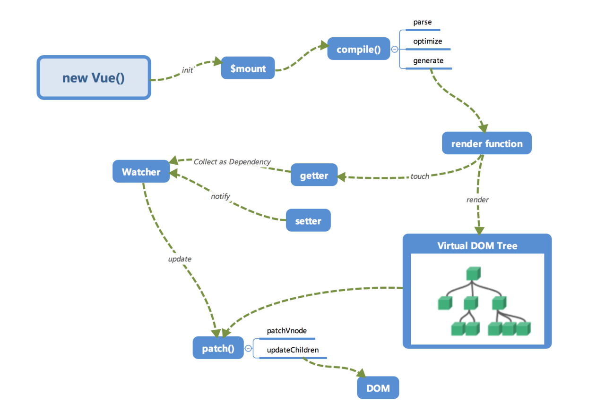
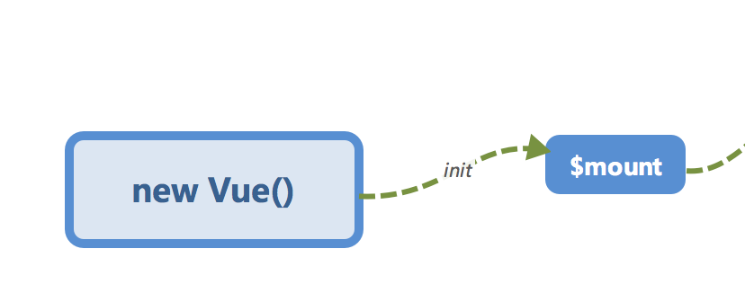
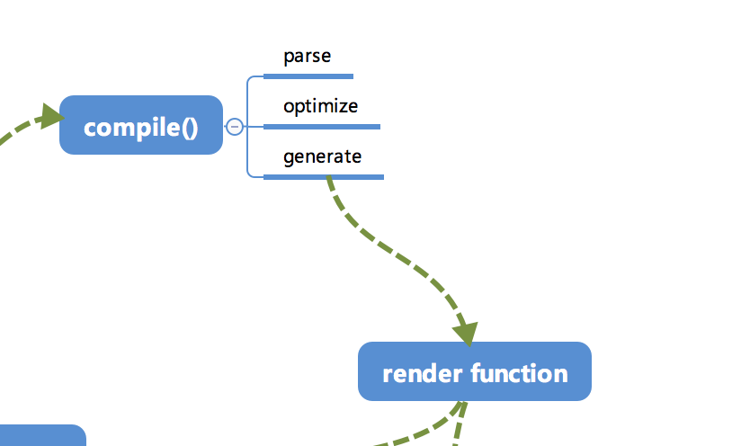
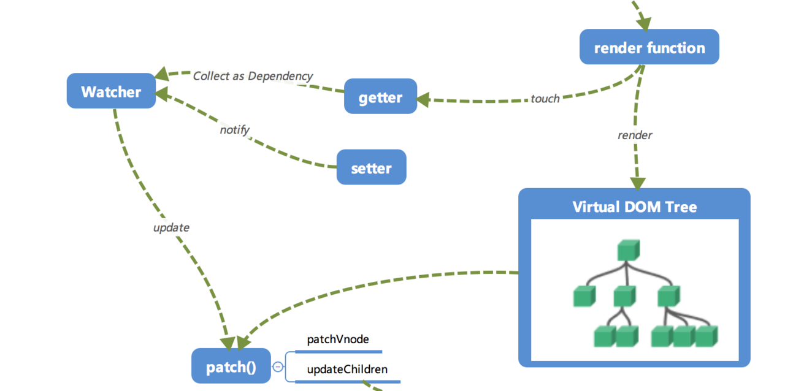
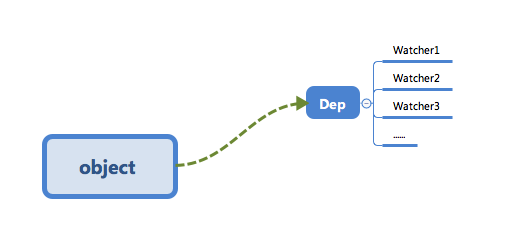
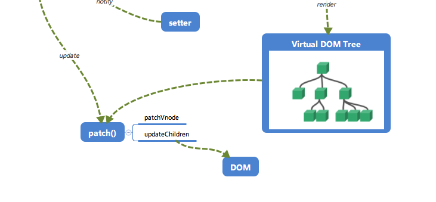

<!-- # Vue内部机制剖析 -->

## 一、Vue内部机制剖析

首先，我们整体的介绍下vue.js内部的整个运行流程，希望能让大家有一个整体的印象，然后我们再逐个模块进行讲解。从来没有了解过`vue.js`实现的同学可能会对一些内容感到疑惑，这是正常的，我们不妨有些耐心，耐心的将内容看完，再回来观看这一部分，相信会有收获的。

首先，我们来看下vue的内部运行流程图。



大家第一次看到这个图一定是一头雾水，没有关系，我们来逐个讲解一下这些模块的作用以及调用关系，相信大家对于`vue.js`内部运行机制会有一个大概的认识。

### 初始化及挂载



在 `new Vue()`之后。Vue会调用 `_init` 函数进行初始化，也就是这里的`init`过程，它会初始化生命周期、事件、props、methods、data、computed 与 watch等。其中最重要的是通过`Object.defineProperty`设置 `setter` 与 `getter` 函数，用来实现「**响应式**」和「**依赖收集**」。

初始化之后调用 `$mount` 会挂载组件、如果是**运行时编译**，即不存在 `render function` 但是存在 template, 需要进行「编译」步骤。

### 编译

compile编译可以分为 parse、optimize与generate三个阶段，最终需要得到render function。



#### parse
parse 会用正则等方式解析 template 模板中的指令、class、style等数据，形成AST。

#### optimize
optimize的主要作用是标记static静态节点，这是vue在编译过程中的一处优化，后面当 update 更新界面时，会有一个patch过程，diff算法会直接跳过静态节点，从而减少了比较的过程，优化了patch的性能。

#### generate
generate 是将AST转化为 render function  字符串的过程，得到结果是 render的字符串以及staticRenderFns 字符串。

在经过 parse、optimize与generate 这三个阶段以后，组价中就会存在渲染Vnode所需要的 render function 了。

### 响应式
接下来也就是 vue.js的响应式核心部分



这里的`getter`和`setter`已经在之前介绍过了，在`init`的时候通过`Object.defineProperty` 进行了绑定，它使得当被设置的对象读取的时候会执行`getter`函数，而当被赋值的时候执行`setter`函数。

当`render function` 被渲染的时候，因为会读取所需对象的值，所以会触发 `getter`函数进行「**依赖收集**」，「**依赖收集**」的目的是将观察者 Watcher 对象存放到当前订阅者 Dep的subs 中，形成如下所示的这样一个关系。



在修改对象的值的时候，会触发对应的 `setter`，`setter` 通知之前「**依赖收集**」得到的Dep中的每一个Watcher，告诉它们自己的值改变了，需要重新渲染视图。这个时候这些Watcher就开始调用`update`来更新视图。当然这中间还有一个`patch`的过程以及使用队列来异步更新策略。这个后面我们会做详细介绍。

### Virtual DOM

我们知道，render function 会被转化为 Vnode 节点。Virtual DOM 其实就是一颗以JavaScript对象（VNode节点）作为基础的树，用对象属性来描述节点，实际上它只是一层真实DOM的抽象。最终可以通过一系列操作使这颗树映射到真实环境上。由于Virtual DOM是以JavaScript对象为基础而不依赖真实平台环境，所以它具有跨平台的能力，比如浏览器平台、Weex、Node等。

比如说下面这样一个例子:
```
{
  tag: 'div',                 /*说明这是一个div标签*/
  children: [                 /*存放该标签的子节点*/
    {
      tag: 'a',               /*说明这是一个a标签*/
      text: 'click me'        /*标签的内容*/
    }
  ]
}
```

渲染后可以得到
```
<div>
  <a>click me</a>
</div>
```

这只是一个简单的例子，实际上的节点有更多的属性来标志节点，比如isStatic(代表是否为静态节点)、isComponent （代表是否为注释节点）等。

### 更新视图


前面我们说到，在修改一个对象值的时候，会通过 setter -> Watcher -> update 的流程来修改对应的视图，那么最终是如何更新视图的呢？

当数据变化后，执行 render function 就可以得到一个新的VNode节点，然后用innerHTML 直接渲染到真实的DOM。 但是其实我们只对其中的一小块内容进行修改，这样做似乎有些 「**浪费**」。

那么我们为什么不能只修改那些「改变了的地方」呢？这个时候就要介绍「patch」了。我们会将新的 VNode 与旧的 VNode 一起传入 patch 进行比较。经过diff算法得出它们的「**差异**」。最后我们只需要将这些「**差异**」的对应DOM 进行修改即可。

### 再看全局


回过头再来看看这张图，是不是大脑中已经有一个大概的脉络了呢？

那么，让我们继续学习每一个模块吧!


## 二、响应式系统的基本原理

### 响应式系统

vue.js数据模型仅仅是普通的JavaScript对象，但是对这些对象进行操作时，却能影响对应视图，它的核心就是「**响应式系统**」。尽管我们在使用vue.js进行开发时候不会直接修改「**响应式系统**」，但是理解它的实现有助于避开一些常见的 「坑」，也有助于在遇见一些琢磨不透的问题可以深入其原理来解决它。

### `Object.defineProperty`

首先我们介绍下 `Object.defineProperty`,vue.js就是基于它实现「响应式系统」的。

首先是使用方法
```js
/**
 * obj: 目标对象
 * prop: 需要操作的目标对象的属性名 
 * descriptor: 描述符
 * return value 传入对象
 */
Object.defineProperty(obj, prop, descriptor)
```
descriptor的一些属性，简单介绍几个属性，具体可以参考 [MDN 文档](https://developer.mozilla.org/en-US/docs/Web/JavaScript/Reference/Global_Objects/Object/defineProperty)。

- enumerable, 属性是否可以枚举，默认是false
- configurable, 属性是否可以被修改或者删除，默认是false。
- get，获取属性的方法。
- set，设置属性的方法。

### 实现 observer(可观察的)

知道了 `Object.defineProperty` 以后，我们来用它使对象变成可观察的。

在init阶段会进行初始化，对数据进行「**响应式化**」。


为了方便理解，我们不考虑数组等复杂的情况，只对对象进行处理。

首先我们定义一个cb函数， 这个函数用来模拟视图更新，调用它即代表更新视图，内部可以是一些更新视图的方法。

```js
function cb (val) {
  /* 渲染视图 */
  console.log("视图更新啦～");
}
```

然后我们定义一个 `defineReactive` 方法, 这个方法通过 `Object.defineProperty`来实现对对象「**响应式**」化，入参是一个obj（需要绑定的对象），key（obj的某一个属性），val（具体的值）。经过 `defineReactive` 处理之后，我们的obj的key属性在「读」的时候会触发 `reactiveGetter`方法，而在该属性被「写」的时候会触发 `reactiveSetter` 方法。

```js
function defineReactive (obj, key, val) {
  Object.defineProperty(obj, key, {
    enumerable: true,       /* 属性可枚举 */
    configurable: true,     /* 属性可被修改或删除 */
    get: function reactiveGetter () {
      return val;           /* 实际上会依赖收集，下一小节会讲 */
    },
    set: function reactiveSetter (newVal) {
      if (newVal === val) return;
      cb(newVal);
    }
  });
}
```

当然这还是不够的，我们需要在上面再封装一层 `observer`。这个函数传入一个value（需要『**响应式**』化的对象），通过遍历所有属性的方式对该对象的每一个属性都通过 `defineReactive` 处理。（注：实际上observer 会进行递归调用，为了便于理解去掉了递归的过程 ）

```js
function observer (value) {
  if (!value || (typeof value !== 'object')) {
    return;
  }
  
  Object.keys(value).forEach((key) => {
    defineReactive(value, key, value[key]);
  });
}
```


 

