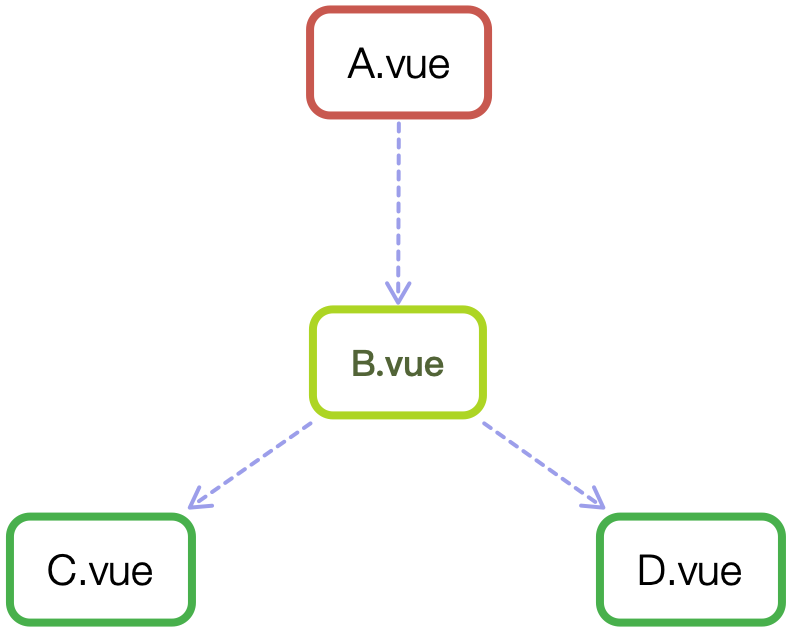

<!-- ## vue中的组件 -->

## 一、vue中的组件

### 写在前面

vue.js 最精髓的，正是它的组件与组件化，写一个vue工程，也正是写一个个的组件。

业务场景千变万化，而不变的是vue.js组件的核心思想使用技巧，掌握了vue.js组件的各种开发模式，再复杂的场景也可以应对。

### 组件的分类

一般来说，vue.js 组件主要分为三类：

1. 由 vue-router 产生的每个页面，本质上也是一个组件 （.vue），主要承载当前页面的HTML结构，包含数据的获取、数据整理、数据可视化等常规业务。整个文件相对较大，但是一般不会有 `props` 选项和`自定义事件`,因为它作为路由的渲染，不会被复用，因此也不会对外提供接口。在项目开发中，我们写的大部分代码都是这类组件（页面），协同开发时候，每个人维护自己的页面，很少有交集。这类组件相对好些，因为主要是还原设计稿，完成需求，不需要太多模块和架构设计上的考虑。

2. 不包含业务，独立、具体功能的基础组件，比如、模态框等。这类组件作为项目的基础控件，会被大量使用，因此组价你的API进行过高强度的抽象，可以通过不同的配置实现不同的功能。独立组件的开发难度要高于第一类组件，因为它的侧重点是API的设计、兼容性、性能，以及复杂的功能。 这类组件对JavaScript的编程能力有一定的要求，也会包含非常多的技巧，比如在不依赖 Vuex 和 Bus(因为独立组件，无法依赖其他库)的情况下，各组件的通信、还会涉及到很多其他问题。


3. 业务组件。它不像第二类独立组件只包含某个功能，而是在业务中被多个页面复用的，它与独立组件的区别是，业务组件只在当前项目中会用到，不具有通用性，而且会包含一些业务，比如数据请求；而独立组件不含业务，在任何项目中都可以使用，功能单一，比如一个具有数据校验功能的输入框。业务组件更像是介于第一类和第二类之间，在开发上也与独立组件类似，但寄托于项目，你可以使用项目中的技术栈，比如 Vuex、axios、echarts 等，所以它的开发难度相对独立组件要容易点，但也有必要考虑组件的可维护性和复用性。


## 二、3个API: prop、event、slot

### 组件的构成

一个再复杂的组件，都是由三个部分组成：prop、event、slot，它们构成了vue.js的组价的API,如果你开发的是一个通用组件，那一定要事先设计好这三部分，因为组件一旦发布，后面再修改 API 就很困难了，使用者都是希望不断新增功能，修复 bug，而不是经常变更接口。如果你阅读别人写的组件，也可以从这三个部分展开，它们可以帮助你快速了解一个组件的所有功能。

#### 属性prop

prop 定义了这个组件有哪些可配置的属性，组件的核心功能也都是它来确定的。写通用组件的时候，props最好使用**对象**的写法，这样可以针对每个属性设置类型、默认值或者自定义校验属性的值，这点在组件开发中很重要，如果我们使用props的数组用法，这样的组件往往不够严谨，比如我们封装一个自己的按钮组件 `<i-button>`

```vue
<template>
  <button :class="'i-button-size' + size" :disabled="disabled"></button>
</template>
<script>
  // 判断参数是否是其中之一
  function oneOf (value, validList) {
    for (let i = 0; i < validList.length; i++) {
      if (value === validList[i]) {
        return true;
      }
    }
    return false;
  }

  export default {
    props: {
      size: {
        validator (value) {
          return oneOf(value, ['small', 'large', 'default']);
        },
        default: 'default'
      },
      disabled: {
        type: Boolean,
        default: false
      }
    }
  }
</script>
```

使用组件:
```html
<i-button size="large"></i-button>
<i-button disabled></i-button>
```

让我们分析下上面的组件，组件中我们定义了两个属性：尺寸size和是否禁用disabled。其中size使用 `validator` 进行了值的自定义验证，也就是说，从父级传入的size，它的值必须是指定的 small、large、default 中的一个，默认值是default，如果传入这三个以外的值，都会抛出一条警告。

要注意的是，组件里定义的props，都是**单向数据流**，也就是只能通过父级修改，组件自己不能修改props的值，只能修改定义在data里面的数据，非要修改，也是通过后面介绍的自定义事件通知父级，由父级来修改。

在使用组件的时候，也可以传入一些标准的html特性，比如 id  class

```html
<i-button id="btn1" class="btn-submit"></i-button>
```

这样的html特性，在组件内的 `<button>`元素上会继承,并不需要在props里面再定义一遍，这个特性是默认支持的，如果不期望开启，在组件选项里面配置`inheritAttrs: false` 就可以禁用了。


#### 属性prop

如果要给上面的按钮组件 `<i-button>` 添加一些文字内容，就要用到组件的第二个API: 插槽 slot，它可以分发组件的内容，比如在上面的按钮组件中定义一个插槽:

```vue
<template>
  <button :class="'i-button-size' + size" :disabled="disabled">
    <slot></slot>
  </button>
</template>
```

这里的 `<slot>` 节点就是指定的一个插槽的位置，这样在组件内部就可以扩展内容了：

```vue
<i-button>按钮 1</i-button>
<i-button>
  <strong>按钮 2</strong>
</i-button>
```

当需要多个插槽时候，会用到具名的slot，比如上面的组件我们再添加一个slot，用于设置另一个图标组件:

```vue
<template>
  <button :class="'i-button-size' + size" :disabled="disabled">
    <slot name="icon"></slot>
    <slot></slot>
  </button>
</template>
```

```vue
<i-button>
  <i-icon slot="icon" type="checkmark"></i-icon>
  按钮 1
</i-button>
```

这样，父级内定义的内容，就会出现在组件对应的slot里面，没有写名字的，就是默认的slot。

在组件的 `<slot>` 里也可以写一些默认的内容，这样在父级没有写任何slot时候，它们就会出现，比如：

```vue
<slot>提交</slot>
```

#### 自定义事件 event

现在我们给组件`<i-button>` 添加一个点击事件，目前有两种写法，我们先看自定义事件event:

```vue
<template>
  <button @click="handleClick">
    <slot></slot>
  </button>
</template>
<script>
  export default {
    methods: {
      handleClick (event) {
        this.$emit('on-click', event);
      }
    }
  }
</script>
```

通过 `$emit`,就可以出发自定义事件 `on-click`, 在父级通过`@on-click`来监听。

```vue
<i-button @on-click="handleClick"></i-button>
```

上面的click事件，是在组件内部的 `<button>` 元素上声明的，这里还有另一种方法，直接在父级声明，但是为了区分原生事件和自定义事件，要用到事件修饰符`.native`,所以上面的示例也可以这样写

```vue
<i-button @click.native="handleClick"></i-button>
```

如果不写 `.native` 修饰符，那上面的 `@click` 就是自定义事件 click，而非**原生事件**click, 但是我们在组件中只触发了 `on-click`事件，而不是 `click`,所以直接写 `@click` 会监听不到。

### 组件的通信
一般来说，组件可以有以下几种关系




A 和 B、B 和 C、B 和 D 都是父子关系，C 和 D 是兄弟关系，A 和 C 是隔代关系（可能隔多代）。组件间经常会通信，Vue.js 内置的通信手段一般有两种：

- `ref`: 给元素或者组件注册引用信息；
- `$parent` / `$children`: 访问父 / 子实例。

这两种都是直接得到组件实例，使用后可以直观调用组件的方法或者访问数据，比如下面的示例中，用ref来访问组件：（部分代码省略）

```js
// component-a
export default {
  data () {
    return {
      title: 'Vue.js'
    }
  },
  methods: {
    sayHello () {
      window.alert('Hello');
    }
  }
}
```

```vue
<template>
  <component-a ref="comA"></component-a>
</template>
<script>
  export default {
    mounted () {
      const comA = this.$refs.comA;
      console.log(comA.title);  // Vue.js
      comA.sayHello();  // 弹窗
    }
  }
</script>
```

`$parent` 和 `$children` 类似，也是基于当前上下文访问父组件或全部子组件的。

这两种方法的弊端是，无法在跨级或兄弟间通信，比如下面的结构：

```vue
// parent.vue
<component-a></component-a>
<component-b></component-b>
<component-b></component-b>
```

我们想在 component-a 中，访问到引用它的页面中（这里就是 parent.vue）的两个 component-b 组件，那这种情况下，就得配置额外的插件或者工具了，比如 Vuex 和Bus的解决方案，不过他们都是依赖第三方插件的存在，这在开发独立组件的时候是不可取的，后续我们会介绍一些其他的黑科技，用于解决这种问题。

## 组件的通信1： provide / inject

我们在上面已经提到  ref 和 $parent / $children 在跨级通信的时候是有弊端的。当组件A和组件B中间隔了数代（甚至不确定具体级别）时候，以往会借助Vuex或者Bus 这样的方案，不得不引入第三方的库来支持。其实 Vue 内置了provide / inject接口。

### 什么是 provide / inject

provide / inject 是vue2.2.0版本后新增的API。

在vue的官方文档中也提到

> provide 和 inject 主要为高阶插件/组件库提供用例。并不推荐直接用于应用程序代码中。

虽然官方不建议，但是用好了也是非常有用的。

我们先来看一下这个API怎么使用，假设有两个组件： **A.vue 和 B.vue** B 是 A的子组件。

```js
// A.vue
export default {
  provide: {
    name: 'Aresn'
  }
}

// B.vue
export default {
  inject: ['name'],
  mounted () {
    console.log(this.name);  // Aresn
  }
}
```

可以看到 在A.vue里面，我们设置了一个 provide:name,值为Aresn, 它的作用就是将name这个变量提供给它的所有子组件。而在B.vue中通过inject注入了A组件中提供的name变量，那么在组件B中，就可以通过 this.name 访问这个变量了，它的值也是Aresn,这就是provide / inject API 最核心的用法。

需要注意的是:

> provide 和 inject 绑定并不是可响应的。这也是刻意为之，然而，如果你传入了一个可监听的对象，那么其对象的属性还是可响应的。

所以，上面A.vue的name如果改变了，B.vue 的this.name 是不会改变的，仍然是 Aresn.

