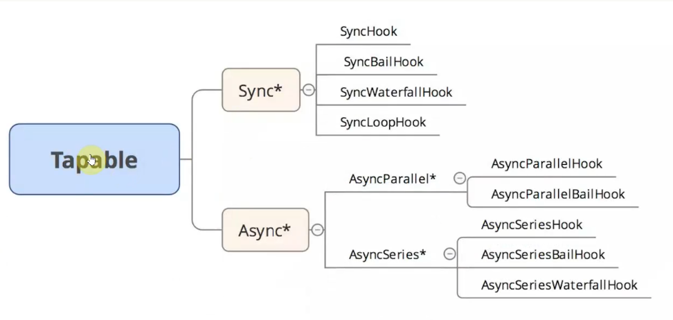

# 1.webpack进阶

## Tapable

webpack本质上是一种事件流的机制，它的工作流程就是将各种插件串联起来，而实现这一切的核心就是Tapable，Tapable有点类似于 nodejs 中的events库。核心原理也是依赖于发布订阅模式。



我们在webpack插件中可能会写这样的代码:
```js
class RunPlugin {
  apply(compiler) {
    //在此插件里可以监听run这个钩子
    compiler.hooks.run.tap("RunPlugin", () => {
      console.log("run1:开始编译")
    })
  }
}
module.exports = RunPlugin
```

apply方法传递进来的是一个实例，在这个类初始化时候，会在实例上挂载一个`hooks`对象，对象的key是对应的方法，value其实是使用Tapable实例化得到的，实例化之后，在插件中可以使用 `run.tap` 这种形式注册事件。在合适的时机webpack会执行call方法执行这些钩子。


## webpack中的懒加载

在webpack中，使用懒加载或者按需加载，是一种很好的优化网页或者应用的打开方式，这种方式实际上是先把你的代码在一些逻辑断点处离开, 然后在一些代码块中完成某些操作后，立即引用或者即将引用另外的一些代码块。这样就加快了应用的初始化的加载速度。减轻了它的总体体积，因为某些代码块可能永远也不可能会被加载。

### 懒加载的场景
我们在真实的项目中可能会涉及文件的上传和下载操作，这个场景非常普遍，一般来说，下载场景就是从服务端请求一个下载链接，使用浏览器打开就好，但是上传场景就稍微有些复杂，可能会用到一些公共组件或者第三方的sdk。而这些sdk的体积可能非常大，并且，我们实际上在没有进行上传操作之前是不需要进行加载这部分代码的。所以这里我们使用懒加载是比较合理的。


