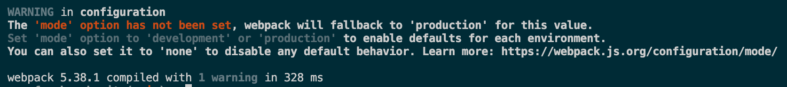

# 1.webpack基础
本质上, webpack是一个用于现代`JavaScript`应用程序的静态模块打包工具，当webpack处理程序的时候，它会在内部构建一个依赖图(dependency graph), 这个依赖图对应映射到项目所需要的每个模块，并生成一个或者多个`bundle`。

## 1.1如何安装
在 npm 项目中执行如下命令，可以安装对应的模块。
```bash
npm install  webpack webpack-cli --save-dev
```

::: tip
该文档在写作时，使用的 webpack 和 webpack-cli版本信息如下:
```
// package.json 
"devDependencies": {
  "webpack": "^5.38.1",
  "webpack-cli": "^4.7.2",
}
```
:::

webpack-cli 是使用webpack的命令行工具，在4.x版本之后不再作为webpack的依赖了，我们使用的时候需要单独安装这个工具。

我们优先选择使用本地开发依赖安装的webpack，即上述的这种方式，这么做的好处是：

- 1、可以为项目指定依赖的webpack版本，不同项目可以使用不同版本的webpack
- 2、clone代码后可以快速使用npm 或者 yarn 安装依赖的webpack
- 3、协作的多人可以确保项目使用版本相同的webpack，避免使用全局安装的不同版本webpack而出现问题。


webpack的配置其实是一个Node的脚本，这个脚本对外暴露一个配置对象，webpack通过这个对象来读取相关的一些配置。因为是node脚本，所以灵活度非常高，可以使用node上的任何模块，如上面提到的`path`模块。当然第三方模块也可以。


## 1.2 入口(entry)
入口起点(entry point)，webpack应该使用哪个模块，来作为构建其内部依赖图(dependency graph)的开始，webpack会找出有哪些模块和库是入口起点（直接和间接）依赖的。

默认值是 `./src/index.js`,但是你可以通过在 `webpack configuration`中配置 `entry` 属性，来指定一个（或者多个）不同的入口起点。

### 1.2.1 src\index.js
我们在`src`目录中创建`index.js`,添加代码如下。

```js
let title = require('./title.txt');
document.write(title.default);
```

### 1.2.2 创建 webpack.config.js 文件
要想对webpack做更加详细的订制化配置，我们需要创建一个配置文件,并将其命名为 `webpack.config.js`
```js {2,7-9}
module.exports = {
  entry: './src/index.js',
};

// 上述配置等同于
module.exports = {
  entry: {
    main: './src/index.js'
  }
}
```

## 1.3 输出(output)

`output`属性告诉webpack在哪里输出它所创建的`bundle`,以及如何命名这些文件。

主要输出文件的默认值是 `./dist/main.js`,其他生成文件默认放置在 `./dist`文件夹中。

我们继续在 `webpack.config.js` 中添加 `output` 配置。


**webpack.config.js**

```js {5-8}
const path = require('path');
module.exports = {
  entry: './src/index.js',
  // 添加输出配置
  output: {
    path: path.resolve(__dirname, 'dist'),
    filename: 'main.js'
  }
};
```

## 1.4 loader
webpack 只能理解 `JavaScrit` 和 `JSON` 文件。

但是在项目开发的过程中会遇到各式各样的文件，例如css代码，图片，模板代码等。webpack中提供了一种处理多种文件格式的机制，这便是`loader`。

我们可以把loader看成一个转换器，负责把某种文件格式的内容转换成 `webpack` 可以支持打包的模块, 以供应用程序使用。

我们继续在 `webpack.config.js` 中添加 `loader` 配置。

当我们需要使用不同的 loader 来解析处理不同类型的文件时，我们可以在 module.rules 字段下来配置相关的规则。

**webpack.config.js**

```js {9-16}
const path = require('path');
module.exports = {
  entry: './src/index.js',
  output: {
    path: path.resolve(__dirname, 'dist'),
    filename: 'main.js'
  },
  // 添加loader模块
  module: {
    rules: [
      { 
        test: /\.txt$/, 
        use: 'raw-loader' 
      }
    ]
  }
};
```

## 1.5 插件(plugin)

在webpack的构建流程中，plugin用于处理更多其他的一些构建任务，可以这么理解，模块代码转换的工作由loader来处理，除此之外的其他工作都可以交给plugin来完成。通过添加我们需要的plugin，可以满足更多构建中的特殊需求。包括：打包优化，资源管理，注入环境变量。

例如，使用 `copy-webpack-plugin` 来复制其他不需要 loader 处理的文件，只需在配置中通过 `plugins` 字段添加新的 `plugin` 即可。

插件通常为第三方的 npm package，都需要安装后才能使。

### 1.5.1 src/index.html

**src/index.html**

```html
<!DOCTYPE html>
<html lang="en">
<head>
  <meta charset="UTF-8">
  <meta name="viewport" content="width=device-width, initial-scale=1.0">
  <title>webpack5</title>
</head>
<body>
</body>
</html>
```

### 1.5.2 webpack.config.js

```js {3,19-21}
const path = require('path');
// 引入 html-webpack-plugin 插件
const HtmlWebpackPlugin = require('html-webpack-plugin');
module.exports = {
  entry: './src/index.js',
  output: {
    path: path.resolve(__dirname, 'dist'),
    filename: 'main.js'
  },
  module: {
    rules: [
      { 
        test: /\.txt$/, 
        use: 'raw-loader' 
      }
    ]
  },
  // 新增加插件配置项
  plugins: [
    new HtmlWebpackPlugin({template: './src/index.html'})
  ]
};
```
### 1.5.3 [clean-webpack-plugin](https://www.npmjs.com/package/clean-webpack-plugin)
在webpack中,打包的文件通常是通过hash生成的，如果文件改动，那么打包的文件会越来越多，如果想要清除之前的文件，可以使用 clean-webpack-plugin。

这个插件默认会清除 output.path 输出的目录。
```js
const path = require('path');
// 引入 html-webpack-plugin 插件
const HtmlWebpackPlugin = require('html-webpack-plugin');
// 引入 clean 插件
const { CleanWebpackPlugin } = require("clean-webpack-plugin");

module.exports = {
  entry: './src/index.js',
  output: {
    path: path.resolve(__dirname, 'dist'),
    filename: 'main.js'
  },
  module: {
    rules: [
      { 
        test: /\.txt$/, 
        use: 'raw-loader' 
      }
    ]
  },
  // 新增加插件配置项
  plugins: [
    new CleanWebpackPlugin(),
    new HtmlWebpackPlugin({template: './src/index.html'})
  ]
};
```

关于常用的参数配置: **cleanOnceBeforeBuildPatterns**

这个参数配置要删除那些文件，和不要删除那些文件，不要删除的文件前面加个逻辑运算符非 !，*号可以通过占位符来处理，表示什么开头，什么结尾啥的

```js
new CleanWebpackPlugin({
  cleanOnceBeforeBuildPatterns: [
    'main*.*', 
    '!vendor', 
    '!vendor.manifest.json'
  ]
}),
```


## 1.6模式(mode)
- 日常开发中一般会用到两套环境
- 一套是开发时候使用，构建结果用于本地开发测试，不进行代码压缩，会打印debug信息，包含sourceMap文件。
- 一套构建后的结果就是直接用于线上的，即代码都是压缩后，运行时不打印debug信息，静态文件不包含sourceMap
- webpack4.x 版本引入了mode概念
- 当你指定使用 production mode 时候，默认会启用各种性能优化功能，包括构建结果优化以及webpack运行性能优化。
- 而如果是development mode 时, 默认会开启debug工具，运行时打印详细的错误信息，以及更加快速的增量编译构建。

### 1.6.1 环境差异
- 开发环境
  - 需要生成sourcemap文件
  - 需要打印debug信息
  - 需要live reload 或者 hot reload 功能
- 生产环境
  - 需要分离CSS成单独的文件，以便多个页面共享同一个CSS文件
  - 需要压缩HTML/CSS/JS代码
  - 需要压缩图片

### 1.6.2 区分环境的方式
- 1、通过在`webpack.config.js`中配置mode模式来设置模块内的 `process.env.NODE_ENV`

::: warning
在当前版本(5.38.1)webpack中，mode字段被认为是必须在配置文件中设置的，如果不设置，webpack会默认使用production模式。
:::

下图展示的为 **不设置mode属性** 启动打包命令的提示信息。


使用这种方式我们可以在`index.js`中查看`process.env.NODE_ENV`信息。

```js {3}
const path = require('path');
module.exports = {
  mode: 'production',
  entry: './src/index.js',
  output: {
    path: path.resolve(__dirname, 'dist'),
    filename: 'main.js'
  },
  // 添加loader模块
  module: {
    rules: [
      { 
        test: /\.txt$/, 
        use: 'raw-loader' 
      }
    ]
  }
};
```

```js
// index.js
console.log(process.env.NODE_ENV); // development or production 
```
- 2、通过在`package.json`中的`script`脚本中传递`mode参数`,也能实现同样的效果:
```json
// package.json
... 省略部分代码
"scripts": {
  "dev": "webpack serve --mode=development",
  "build": "webpack --mode=production"
},
```

上面介绍的这两种配置环境变量的方式可以在模块中获取当前的环境变量，但是无法在webpack配置文件中获取此变量

**webpack.config.js**

```js
console.log('NODE_ENV',process.env.NODE_ENV);// undefined
```

- 3、通过使用`--env`来设置webpack配置文件的函数参数
  - 这种形式无法在模块内通过 `process.env.NODE_ENV` 访问
  - 可以通过 `webpack` 配置文件中 通过函数获取当前环境变量 

```json
"scripts": {
  "dev": "webpack serve --env=development",
  "build": "webpack --env=production",
}
```
index.js

```js
console.log(process.env.NODE_ENV);// undefined
```

webpack.config.js

```js
// 导出的是一个函数，env 作为参数被传递进来
module.exports = (env,argv) => {
  console.log('env',env); // development | production
};
```

- 4、通过 DefinePlugin 
  - 设置全局变量（不是window）,所有模块都能读取到这个变量的值
  - 可以在任意模块内通过 `process.env.NODE_ENV` 获取当前的环境变量
  - 但是无法在node环境 (webpack 配置文件中)下获取当前的环境变量

```js
// 这是一个webpack内置的模块
plugins: [
  new webpack.DefinePlugin({
  'process.env.NODE_ENV': JSON.stringify('development'),
  'NODE_ENV': JSON.stringify('production'),
  })
]
```

**index.js**
```js
console.log(NODE_ENV); // production
```
**webpack.config.js**
```js
console.log('process.env.NODE_ENV',process.env.NODE_ENV);// undefined
console.log('NODE_ENV',NODE_ENV);// error ！！！
```

- 5、最优解决方案：cross-env

- 只能设置node环境下的变量NODE_ENV

package.json
```json
"scripts": {
  "build": "cross-env NODE_ENV=development webpack"
}
```
webpack.config.js
```js
console.log('process.env.NODE_ENV',process.env.NODE_ENV);// development
```

# 2.开发环境配置

## 2.1 开发服务器

### 2.1.1 安装服务器
```bash
npm install webpack-dev-server --save-dev
```

### 2.1.2 webpack.config.js

```js {3-7}
module.exports = {
  //...其他配置
  devServer: {
    compress: true, // 是否压缩文件
    port: 8080, // 启动服务的端口
    open: true // 是否自动打开浏览器
  },
}
```

### 2.1.3 package.json

```json {3}
  "scripts": {
    "build": "webpack",
    "start": "webpack serve"
  }
```

## 2.2 支持CSS
- css-loader 用来翻译处理 `@import` 和 `url()` 这类css语法
- style-loader 可以把css插入到DOM中

### 2.2.1 安装模块

```bash
npm install style-loader css-loader -D
```

在`module`配置项中增加如下配置

### 2.2.2 webpack.config.js
```js {13}
const path = require('path');
const HtmlWebpackPlugin = require('html-webpack-plugin');
module.exports = {
  mode: 'development',
  entry: './src/index.js',
  output: {
    path: path.resolve(__dirname, 'dist'),
    filename: '[name].js'
  },
  module: {
    rules: [
      { test: /\.txt$/, use: 'raw-loader' },
      { test: /\.css$/, use: ['style-loader','css-loader'] }
    ]
  },
  plugins: [
    new HtmlWebpackPlugin({template: './src/index.html'})
  ]
};
```

### 2.2.3 src/bg.css

src/bg.css

```css
body {
  background-color: green;
}
```

### 2.2.4 src\index.css

src\index.css
```css
@import "./bg.css";
body{
  color: red;
}
```

### 2.2.5 src\index.js
src\index.js

```js {1}
import './index.css';
let title = require('./title.txt');
document.write(title.default);
```

## 2.4 CSS兼容性的处理

- 为了浏览器的兼容性，有时候我们必须加入-webkit、-ms、 -o、 -moz这些前缀。
- Trident内核：主要代表为IE浏览器, 前缀为-ms
- Gecko内核：主要代表为Firefox, 前缀为-moz
- Presto内核：主要代表为Opera, 前缀为-o
- Webkit内核：产要代表为Chrome和Safari, 前缀为-webkit

## 2.5 支持图片

### 2.5.1 安装

- file-loader 解决CSS等文件中的引入图片路径问题。
- url-loader 当图片小于`limit`的时候，把图片`BASE64`编码，大于`limit`参数的时候还是使用`file-loader`进行拷贝。

```bash
npm i file-loader url-loader html-loader -D
```

### 2.5.2 webpack.config.js 中配置 url-loader
```js {17-26}
const path = require('path');
const HtmlWebpackPlugin = require('html-webpack-plugin');
module.exports = {
  mode: 'development',
  devtool: false,
  entry: './src/index.js',
  output: {
    path: path.resolve(__dirname, 'dist'),
    filename: '[name].js'
  },
  module: {
    rules: [
      { test: /\.txt$/, use: 'raw-loader' },
      { test: /\.css$/, use: ['style-loader', 'css-loader'] },
      { test: /\.less$/, use: ['style-loader','css-loader', 'less-loader'] },
      { test: /\.scss$/, use: ['style-loader','css-loader', 'sass-loader'] },
      { test: /\.(jpg|png|bmp|gif|svg)$/, 
        use: [{
          loader: 'url-loader', 
          options: {
            esModule: false,
            name: '[hash:10].[ext]',
            limit: 8*1024,
          }
        }]
      }
    ]
  },
  plugins: [
    new HtmlWebpackPlugin({ template: './src/index.html' })
  ]
};
```

### 2.5.3 src/index.js 添加图片引用代码

src/index.js
```js {7-10}
import './index.css';
import './less.less';
import './sass.scss';
let title = require('./title.txt');
document.write(title.default);

let logo = require('./assets/logo.png');
let img = new Image();
img.src = logo.default;
document.body.appendChild(img);
```

## 2.6 webpack打包多页应用

### 2.6.1 [应用场景](https://zhuanlan.zhihu.com/p/109527475)
首先我们需要明白一个问题，为什么需要多页面打包，毕竟我们已经习惯了vue、react全家桶这种单页应用的开发模式。

但是很多时候我们开发的活动页需要打包，就是需要多页面打包场景。

```js
https://www.demo.com/activity/activity1.html 
https://www.demo.com/activity/activity2.html 
https://www.demo.com/activity/activity3.html
```

上面三个页面都是互相不相干的活动页，页面之间并没有共享的数据。然而每个页面都使用了react框架，并且都使用了通用的弹框组件，这种场景下，这个时候就应该使用多页面打包的方案了。

### 2.6.2 配置多个entry
首先我们约定：`src/pages` 目录下，每个文件夹为单独的一个页面，每个页面至少有两个文件配置

```js
src/pages
├── page1
│   ├── index.js
│   ├── index.html
└── page2
    ├── other.js
    └── index.html
```

多页应用需要配置多个entry, 同时，因为多页的index.html模板各不相同，所以需要配置多个 HtmlWebpackPlugin

::: tip
注意：HtmlWebpackPlugin一定要配chunks，否则所有页面的js都会被注入到当前html里
:::
```js{6,7,17,22}
const HtmlWebpackPlugin = require('html-webpack-plugin')
const path = require('path')
module.exports = {
  mode: "development",
  entry: {
    page1: "./src/pages/page1/index.js", // 页面1
    page2: "./src/pages/page2/index.js", // 页面2
  },
  output: {
    filename: "js/[name]/[name]-bundle.js",
    path: path.resolve(__dirname, "dist") 
  },
  plugins: [
    new HtmlWebpackPlugin({
      template: './src/pages/page1/index.html',
      filename: "page1.html",
      chunks: ['page1'],
    }),
    new HtmlWebpackPlugin({
      template: './src/pages/page2/index.html',
      filename: "page2.html",
      chunks: ['page2']
    })
  ]
}
```