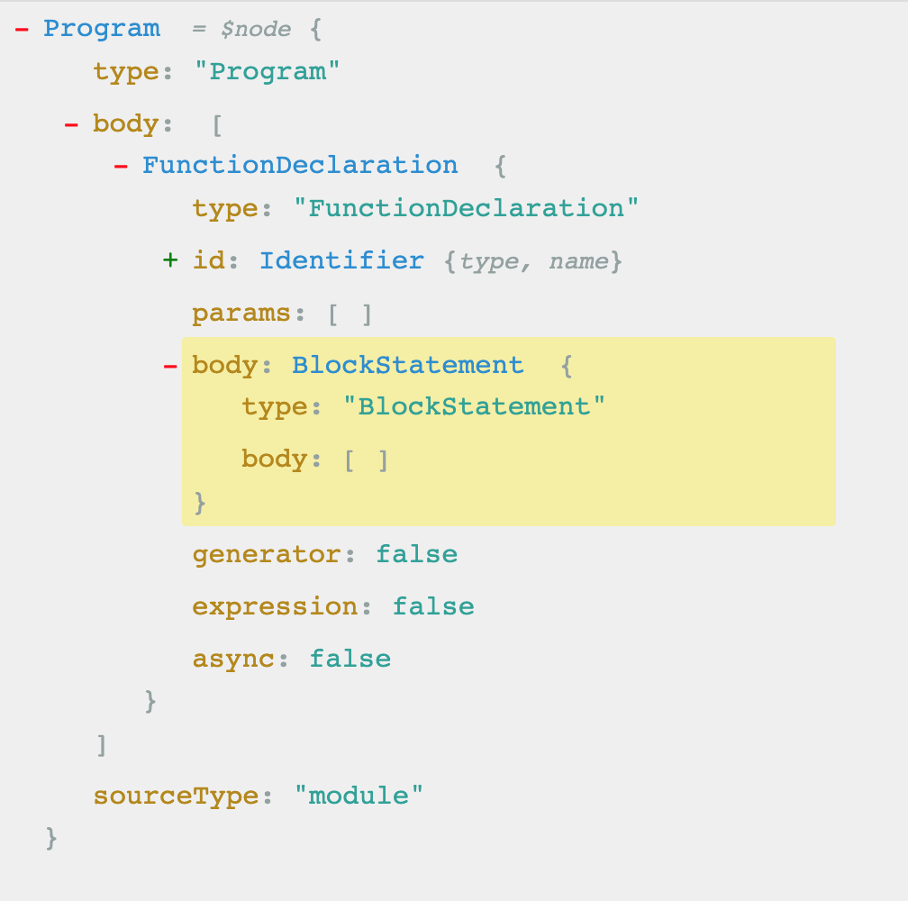

# 抽象语法树

## 什么是抽象语法树?

抽象语法树英文表示为（Abstract Syntax Tree），或者一般简称为（Syntax tree），是源代码语法结构的一种抽象表示，它以树状的形式表现编程语言的语法结构，树上的每个节点都表示源代码中的一种结构。

## 抽象语法树有什么用？
代码语法的检查、代码风格的检查、代码的格式化、代码的高亮、代码错误提示、代码自动补全等等
- 如 JSLint、JSHint 对代码错误或风格的检查，发现一些潜在的错误
- IDE 的错误提示、格式化、高亮、自动补全等等

代码混淆压缩
- UglifyJS2 等
  
优化变更代码，改变代码结构使达到想要的结构
- 代码打包工具 webpack、rollup 等等
- CommonJS、AMD、CMD、UMD 等代码规范之间的转化
- CoffeeScript、TypeScript、JSX 等转化为原生 Javascript

## JavaScript Parser
那如何将我们平时写的代码变换成抽象语法树呢？我们可以借助一些常用的工具：
- esprima
- traceur
- acorn
- shift

他们都可以称之为 `JavaScript Parser` 是能够把JavaScript源码转化为抽象语法树的解析器。

## 一个例子

我们有这样一个函数： 
```js
function ast(){}
```
经过抽象语法树解析、改变内容、重新生成源码的流程后改造后，我们想要获得一个新的函数

```js
function newAst(){}
```
从上述的函数声明可以看出，新的函数和老的函数相比，只有名称变了。


这样说起来可能还是有些抽象，我们借助一些在线工具[astexplorer](https://astexplorer.net/)可以简单的查看下ast的结构：



或者换一个解析工具[esprima](https://esprima.org/demo/parse.html#), 生成一个我们比较熟悉的对象结构：

```js
{
  "type": "Program",
  "body": [
    {
      "type": "FunctionDeclaration",
      "id": {
        "type": "Identifier",
        "name": "ast"
      },
      "params": [],
      "body": {
        "type": "BlockStatement",
        "body": []
      },
      "generator": false,
      "expression": false,
      "async": false
    }
  ],
  "sourceType": "script"
}
```

从上面两种结果的比较可以看出，不同平台生成的结构存在些许的差异，但是基本的结构是相同的。

从图中我们可以看到，抽象语法树其实是一个对象，type 字段标识的是层级结构类型，里面还有一些字段，标识具体的类型、参数等等。

我们要做的就是将函数生成这样的结构，然后解析，最后返回出一个新的函数。

我们首先安装依赖: 

```bash
npm i esprima estraverse escodegen -S
```

- esprima: 这个包能将源代码生成抽象语法树
- estraverse: 这个包能遍历抽象语法树，修改树上的代码
- escodegen: 将抽象语法树，重新生成代码


```js
let esprima = require("esprima") // 把JS源代码转成AST语法树
let estraverse = require("estraverse") // 遍历语法树, 修改树上的节点
let escodegen = require("escodegen") // 把AST语法树重新转换成代码

// 源代码 是一个函数声明，函数名字为 ast
let code = `function ast(){}`
// 第一步：将源代码生成抽象语法树
let ast = esprima.parse(code)
// 缩进样式
let indent = 0
const padding = () => " ".repeat(indent)

// 调用 traverse方法遍历语法树
// function ESTraverse.traverse(root: Node, visitor: estraverse.Visitor): void
estraverse.traverse(ast, {
  enter(node) {
    console.log(padding() + node.type + "进入")
    // 如果是函数声明
    if (node.type === "FunctionDeclaration") {
      // 将函数的名称修改为  newAst
      node.id.name = "newAst"
    }
    indent += 2
  },
  leave(node) {
    indent -= 2
    console.log(padding() + node.type + "离开")
  },
})

// 用修改过的ast 生成新的代码
const result =  escodegen.generate(ast)

console.log(result)
```

通过打印，结合上面那张图的，我们可以看到代码处理的流程如下。
```
Program进入
  FunctionDeclaration进入
    Identifier进入
    Identifier离开
    BlockStatement进入
    BlockStatement离开
  FunctionDeclaration离开
Program离开
```

最终打印的新生成的函数结果是：

```js
function newAst() {}
```

通过上面的小例子，是不是感觉似曾相识，如果你有这种感觉就对了，这个就特别类似于我们在平时工作中使用的babel。

## 什么是babel?

简单来说，babel 能够转译`ECMAScript 2015+ `的代码，使它在旧的浏览器或者环境中也能够运行。
就像上面的例子一样，babel的工作过程也可以分为三个部分：

- Parse(解析) 将源代码转换成抽象语法树，树上有很多的节点
- Transform(转换) 对抽象语法树进行转换
- Generate(代码生成) 将上一步经过转换过的抽象语法树生成新的代码

我们可以用一张图展示这三个步骤：


## 介绍几个babel的常用包

我们在日常开发中，但凡观察下package.json中的依赖，就肯定有这个这几个包：

- @babel/core: Babel 的编译器，核心 API 都在这里面，比如常见的 transform、parse,并实现了插件功能。需要注意的是，这个包本身并不知道你想转换哪些内容，比如你是否想转换箭头函数，你是否想转换装饰器？这些能力需要安装特定的插件配合这个包使用。
- @babel/traverse: 用于对 AST 的遍历，维护了整棵树的状态，并且负责替换、移除和添加节点.
- @babel/generate: 可以把AST生成源码，同时生成sourcemap
- @babel/types 用于 AST 节点的 Lodash 式工具库, 它包含了构造、验证以及变换 AST 节点的方法，对编写处理 AST 逻辑非常有用。

## 使用babel利用ast的原理转换ES6代码

既然已经知道了`babel`的工作原理，我们不妨使用babel提供的工具来写一个小例子，加深理解，就拿**箭头函数**为例，我们想利用`babel`将箭头函数转换为普通函数。

安装依赖
```bash
npm install @babel/core babel-types babel-plugin-transform-es2015-arrow-functions -D
```

:::tip
在书写本篇文章时，安装的依赖版本如下：
```json
{
  "@babel/core": "^7.16.5",
  "babel-plugin-transform-es2015-arrow-functions": "^6.22.0",
  "babel-types": "^6.26.0"
}
```
:::

>上面的安装命令中的`babel-plugin-transform-es2015-arrow-functions`就是babel的一个插件，这个插件的作用就是当源代码中匹配到箭头函数的时候，使用这个插件来转换，可以这么理解，`babel/core` 中提供了插件的机制，可以在解析到箭头函数的时候，调用这箭头函数插件来处理这种特定的语法格式。

事实上，插件就是一个钩子函数，在遍历语法树的过程中，可以捕获某些特定类型的节点并进行转换，每一个ES6的语法都会对应这样一个插件，每个插件都会捕获自己的语法节点，转换对应的ES6的语法。

我们平时在开发的过程中为了方便，会将所有的插件打成一个包，@babel/preset-env 这其实是一个插件集合。

```js
// 这是babel的核心包
let babelCore = require("@babel/core")
// 箭头函数插件
let arrowFunctionsPlugin = require("babel-plugin-transform-es2015-arrow-functions") 
// 源代码是一个箭头函数
let sourceCode = `
  const sum = (a,b) => {
    console.log(this)
    return a + b
  }
`;

// 调用 babel的转化能力
let targetCode = babelCore.transform(sourceCode,{
  // 使用的是箭头函数转换插件
  plugins:[arrowFunctionsPlugin]
})

console.log(targetCode.code)
```
查看控制台，可以看到打印出来转换后的代码:

```js
var _this = this;

const sum = function (a, b) {
  console.log(_this);
  return a + b;
};
```
至此，我们已经使用原生的babel工具完成了箭头函数的转换。


## 手写一版自己的箭头函数babel插件

插件是一个钩子函数，返回一个对象，对象中拥有一个 visitor 属性，也是一个对象，这个对象中配置的属性，就是我们想要转换的规则。比如`ArrowFunctionExpression` 就是箭头函数转换规则的key。


```js
// 我们尝试手写一般babel插件
let babelCore = require("@babel/core")
// 这是babel的工具包，判断某个节点是不是某个类型，动态创建某个类型的节点
let types = require("babel-types")

// let arrowFunctionsPlugin = require("babel-plugin-transform-es2015-arrow-functions") 
// 自己定义一个 selfArrowFunctionsPlugin
let selfArrowFunctionsPlugin = function () {
  return {
    visitor: {
      // 处理所有的箭头函数节点
      // nodePath 是节点路径
      ArrowFunctionExpression(path) {
        // path的node节点，才是真正的节点
        let node = path.node
        let params = node.params
        let body = node.body
        // 使用types生成新的函数声明，有些参数是从老的函数中直接拿来复用
        let func = types.functionExpression(null, params, body, false, false)
        // 替换老的节点
        path.replaceWith(func)
      },
    },
  }
}

// 源代码是一个箭头函数
let sourceCode = `
  const sum = (a,b) => {
    console.log(this)
    return a + b
  }
`
// 调用 babel的转化能力
let targetCode = babelCore.transform(sourceCode, {
  // 使用的是箭头函数转换插件
  plugins: [selfArrowFunctionsPlugin],
})
console.log(targetCode.code)

// const sum = function (a, b) {
//   console.log(this);
//   return a + b;
// };
```

上面代码中，我们遍历node节点，利用`babel-types`来生成新的函数。

## 解决代码块的问题

思考一个场景, 我们在写箭头函数的时候, 当代码块只有一行语句时，我们一般可以省略大括号。

```js
// 带有代码块包裹
const sum = (a,b) => {
  return a + b
}
// 以上两种写法是等价的
const sum = (a,b) =>  a + b
```

使用ast工具解析出来的tree类型
```js
{
  "type": "Program",
  "body": [
    {
      "type": "VariableDeclaration",
      "declarations": [
        {
          "type": "VariableDeclarator",
          "id": {
            "type": "Identifier",
            "name": "sum"
          },
          "init": {
            "type": "ArrowFunctionExpression",
            "id": null,
            "params": [
              {
                "type": "Identifier",
                "name": "a"
              },
              {
                "type": "Identifier",
                "name": "b"
              }
            ],
            "body": {
              "type": "BlockStatement",
              "body": [
                {
                  "type": "ReturnStatement",
                  "argument": {
                    "type": "BinaryExpression",
                    "operator": "+",
                    "left": {
                      "type": "Identifier",
                      "name": "a"
                    },
                    "right": {
                      "type": "Identifier",
                      "name": "b"
                    }
                  }
                }
              ]
            },
            "generator": false,
            "expression": false,
            "async": false
          }
        }
      ],
      "kind": "const"
    }
  ],
  "sourceType": "script"
}
```

不携带return
```js
{
  "type": "Program",
  "body": [
    {
      "type": "VariableDeclaration",
      "declarations": [
        {
          "type": "VariableDeclarator",
          "id": {
            "type": "Identifier",
            "name": "sum"
          },
          "init": {
            "type": "ArrowFunctionExpression",
            "id": null,
            "params": [
              {
                "type": "Identifier",
                "name": "a"
              },
              {
                "type": "Identifier",
                "name": "b"
              }
            ],
            "body": {
              "type": "BinaryExpression",
              "operator": "+",
              "left": {
                "type": "Identifier",
                "name": "a"
              },
              "right": {
                "type": "Identifier",
                "name": "b"
              }
            },
            "generator": false,
            "expression": true,
            "async": false
          }
        }
      ],
      "kind": "const"
    }
  ],
  "sourceType": "script"
}
```

从生成的两份ast来看，只有部分内容有差异，但是我们确实需要针对这部分差异做一些处理，否则编译的时候就会报错。

```js{12-15}
// ...
let selfArrowFunctionsPlugin = function () {
  return {
    visitor: {
      // 处理所有的箭头函数节点
      // nodePath 是节点路径
      ArrowFunctionExpression(path) {
        // path的node节点，才是真正的节点
        let node = path.node
        let params = node.params
        let body = node.body
        if (!types.isBlockStatement(body)) {
          let returnStatement = types.returnStatement(body)
          body = types.blockStatement([returnStatement])
        }
        // 使用types生成新的函数声明，有些参数是从老的函数中直接拿来复用
        let func = types.functionExpression(null, params, body, false, false)
        // 替换老的节点
        path.replaceWith(func)
      },
    },
  }
}
// ...
```

上面高亮的代码块就是判断一下body是不是一个代码块，如果不是一个代码块，生成一个return的语句体，然后将body变成一个return的结构体，最后返回。


## 解决this指向的问题

为了更加了解细节，我们把访问器函数中的 path 属性打印出来

```js
NodePath {
  contexts: [
    TraversalContext {
      queue: [Array],
      priorityQueue: [],
      parentPath: [NodePath],
      scope: [Scope],
      state: undefined,
      opts: [Object]
    }
  ],
  state: undefined,
  ......
  node: Node {
    type: 'ArrowFunctionExpression',
    start: 15,
    end: 68,
    loc: SourceLocation {
      start: [Position],
      end: [Position],
      filename: undefined,
      identifierName: undefined
    },
    id: null,
    generator: false,
    async: false,
    params: [ [Node], [Node] ],
    body: Node {
      type: 'BlockStatement',
      start: 24,
      end: 68,
      loc: [SourceLocation],
      body: [Array],
      directives: [],
      leadingComments: undefined,
      innerComments: undefined,
      trailingComments: undefined
    },
    leadingComments: undefined,
    innerComments: undefined,
    trailingComments: undefined
  },
  type: 'ArrowFunctionExpression',
  ...
}
```

可以看到 path的信息非常丰富，并且原生的插件在实现的时候，思路是将this的作用域提升到拥有this的部分（箭头函数是没有this指向的）。所以我们的实现思路也是手动书写一个环境变量提升函数。

来看第二版代码

```js
// 我们尝试手写一般babel插件
let babelCore = require("@babel/core")
// 这是babel的工具包，判断某个节点是不是某个类型，动态创建某个类型的节点
let types = require("babel-types")

function getScopeInfo(path) {
  let thisPaths = []
  // 遍历当前路径的子路径，从当前路径向下查找
  // 如果遇到 this应用的节点 把它添加进数组中
  path.traverse({
    ThisExpression(path) {
      thisPaths.push(path)
    },
  })

  return thisPaths
}

// 处理函数作用域的提升问题
function hoistFunctionEnvironment(path) {
  // 当前的路径向上找 查找this定义的位置
  const thisEnv = path.findParent((parent) => {
    return (
      // 作用域：函数作用域 全局作用域 并且不是箭头函数
      (parent.isFunction() && !path.ArrowFunctionExpression()) ||
      parent.isProgram()
    )
  })

  // 寻找到代码块中所有包含this的地方
  let thisPaths = getScopeInfo(path)

  // 节点里面有this指针
  if (thisPaths.length > 0) {
    // console.log(thisEnv)
    let thisBindings = "_this"

    // 在节点的作用域中添加一个变量
    // var _this = this
    thisEnv.scope.push({
      id: types.identifier(thisBindings), // 生成一个标识符 _this
      init: types.thisExpression(), // 生成一个this调用 this
    })
    // 替换 this 为 _this
    thisPaths.forEach((thisPath) => {
      thisPath.replaceWith(types.identifier(thisBindings))
    })
  }
}

// let arrowFunctionsPlugin = require("babel-plugin-transform-es2015-arrow-functions") 
// 自己定义一个 selfArrowFunctionsPlugin
let selfArrowFunctionsPlugin = function () {
  return {
    visitor: {
      // 处理所有的箭头函数节点
      // nodePath 是节点路径
      ArrowFunctionExpression(path) {
        let node = path.node
        // 写一版函数作用域提升代码 
        hoistFunctionEnvironment(path)
        // 将node的类型修改成 函数声明的形式
        node.type = "FunctionExpression"
      },
    },
  }
}

// 源代码是一个箭头函数
let sourceCode = `
  const sum = (a,b) => {
    console.log(this)
    return a + b
  }
`
// 调用 babel的转化能力
let targetCode = babelCore.transform(sourceCode, {
  // 使用的是箭头函数转换插件
  plugins: [selfArrowFunctionsPlugin],
})
console.log(targetCode.code)
```


