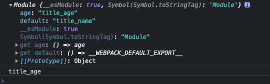

# webpack 打包文件分析

## 场景分析
我们在实际开发项目的过程中，可能存在同时使用ESModule 和 Commonjs 的情况，这时候webpack在编译打包的时候会替我们做一些处理，这里我们就来分析一下。

## 准备工作：

### 安装模块：
```shell
npm i webpack webpack-cli html-webpack-plugin clean-webpack-plugin -D
```

### 配置webpack.config.js

```js
const path = require("path"); // 引入path模块
const HtmlWebpackPlugin = require("html-webpack-plugin");
const { CleanWebpackPlugin } = require("clean-webpack-plugin");
module.exports = {
  mode: "development", // 开发模式
  devtool: "source-map", // 启用sourcemap
  entry: "./src/index.js", // 入口文件
  output: { 
    path: path.resolve(__dirname, "dist"), //必须是绝对路径
    filename: "main.js",
  },
  module: {}, // loader 的配置区域
  plugins: [ // webpack 插件
    new CleanWebpackPlugin({ cleanOnceBeforeBuildPatterns: ["**/*"] }),
    new HtmlWebpackPlugin({
      template: "./src/index.html",
      filename: "index.html",
    }),
  ],
  devServer: {},
};
```


## 1 commonJS 加载 commonJS 场景

我们创建一个 `title.js` 的文件，使用 `commonJS` 规范导出一个字符串，然后在项目的入口文件 `index.js` 中导入这个模块。

### 1.1 .src/title.js
```js
module.exports = 'webpack'
```

### 1.2 .src/index.js
```js
const title = require('./title')
console.log(title);
```

执行 `npm run build` 之后，webpack会将打包编译后的文件输出到 dist 目录下，很显然这是我们配置的结果。

### 1.3 ./dist/main.js 

打包之后的结果：

我们在入口文件引入了title.js, 这就是一个模块，模块id一般为模块相对项目根目录的相对路径。

```js{2-6,8,11,18-22,25,34-37}
;(() => {
  var __webpack_modules__ = {
    "./src/title.js": (module) => { // 模块id一般为模块相对项目根目录的相对路径
      module.exports = "webpack"
    },
  }
  // The module cache
  var __webpack_module_cache__ = {}

  // The require function
  function __webpack_require__(moduleId) {
    // Check if module is in cache
    var cachedModule = __webpack_module_cache__[moduleId]
    if (cachedModule !== undefined) {
      return cachedModule.exports
    }
    // Create a new module (and put it into the cache)
    var module = (__webpack_module_cache__[moduleId] = {
      // no module.id needed
      // no module.loaded needed
      exports: {},
    })

    // Execute the module function
    __webpack_modules__[moduleId](module, module.exports, __webpack_require__)

    // Return the exports of the module
    return module.exports
  }

  var __webpack_exports__ = {}
  // This entry need to be wrapped in an IIFE because 
  // it need to be isolated against other modules in the chunk.
  ;(() => {
    const title = __webpack_require__(/*! ./title */ "./src/title.js")
    console.log(title)
  })()
})()
```

### 1.4 文件分析

- 1、打包之后的结果是一个自执行函数, 浏览器自然能够识别。
- 2、{2-6}行定义了一个 **`__webpack_modules__`** 对象，key是入口文件引用的模块，value是一个函数，接收一个module参数，将title.js 中的内容放进了函数体内。
  ```js
  var __webpack_modules__ = {
    "./src/title.js": (module) => {
      module.exports = "webpack"
    },
  }
  ```
- 3、34-37行也是一个自执行函数，也是程序的入口，可以看到, 这里调用了webpack中自定义的一个 **`__webpack_require__`** 函数, 入参就是 **`__webpack_modules__`** 中的key。

- 4、我们接着定位到 __webpack_require__  这个方法, 这是webpack中自行实现的方法, 入参是一个 moduleId, {8} 行定义了一个缓存对象，首先在函数中判断，这个`moduleId`是否存在了，如果存在了就返回 `cachedModule的exports` 对象。{18-22}行可以看出，这个 __webpack_require__ 函数创建了一个新对象，这个对象中的key是 `exports`, value 是一个空的对象。
  ```js
  // 不考虑缓存 简化之后的代码如下所示
  var module = {
    exports: {},
  }
  ```

- 5 开始调用 __webpack_modules__ 根据 传入的 moduleId 调用对象的函数。传入的三个参数，在这个例子中，传入的后两个参数暂时没有用到，只用到了第一个`moudle`参数。这个module参数就是上自己定义的对象, 里面拥有一个属性 exports 也是一个对象。 

- 6 {25} 执行函数 得到 `module.exports = "webpack"` , 这个操作实际上, 就是将 `webpack` 这个字符串，赋值给了原本的对象，最后返回的 module.exports 也就是返回了  `webpack` 这个字符串。

- 7 console.log(title) 的时候 打印出来的字符串 就是 webpack。

### 1.5 总结：

commonJS加载commonJS代码, 本质上并没有做特别的操作，就是基于函数的，通过匹配 `moduleId` 去找到另一个函数，利用语法的匹配，最终将其他模块中代码拿过来执行了。


## 2 commonJS 加载 ESModule 场景

### 2.1 ./src/title.js

```js
export default "title_name";
export const age = "title_age";
```

### 2.2 ./src/index.js

```js
let title = require("./title");
console.log(title);
console.log(title.age);
```

### 2.3 打包后的dist目录的main.js 去除注释和外层自执行函数

```js{2-17,21,26-28,30,59}
;(() => {
  var __webpack_modules__ = {
    "./src/title.js": (
      __unused_webpack_module,
      __webpack_exports__,
      __webpack_require__
    ) => {
      "use strict"
      __webpack_require__.r(__webpack_exports__)
      __webpack_require__.d(__webpack_exports__, {
        default: () => __WEBPACK_DEFAULT_EXPORT__,
        title_age: () => title_age,
      })
      const __WEBPACK_DEFAULT_EXPORT__ = (title_name = "title_name")
      const title_age = "title_age"
    },
  }

  var __webpack_module_cache__ = {}

  function __webpack_require__(moduleId) {
    var cachedModule = __webpack_module_cache__[moduleId]
    if (cachedModule !== undefined) {
      return cachedModule.exports
    }
    var module = (__webpack_module_cache__[moduleId] = {
      exports: {},
    })

    __webpack_modules__[moduleId](module, module.exports, __webpack_require__)
    return module.exports
  }

  __webpack_require__.d = (exports, definition) => {
    for (var key in definition) {
      if (
        __webpack_require__.o(definition, key) &&
        !__webpack_require__.o(exports, key)
      ) {
        Object.defineProperty(exports, key, {
          enumerable: true,
          get: definition[key],
        })
      }
    }
  }

  __webpack_require__.o = (obj, prop) =>
    Object.prototype.hasOwnProperty.call(obj, prop)
  
  __webpack_require__.r = (exports) => {
    if (typeof Symbol !== "undefined" && Symbol.toStringTag) {
      Object.defineProperty(exports, Symbol.toStringTag, { value: "Module" })
    }
    Object.defineProperty(exports, "__esModule", { value: true })
  }
  var __webpack_exports__ = {}

  let title = __webpack_require__("./src/title.js")
  console.log(title)
  console.log(title.age)
})()
```

### 2.4 文件分析
- 1 {2-17} 行定义 __webpack_modules__ 对象，这个对象的 key 就是文件模块，一般来说，这个文件模块的名称都是相对于项目根目录定义的，value 是一个函数。
- 2 函数的入口部分就是 {59} 行，进入 {21} 行的 __webpack_require__ 方法 {26-28} 行，定义了一个 module 对象，里面有一个属性，这个属性 expots 也是一个对象：
  ```js
    module: {
      exports: {},
    }
  ```
- 3 __webpack_require__ 函数的执行到 {30} 行, 开始调用 {2} 行 value 对应的函数, 我们来将这个函数抽出来，仔细分析一下。
```js
 __webpack_modules__[moduleId] (module, module.exports, __webpack_require__)
//  __webpack_modules__[moduleId] 对应的就是下面这个函数

(__unused_webpack_module, __webpack_exports__, __webpack_require__) => {
  "use strict"
  __webpack_require__.r(__webpack_exports__)
  __webpack_require__.d(__webpack_exports__, {
    default: () => __WEBPACK_DEFAULT_EXPORT__,
    title_age: () => title_age,
  })
  const __WEBPACK_DEFAULT_EXPORT__ = "title_name"
  const age = "title_age" 
},
```
从上面可以看出, 其实就是调用了 两个函数 处理 __webpack_exports__ 和我们导出的变量之间的关系。

__webpack_require__.r 这个方法做了两个步骤：第一在 __webpack_exports__ 属性上定义了两个属性{53-55}行，Module 和 __esModule

__webpack_require__.d 这个方法 就是做了一个遍历，然后返回了一个getter。

最后处理过的 __webpack_exports__ 中 使用 default 导出的变量 挂载到了 default 变量上面，解构导出的变量 直接放在了 自己定义的变量名称上面。




## 3 ESModule 加载 ESModule 场景


### 3.1 ./src/title.js

```js
export default "title_name";
export const age = "title_age";
```

### 3.2 ./src/index.js

```js
import name,{ age} from './title'

console.log(name);
console.log(age);
```

### 3.3 打包后的dist目录的main.js 去除注释和外层自执行函数

```js
;(() => {
  "use strict"
  var __webpack_modules__ = {
    "./src/title.js": (
      __unused_webpack_module,
      __webpack_exports__,
      __webpack_require__
    ) => {
      __webpack_require__.r(__webpack_exports__)
      __webpack_require__.d(__webpack_exports__, {
        default: () => __WEBPACK_DEFAULT_EXPORT__,
        age: () => age,
      })
      const __WEBPACK_DEFAULT_EXPORT__ = "title_name"
      const age = "title_age"
    },
  }
  var __webpack_module_cache__ = {}
  function __webpack_require__(moduleId) {
    var cachedModule = __webpack_module_cache__[moduleId]
    if (cachedModule !== undefined) {
      return cachedModule.exports
    }
    var module = (__webpack_module_cache__[moduleId] = {
      exports: {},
    })
    __webpack_modules__[moduleId](module, module.exports, __webpack_require__)
    return module.exports
  }
  __webpack_require__.d = (exports, definition) => {
    for (var key in definition) {
      if (
        __webpack_require__.o(definition, key) &&
        !__webpack_require__.o(exports, key)
      ) {
        Object.defineProperty(exports, key, {
          enumerable: true,
          get: definition[key],
        })
      }
    }
  }
  __webpack_require__.o = (obj, prop) =>
    Object.prototype.hasOwnProperty.call(obj, prop)

  __webpack_require__.r = (exports) => {
    if (typeof Symbol !== "undefined" && Symbol.toStringTag) {
      Object.defineProperty(exports, Symbol.toStringTag, { value: "Module" })
    }
    Object.defineProperty(exports, "__esModule", { value: true })
  }

  var __webpack_exports__ = {}
  __webpack_require__.r(__webpack_exports__)
  var _title__WEBPACK_IMPORTED_MODULE_0__ = __webpack_require__("./src/title.js")

  console.log(__webpack_exports__)
  console.log(_title__WEBPACK_IMPORTED_MODULE_0__);

  console.log(_title__WEBPACK_IMPORTED_MODULE_0__.default)
  console.log(_title__WEBPACK_IMPORTED_MODULE_0__.age)
})()
```

### 3.4 文件分析
这种形似和上述 commonJS 加载ESModule 几乎没有变化。在引用模块多了一个步骤：

```js
var __webpack_exports__ = {}
__webpack_require__.r(__webpack_exports__)
```

## 4 ESModule 加载 commonJS 场景

### 4.1 ./src/title.js

```js
module.exports = {
  title_name:"title_name",
  age:"title_age"
}
```


### 4.2 ./src/index.js

```js
import {title_name, age} from './title'

console.log(title_name);
console.log(age)
```

### 4.3 打包后的dist目录的main.js 去除注释

```js
;(() => {
  var __webpack_modules__ = {
    "./src/title.js": (module) => {
      module.exports = {
        title_name: "title_name",
        age: "title_age",
      }
    },
  }
  var __webpack_module_cache__ = {}
  function __webpack_require__(moduleId) {
    var cachedModule = __webpack_module_cache__[moduleId]
    if (cachedModule !== undefined) {
      return cachedModule.exports
    }
    var module = (__webpack_module_cache__[moduleId] = {
      exports: {},
    })
    __webpack_modules__[moduleId](module, module.exports, __webpack_require__)
    return module.exports
  }
  ;(() => {
    __webpack_require__.n = (module) => {
      var getter =
        module && module.__esModule ? () => module["default"] : () => module
      __webpack_require__.d(getter, { a: getter })
      return getter
    }
  })()
  ;(() => {
    __webpack_require__.d = (exports, definition) => {
      for (var key in definition) {
        if (
          __webpack_require__.o(definition, key) &&
          !__webpack_require__.o(exports, key)
        ) {
          Object.defineProperty(exports, key, {
            enumerable: true,
            get: definition[key],
          })
        }
      }
    }
  })()
  ;(() => {
    __webpack_require__.o = (obj, prop) =>
      Object.prototype.hasOwnProperty.call(obj, prop)
  })()
  ;(() => {
    __webpack_require__.r = (exports) => {
      if (typeof Symbol !== "undefined" && Symbol.toStringTag) {
        Object.defineProperty(exports, Symbol.toStringTag, { value: "Module" })
      }
      Object.defineProperty(exports, "__esModule", { value: true })
    }
  })()
  var __webpack_exports__ = {}
  ;(() => {
    "use strict"
    __webpack_require__.r(__webpack_exports__)
    var _title__WEBPACK_IMPORTED_MODULE_0__ =
      __webpack_require__("./src/title.js")
    var _title__WEBPACK_IMPORTED_MODULE_0___default =
      /*#__PURE__*/ __webpack_require__.n(_title__WEBPACK_IMPORTED_MODULE_0__)
    console.log(_title__WEBPACK_IMPORTED_MODULE_0__.title_name)
    console.log(_title__WEBPACK_IMPORTED_MODULE_0__.age)
  })()
})()
```

### 4.4 文件分析

ESModule 加载 commonJS 其中多了一个方法的定义:
```js
__webpack_require__.n = (module) => {
  var getter =
    module && module.__esModule ? 
    () => module["default"] : 
    () => module
  __webpack_require__.d(getter, { a: getter })
  return getter
}
```

就是判断 module 是不是一个ESModule 模块，如果是，就返回 module["default"] 否则返回 module 本身


## 总结
- 1 es6模块调用commonjs模块，可以直接使用commonjs模块，commonjs模块将不会被webpack的模块系统编译而是会原样输出，并且commonjs模块没有.default属性。
- 2 es6模块调用es6模块, 被调用的es6模块不会添加{__esModule:true}，只有调用者才会添加{__esModule: true}；并且可以进行tree-shaking 操作，如果被调用的es6模块只是import进来，但是并没有被用到，那么被调用的es6模块将会被标记为/* unused harmony default export */，在压缩时此模块将会被删除 （例外：如果被调用的es6模块里有立即执行语句，那么这些语句将会被保留）。
- 3 如果是commonjs模块引用了es6模块，那么es6模块编译后会添加{__esModule:true}。如果被调用的es6模块中恰好有export default语句，那么编译后的es6模块将会添加.default = ...，这时调用require进来的es6模块默认值，就需要例如：var b = require('./b').default console.log(b)
- 4 如果commonjs模块调用commonjs模块，那么commonjs模块会原样输出。
- 5 commonjs模块中不能使用import语句，会报错
- 6 webpakc的output设置会设置模块的打包格式和保留变量，如果设置library = 'test'，那么打包后的js执行完成后所有的模块将会挂到window.test上。


